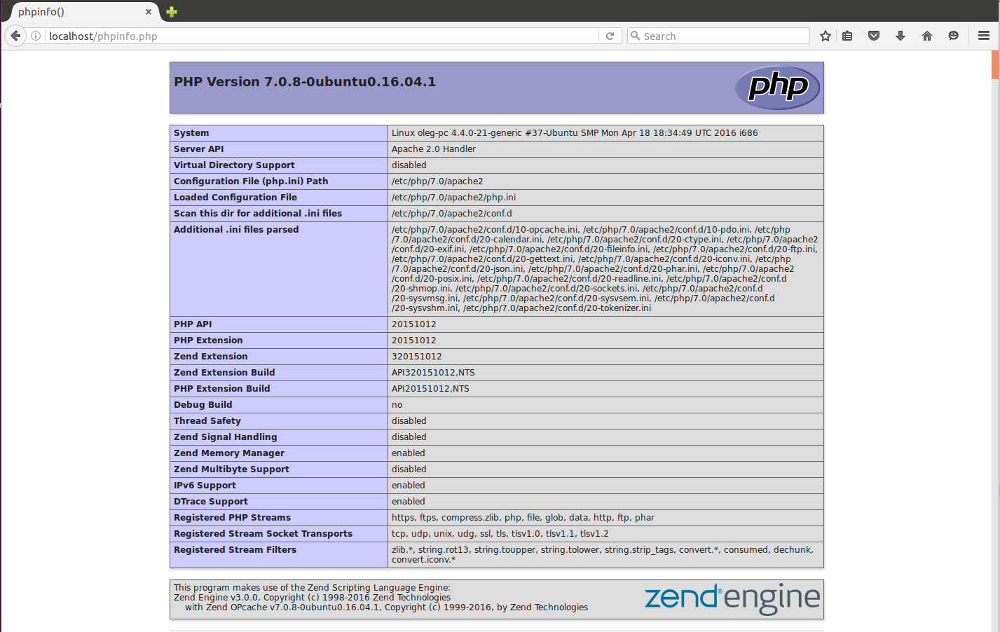
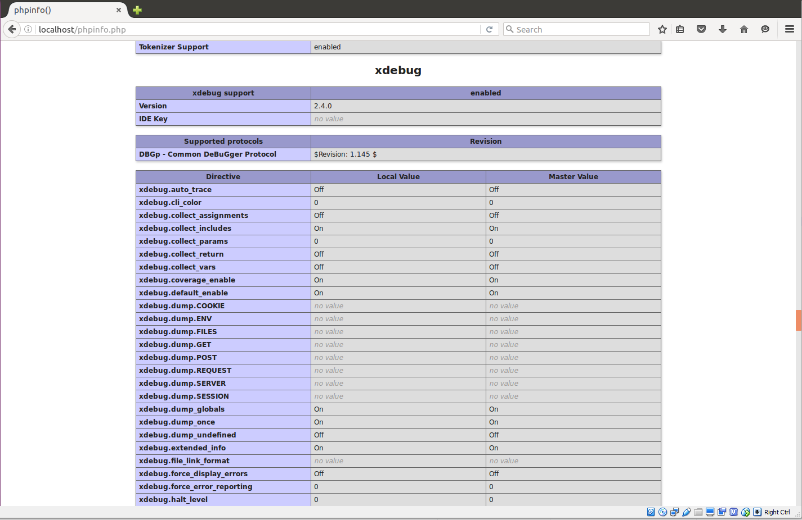
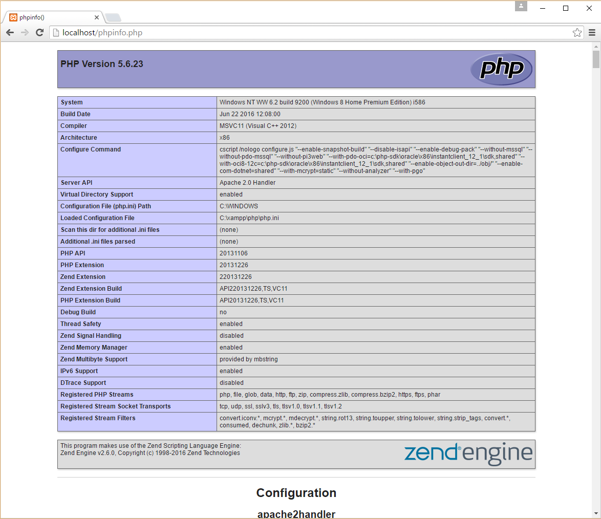
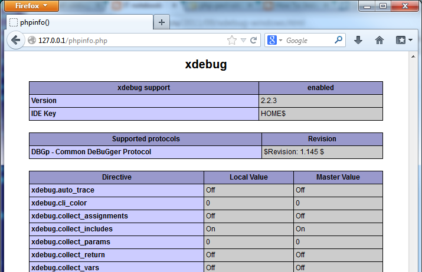
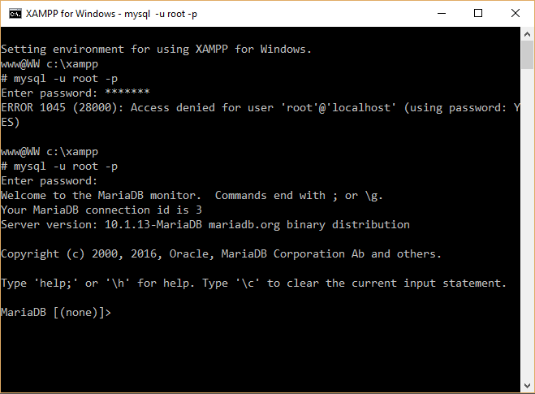
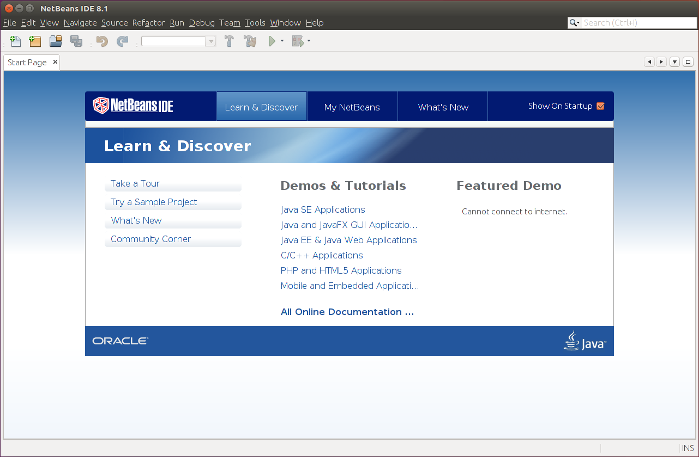
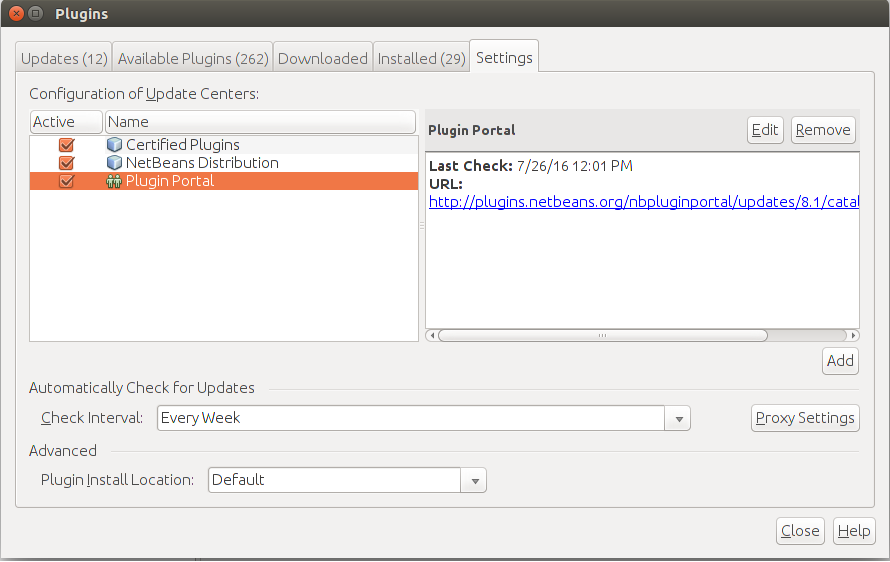
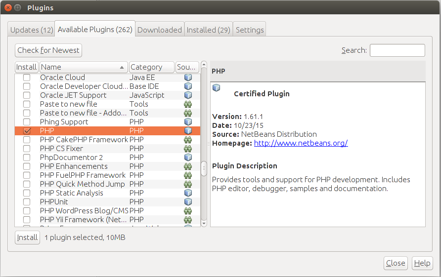
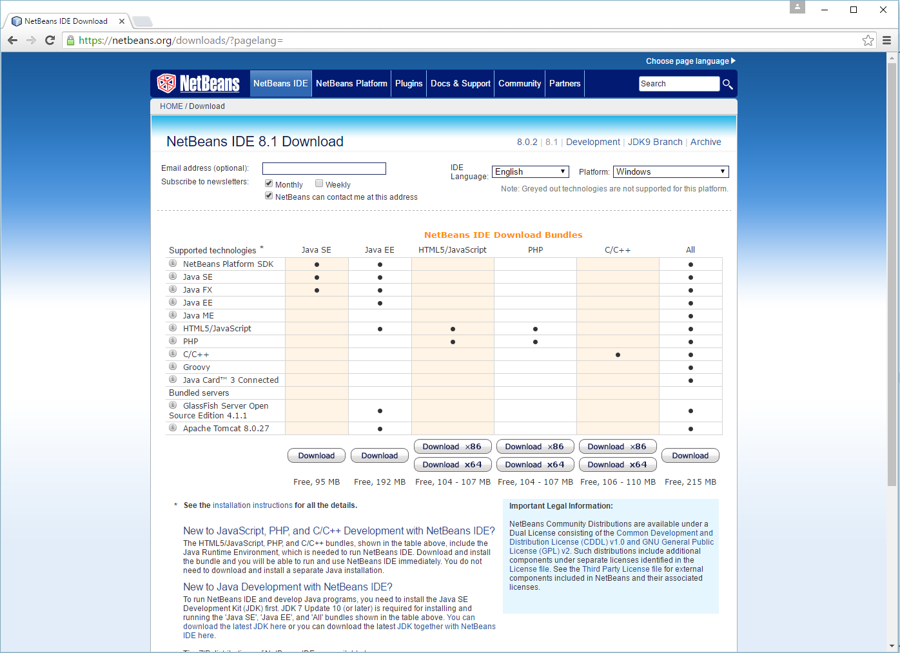

# Appendix A. Configuring Web Development Environment

Here we will provide instructions on how to prepare your environment
for developing laminas-based applications. If you already have the configured environment,
you can skip this.

Configuring the development environment is the first thing you have to do
when beginning with creating your first web-site. This includes installing
the web server, the PHP engine with required extensions and a database.

For the purpose of running the code examples created in this book, we will use
Apache HTTP Server (v.2.4 or later), PHP engine (v.5.6 or later)
with XDebug extension and MySQL database (v.5.6 or later).

We also provide instructions for installing NetBeans IDE, which is a
convenient integrated development environment for PHP development. It allows
for an easier navigation, editing and debugging of your PHP application.
The NetBeans IDE is written in Java and can be installed in Windows, Linux and other
platforms supporting a compatible Java machine.

!!! note
    We also provide instructions for beginners on how to install a Laminas website to Amazon EC2 cloud in
    [Appendix E. Installing a Laminas Web Application to Amazon EC2](ec2_tutorial.md).

## Installing Apache, PHP and MySQL in Linux

!!! note
    This section is highly outdated. Most distributions by now only have 64-bit versions. Furthermore PHP 8.3 is out.
	(As written in January 2024.) But it gives you a general overview over the existing distributions and their
	versions. Furthermore it makes you aware of the fact that you need to check the PHP versions when looking
	at a distribution version.

In general, it is recommended that you use a popular and well supported
Linux distribution, either 32-bit (x86) or 64-bit (amd64). A 64-bit version can give a great performance,
but deliver more problems (like driver compatibility issues). 32-bit systems are with us for a longer time
and have less problems, which is important for novice users.

There are two big families of Linux distributions: [Debian](https://www.debian.org/) and
[Red Hat](https://www.redhat.com). Debian is a free and open-source project,
which has several branches, the most popular of which is [Linux Ubuntu](http://www.ubuntu.com/). Red Hat is a commercially
distributed operating system, which has "free" branches named [Linux CentOS](https://www.centos.org/)
and [Linux Fedora](https://getfedora.org/).

Red Hat Linux is being developed by Red Hat Inc.
Red Hat Linux (or its "free" modification CentOS) is known as a "corporate" operating system.
Its main advantage is "stability" (low rate of system crashes). However, this stability is achieved
through carefully choosing the software which is installed out of the box. When you install such
an operating system for the purpose of PHP development, this "stability" may become a problem, because
you have access to some old (but "stable") version of PHP and other software. They do not
include a new "bleeding-edge" software into their repository, so if you want to install one, you
will need to download it from somewhere, read the manual, and possibly (if you are not lucky)
compile it yourself.

There is another Linux distribution, which, in the author's opinion, suits better for PHP development.
Its name is Linux Ubuntu. Ubuntu is being developed by Canonical Ltd. Linux Ubuntu has two editions: Desktop
edition and Server edition. Ubuntu Desktop is a distribution containing graphics environment, while Ubuntu Server
edition has console terminal only. For the purpose of PHP development, it is recommended to use the Desktop edition.

Canonical typically releases a new version of Linux Ubuntu each 6 months, in April and October,
and a "long term support" (LTS) version each 2 years. For example, at the
moment of writing this text, the latest version is Ubuntu 16.04 Xenial Xerus LTS
(released in April 2016).

Non-LTS releases have short support period (about 9 months), but they have the newest versions of the PHP software
out of the box. On the other hand, LTS releases have longer support period (5 years), but a little
outdated PHP software out of the box.

For PHP development, the author would recommend to use the latest
version of Ubuntu Desktop, because it has the newest version of PHP and other software available from
repository. The disadvantage of using such a version is that you will need to upgrade it
to the next release every 9 months (as support period expires). If you don't like the perspective of
upgrading every 9 months, choose the latest LTS release.

For your information, table A.1 lists PHP versions available for installation
from repository in different Linux distributions:

| Linux Distribution                       |	PHP Version             |
|------------------------------------------|----------------------------|
| Linux Ubuntu 16.04 Xenial Xerus LTS      |	7.0                     |
| Linux Ubuntu 15.10 Wily Werewolf         |	5.6                     |
| Linux Ubuntu 15.04 Vivid Vervet          |	5.6                     |
| Linux Ubuntu 14.10 Utopic Unicorn        |	5.5                     |
| Linux Ubuntu 14.04 Trusty Tahr           |	5.5                     |

Table A.1. Available PHP versions in different Linux distributions

As you can see from the table above, for the purpose of Laminas development, you'll have to install
Ubuntu 15.04 or later.

When choosing between 32-bit and 64-bit versions of the system, remember that
the 64 bit version of Linux Ubuntu will have more compatibility issues than its
32-bit counterpart. The support of drivers can also cause problems on the
64-bit platform.

!!! note "New to Ubuntu Linux?"
    If you are new to Linux Ubuntu, watch these excellent video tutorials by
    [LearnLinux.tv](https://www.youtube.com/channel/UCxQKHvKbmSzGMvUrVtJYnUA) YouTube user:
    [Tutorial - Installing Ubuntu 16.04 LTS](https://www.youtube.com/watch?v=ajYMQ69S4pg) (this
    one shows how to install Ubuntu Desktop Edition)
    and [Tutorial - Installing Ubuntu Server 16.04](https://www.youtube.com/watch?v=w5W_48vyC6U)
    (this one shows how to install Ubuntu Server Edition which has console terminal only).

### Installing Apache and PHP

In modern Linux distributions, you can easily download and install
software from a centralized *repository*. The repository contains so called
*packages*. A package has a name (for example, `php`, `apache2`), and a version.

In general you can install a package with a single command. However the command (and a package name)
may differ based on linux distribution you use. For example, to download and install
packages in Debian-based Linux distributions (e.g. Ubuntu Linux), you use Advanced
Packaging Tool (APT). In Red Hat provided distributions (e.g. Fedora or CentOS), you use
YUM (RPM package manager). Below, detailed installation instructions for these operating systems are provided.

**Debian or Linux Ubuntu**

First of all, it is recommended that you update your system by installing
the latest available updates. To do this, from a command shell, run the
following commands:

```bash
sudo apt-get update

sudo apt-get upgrade
```

The commands above run the APT tool and install the newest system packages updates.
The `sudo` command (stands for "Super User DO") allows to run another command,
`apt-get` in our case, as system administrator (root). You typically use `sudo` when you
need to elevate your privileges to install a package or edit some configuration file.

!!! note
    The `sudo` command may request you for password. When prompted, enter the password
    under which you log into the system and press Enter.

Next, from a command shell, run the following commands:

```bash
sudo apt-get install apache2

sudo apt-get install php

sudo apt-get install libapache2-mod-php
```

The commands above download from repository and install the latest available
versions of Apache HTTP Server, PHP engine and PHP extension module for Apache.

The commands above may ask you for confirmation when installing a package.
It is recommended to answer Yes (press "y" and then press Enter).

**Fedora, CentOS or Red Hat Linux**

First of all, it is recommended that you update your system by installing
the latest available updates. To do this, from a command shell, run the
following command:

```bash
sudo yum update
```

The command above runs the YUM tool and installs the newest system package updates.

Next, from a command shell, run the following commands:

```bash
sudo yum install httpd

sudo yum install php
```

The commands above download from repository and install the latest available
versions of Apache HTTP Server and PHP engine.

Next, run the following commands to add Apache HTTP Server to system autorun and start it:

```bash
sudo chkconfig --level 235 httpd on

sudo service httpd start
```

### Checking Web Server Installation

After you set up your Apache HTTP web server, check that it is installed
correctly and that the server sees the PHP engine. To do that, create *phpinfo.php*
file in Apache document root directory.

The *document root* is a directory where you can (by default) store the web files.
Typically, the Apache document root directory is */var/www/html*.

!!! note "Recommendation from the author"
    To be able to navigate the directory structure and edit files, it is
    recommended to install Midnight Commander (convenient file manager and text editor).
    To install Midnight Commander in Debian or Linux Ubuntu, type the following:

    `sudo apt-get install mc`

    The following command installs Midnight Commander in Fedora, CentOS or Red Hat Linux:

    `sudo yum install mc`

    After installation, you can launch the file manager with the `mc` command, and edit a
    text file with the command like this:

    `mcedit /path/to/file`

    If you need administrative permissions to edit the file, prepend the `sudo` command
    to the command above.

In the *phpinfo.php* file, enter the PHP method `phpinfo()` as follows:

~~~php
<?php
  phpinfo();
?>
~~~

Open the file in your web browser. The standard PHP information page should display
(see figure A.1 for example).



### Editing PHP Configuration

To configure PHP for your development environment, you need to edit the
PHP config file (*php.ini*) and adjust some parameters.

!!! note "Where to find the config file?"
    In different distributions of Linux, PHP configuration file can be located in different paths.
    To edit the PHP config file in Debian or Linux Ubuntu, type the following:

    `sudo mcedit /etc/php/7.0/apache2/php.ini`

    Type the following to edit *php.ini* in Fedora, CentOS or Red Hat Linux:

    `sudo mcedit /etc/php.ini`

For the development environment, it is recommended to set the following
error handling and logging parameters as below. This will force PHP to
display errors on your PHP pages to screen.

`error_reporting = E_ALL`

`display_errors = On`

`display_startup_errors = On`

!!! note
    To conveniently search within the file, press `F7` in Midnight Commander's editor window and
    enter the search string (the name of the parameter to search for).

Set your time zone settings (replace `<your_time_zone>` placeholder with your time zone,
for example, `UTC` or `America/New_York`):

`date.timezone = <your_time_zone>`

Set `max_execution_time`, `upload_max_filesize` and `post_max_size` parameters
to allow large file uploads through POST. For example, setting `upload_max_filesize` with `128M`
allows to upload files up to 128 megabytes in size. Setting `max_execution_time` with zero allows to execute
the PHP script indefinitely long.

`max_execution_time = 0`

`post_max_size = 128M`

`upload_max_filesize = 128M`

When ready, save your changes by pressing the *F2* key and then
press *F10* to exit from Midnight Commander's editor.

### Restarting Apache Web Server

After editing configuration files, you usually have to restart Apache HTTP Server
to apply your changes. You do this with the following command (in Debian or Linux Ubuntu):

`sudo service apache2 restart`

or the following (in Fedora, CentOS or Red Hat):

`sudo service httpd restart`

### Enabling Apache's mod_rewrite module

Laminas Framework requires that you have Apache's *mod_rewrite* module enabled.
The *mod_rewrite* module is used to rewrite requested URLs based on some rules,
redirecting site users to another URL.

**In Debian or Ubuntu Linux**

To enable Apache `mod_rewrite` module, type the following command:

`a2enmod rewrite`

Finally, restart Apache web server to apply your changes.

**In Fedora, CentOS or Red Hat Linux**

In these Linux distributions, `mod_rewrite` is enabled by default, so you don't need to do
anything.

### Creating Apache Virtual Host

Laminas Framework requires that you create a *virtual host* for
your web site. A virtual host term means that you can run
several web-sites on the same machine.

The virtual sites are differentiated by domain name (like
*site.mydomain.com* and *site2.mydomain.com*). Each virtual
host has its own document root directory, allowing you to place
your web files anywhere on the system (not only to */var/www/html* directory).

!!! note
    Please note that right now you don't need to create a virtual host,
    we'll do that in chapter [Laminas Skeleton Application](skeleton.md). Now you just need to have an idea of
    how virtual hosts are created in different Linux distributions.

**In Debian or Ubuntu Linux**

You have an example default virtual host at
*/etc/apache2/sites-available/000-default.conf* (see below).

~~~text
<VirtualHost *:80>
	# The ServerName directive sets the request scheme, hostname and port that
	# the server uses to identify itself. This is used when creating
	# redirection URLs. In the context of virtual hosts, the ServerName
	# specifies what hostname must appear in the request's Host: header to
	# match this virtual host. For the default virtual host (this file) this
	# value is not decisive as it is used as a last resort host regardless.
	# However, you must set it for any further virtual host explicitly.
	#ServerName www.example.com

	ServerAdmin webmaster@localhost
	DocumentRoot /var/www/html

	# Available loglevels: trace8, ..., trace1, debug, info, notice, warn,
	# error, crit, alert, emerg.
	# It is also possible to configure the loglevel for particular
	# modules, e.g.
	#LogLevel info ssl:warn

	ErrorLog ${APACHE_LOG_DIR}/error.log
	CustomLog ${APACHE_LOG_DIR}/access.log combined

	# For most configuration files from conf-available/, which are
	# enabled or disabled at a global level, it is possible to
	# include a line for only one particular virtual host. For example the
	# following line enables the CGI configuration for this host only
	# after it has been globally disabled with "a2disconf".
	#Include conf-available/serve-cgi-bin.conf
</VirtualHost>

# vim: syntax=apache ts=4 sw=4 sts=4 sr noet
~~~

All you have to do is just to edit this virtual host file when needed and restart Apache
to apply changes.

You can also copy this file and create another virtual
host, when you need several web sites to operate on the same machine.
For example, to create another virtual host file named *001-vhost2.conf* , type the following from
your command shell:

~~~bash
cd /etc/apache2/sites-available
sudo cp 000-default.conf 001-vhost2.conf
sudo a2ensite 001-vhost2.conf
~~~

The virtual host's name starts with a prefix (like *000*, *010*, etc.), which defines
the priority. Apache web server tries to direct
an HTTP request to each virtual host in turn (first to *000-default*, then to *001-vhost2*),
and if a certain virtual host cannot serve the request, the next one is tried and so on.

**In Fedora, CentOS or Red Hat Linux**

There is an example virtual host in */etc/httpd/conf/httpd.conf* file.
Scroll down to the very bottom of the document to the section called Virtual Hosts.
You can edit this section as you need and restart Apache to apply your changes.

### Installing XDebug PHP extension

To be able to debug your web sites, it is recommended that
you install the *XDebug* extension. The XDebug extension allows
to look inside a running program, see the variables passed from the client,
walk the call stack and profile your PHP code. XDebug also provides the code
coverage analysis capabilities, which are useful when you write unit tests
for your code.

**In Debian or Ubuntu Linux**

To install XDebug, simply type the following command:

`sudo apt-get install php-xdebug`

Then edit the `/etc/php/7.0/mods-available/xdebug.ini` file by typing the following:

`sudo mcedit /etc/php/7.0/mods-available/xdebug.ini`

Add the following lines to the end of file (replace the remote IP address placeholder with the IP address
you plan to debug your website from):

~~~ini
xdebug.remote_enable=1
xdebug.remote_handler=dbgp
xdebug.remote_mode=req
xdebug.remote_host=<remote_ip_address>
~~~

Finally, restart the Apache server to apply your changes. Then
open the *phpinfo.php* in your browser and look for XDebug section (it should look
like in the figure A.2):



**In Fedora, CentOS or Red Hat Linux**

In these Linux distributions, installing XDebug is a little more difficult.
Install XDebug package with the following command:

`yum install php-pecl-xdebug`

After install, it is required to create the file *xdebug.ini* in */etc/php.d* directory:

`mcedit /etc/php.d/xdebug.ini`

Add the following lines to the end of file (replace the remote IP address placeholder with the IP address
you plan to debug your website from):

~~~ini
[xdebug]

Laminas_extension = /usr/lib/php/modules/xdebug.so
xdebug.remote_enable=1
xdebug.remote_handler=dbgp
xdebug.remote_mode=req
xdebug.remote_host=<remote_ip_address>
xdebug.remote_port=9000
~~~

Restart the Apache web server to apply your changes.
Then check the *phpinfo.php* in your browser. If installation was successfull,
you'll see some XDebug-related information.

### Installing MySQL Database Server

[MySQL](http://www.mysql.com/) is a free relational database management system being
developed and supported by Oracle. MySQL is the most popular database system used with PHP.
In this book, we will be using MySQL.

**Debian or Linux Ubuntu**

In order to install MySQL database, type the following:

~~~bash
sudo apt-get install mysql-server

sudo apt-get install mysql-client

sudo apt-get install php-mysql
~~~

The commands above install MySQL server component, MySQL client
component and MySQL extension module for PHP, respectively.

**Fedora, CentOS or Red Hat Linux**

In order to install MySQL database, type the following:

~~~bash
sudo yum install mysql-server

sudo yum install mysql

sudo yum install php-mysql
~~~

The commands above install MySQL server component,
MySQL client component and MySQL extension module for PHP, respectively.

Run the following commands to add MySQL server
to autostart and start the server:

~~~
sudo chkconfig --level 235 mysqld on

sudo service mysqld start
~~~

### Configuring the MySQL Database Server

During the installation of the MySQL server,
a *root* user is created. By default the root user has no password,
so you have to set it manually. You will need that password for creating
other MySQL database users.

To connect to the MySQL server enter the following command:

~~~
mysql -u root -p
~~~

The MySQL command prompt will appear. In the command prompt
enter the following command and press Enter (in the command
below, replace the `<your_password>` placeholder with some password):

~~~
SET PASSWORD FOR 'root'@'localhost' = '<insert_your_password>';
~~~

If the command is executed successfully, the following message is displayed:

`Query OK, 0 rows affected (0.00 sec)`

Now we need to create a new database that will
store the tables. To do this, type the following:

~~~
CREATE DATABASE test_db;
~~~

The command above creates empty schema that we will populate later.

Next, we want to create another database user named `test_user` that
will be used by the laminas-based web site for connecting to the database.
To create the user, type the following (in the command below,
replace the `<insert_your_password>` placeholder with some password):

```
GRANT ALL PRIVILEGES ON test_db.* TO 'test_user'@'localhost' IDENTIFIED BY '<insert_your_password>';
```

The command above creates the user named
'test_user' and grants the user all privileges on the
'test_db' database.

Finally, type `quit` to exit the MySQL prompt.

## Installing Apache, PHP and MySQL in Windows

We strongly recommend to use Linux for the purposes of PHP development. Most server systems have Linux
installed. If you are using Windows for your everyday tasks, you still can install Linux on a virtual machine
(for example, on [VirtualBox](https://www.virtualbox.org/)) and run Apache, PHP and MySQL on that virtual machine. If at the same time you would like to use
NetBeans in Windows, you can do that - just configure a shared directory (for example, set up Samba server on your
virtual machine).

In case you strongly wish to install Apache, PHP and MySQL in Windows (which we do not recommend), here
are some instructions (but note that installing those in Windows may be more difficult than in Linux).

There are a couple of most popular Apache + MySQL + PHP distributions:

 * [WampServer](http://www.wampserver.com/)
 * [XAMPP](https://www.apachefriends.org/ru/index.html)

Choose one and install it on your Windows server machine.

### Checking Web Server Installation

After you set up your web server, check that it is installed correctly
and that your Apache server recognizes the PHP engine.

To check that Apache and PHP are installed correctly, create *phpinfo.php*
file in Apache document root directory.

In the *phpinfo.php* file, enter the PHP method `phpinfo()` as follows:

~~~php
<?php
	phpinfo();
?>
~~~

Open the file in your browser. The standard PHP information page should display
(figure A.3).



### Enabling Apache's mod_rewrite module

Laminas Framework requires that you have Apache's `mod_rewrite` module enabled.
To enable `mod_rewrite`, open your the Apache config file (typically *httpd.conf*), then find the following line:

~~~text
#LoadModule rewrite_module modules/mod_rewrite.so
~~~

and remove the hash (#) sign from the beginning to uncomment the line. It
should now look like this:

~~~text
LoadModule rewrite_module modules/mod_rewrite.so
~~~

Finally, restart Apache web server to apply your changes.

### Creating Apache Virtual Host

A virtual host term means that you can run several web-sites on the same machine.
The virtual sites are differentiated by domain name (like *site.mydomain.com*
and *site2.mydomain.com*)

Please consult to your WAMP or XAMPP documentation for information on how to create virtual hosts.

!!! note
    Right now, you don't need to edit virtual host file, we'll do that in chapter [Laminas Skeleton Application](skeleton.md)
    when installing the Hello World application. Now you just need to understand
    how to create virtual hosts.

### Installing XDebug PHP extension

To be able to debug your web sites in NetBeans IDE, it is recommended that
you install the XDebug extension of your PHP engine. Download an appropriate
DLL from [this site](http://www.xdebug.org/download.php).

Then edit your *php.ini* file and add the following line:

~~~ini
Laminas_extension="C:/path/to/your/xdebug.dll"
~~~

Add the following lines to the end of file (replace the remote IP address placeholder with the IP address
you plan to debug your website from):

~~~ini
xdebug.remote_enable=on
xdebug.remote_handler=dbgp
xdebug.remote_host=<remote_ip_address>
~~~

Finally, restart the Apache server to apply your changes.
Then open the *phpinfo.php* in your browser and look for XDebug section (it should look
like in the figure A.4):



### Configuring the MySQL Database Server

Now we want to create a database schema and a database user. We will use
MySQL Command Line Client. Consult your WAMP or XAMPP documentation on how to do that.

The MySQL Command Line Client console looks like follows (see the figure A.5):



Now we need to create a new database that will
store the tables. To do this, type the following in the
MySQL client window:

`CREATE DATABASE test_db;`

The command above creates an empty database that we will populate later.
If the command is executed successfully, the following message is displayed:

`Query OK, 1 rows affected (0.05 sec)`

Next, we want to create another database user named `test_user`
that will be used by the web site for connecting
to the database. To create the user, type the following (in the
command below, replace the `<your_password>` placeholder with
some password):

`GRANT ALL PRIVILEGES ON test_db.* TO 'test_user'@'localhost' IDENTIFIED BY '<your_password>';`

The command above creates the user named `test_user` and
grants the user all privileges on the `test_db` database schema.

## Installing NetBeans IDE in Linux

You can install NetBeans IDE using two methods: either from repository, as you did with Apache,
PHP and MySQL, or by downloading the installer from NetBeans web site and running it. The first
method is simpler, so we recommend to use it.

To install NetBeans IDE in Debian or Linux Ubuntu, type the following command from your command shell:

`sudo apt-get install netbeans`

or the following command to install it in Fedora, CentOS or Red Hat Linux:

`sudo yum install netbeans`

The command above downloads from repository and installs NetBeans and all its
dependent packages. After the installation is complete, you can run netbeans
by typing:

`netbeans`

The NetBeans IDE window is shown in figure A.6.



To be able to create PHP projects, you need to activate PHP plugin for NetBeans. To do that,
open menu `Tools->Plugins`, the Plugins dialog appears. In the appeared dialog, click
*Settings* tab and set check marks to all *Update Centers* (see the figure A.7).



Then click the *Available Plugins* tab. On that tab, click the *Check for Newest* button
to build the list of all available plugins. Then in the list, set check mark to PHP plugin
and click the Install button (see the figure A.8).



When the PHP plugin installation is complete, restart the IDE.
Then you should be able to create new PHP projects
from menu `New->New Project...`.

!!! note
    It is also recommended to update NetBeans IDE to the latest version by opening menu `Help->Check for updates`.

## Installing NetBeans IDE in Windows

Installing NetBeans in Windows is strightforward. You just need to download the installer
from [NetBeans site](https://netbeans.org/) and run it. You may encounter several bundles
of NetBeans available for download, and you should download the bundle that is
intended for PHP development (see the figure A.9 for example).



## Summary

In this appendix, we've provided instructions on how to install and configure
Apache HTTP Server, PHP engine and MySQL database in both Linux and Windows platforms.

We've also provided instructions for installing NetBeans integrated development environment (IDE),
which is a convenient integrated development environment for PHP development. It allows you
to navigate, edit and debug your laminas-based application in an effective manner.
