# Appendix E. Installing a Laminas Web Application to Amazon EC2

Once you have developed a laminas-based website, you'll need to install it on some publicly acessible web server
to make it visible to other people.

If you want to install a Laminas Framework based web application, but do not have a web server yet,
this tutorial is for you. In this tutorial, we will show how to create a virtual Linux machine in
the *Amazon Web Services Cloud* for free and how to install the *Hello World* application on that machine.

## What is Amazon Web Services?

[Amazon Web Services (AWS)](https://aws.amazon.com) is a cloud platform providing scalable and
reliable web hosting services. Cloud computing is the delivery of computing and storage capacity
as a service to a community of end-recipients. With AWS, you can easily set up a web server and
access it in a few minutes. For new users, Amazon provides a free usage tier: you are able to run a
web server for one year absolutely for free.

So, with AWS free usage tier you have:

  * virtual Linux server (613 MB of memory and 32-bit and 64-bit platform support);
  * 30 GB of storage;
  * 15 GB of traffic per month;
  * a dedicated external IP address.

And all this you can register and prepare for work in half an hour, if you have a credit card that
Amazon accepts (Amazon will charge $2 during registration) and a phone (Amazon may request your identity
verification).

## Creating Amazon Web Services Account

To create new AWS account, you need to open *Amazon Web Services* page in your browser and click the *Sign
Up* button. The *Sign In or Create an AWS Account* page appears (shown in the figure below):

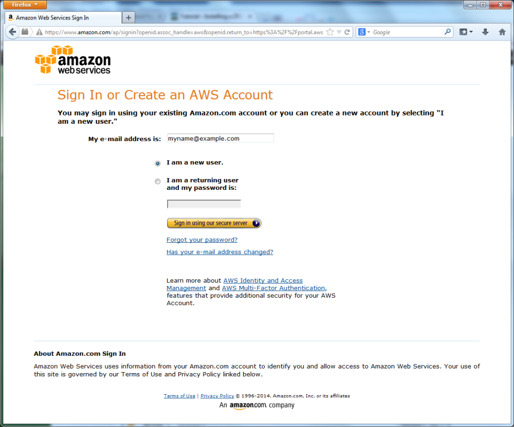

You need to enter your E-mail address, select the *I am a new user* option and click the *Sign in
using our secure server* button. Then you have to pass through several registration steps: account
creation, payment method choice, identity verification and confirmation.

When you are ready with registration, sign into your AWS account, click the *My Account/Console* button
and select *AWS Management Console* from drop-down menu. *AWS Management Console* page appears (shown in the
figure below):

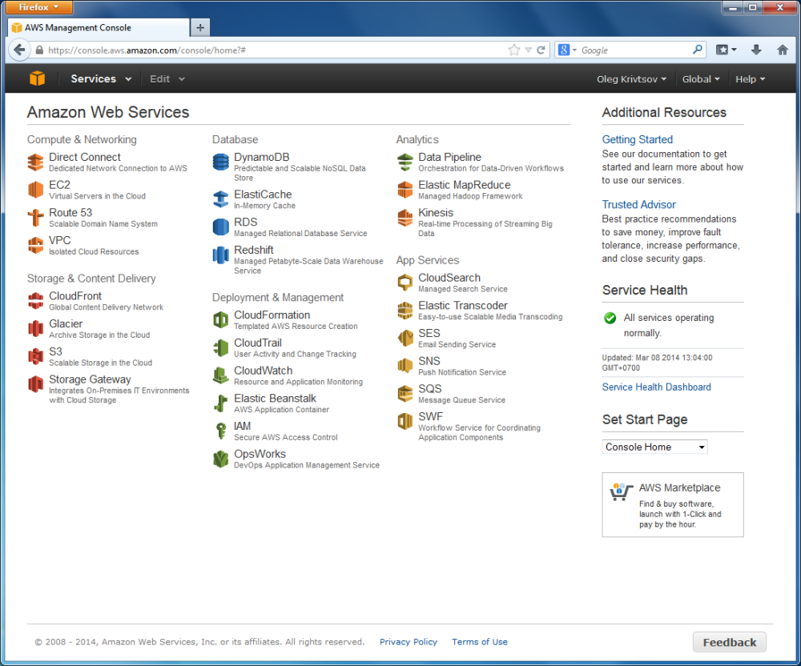

The *AWS Management Console* displays the products currently accessible by you. You are interested in EC2
product (Elastic Compute Cloud, shortly EC2), because EC2 allows to run a virtual Linux server. In terms
of AWS, such a virtual server is also called an EC2 Instance.

## Creating a Key Pair

A key pair is used by AWS to authenticate you when you will connect to the EC2 virtual machine. The key
pair consists of two keys: the public key and the private key. The private key should be stored in a
secret place, and you should not give it to anyone.

Click EC2 icon in your *AWS Management Console* window. *EC2 Console* page appears. The page has a side bar
menu where you can find several sections like *INSTANCES*, *IMAGES*, *ELASTIC BLOCK STORE*, *NETWORK & SECURITY*.

In order to securely connect to your virtual server through SSH protocol, you need to create a key pair.
To do this, in the EC2 Console side bar menu, under *NETWORK & SECURITY* section, click the *Key Pairs* link.

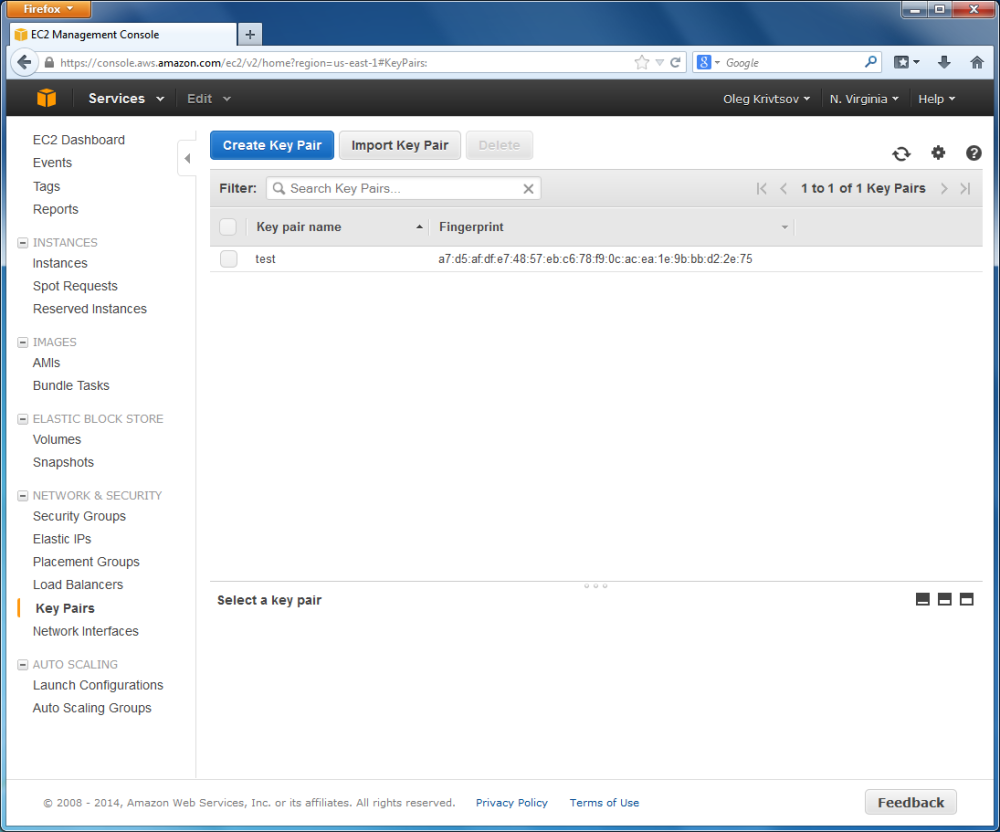

On the page that appears, click the *Create Key Pair* button and enter the name for your new key pair (for example,
enter ‘test’) and press the *Create* button. When your key pair has been generated, you are offered to download
the key as a PEM file. Save the file to some folder – you will need it later.

## Launching EC2 Linux Instance

On the EC2 Console side bar menu, under the *INSTANCES* section, click the *Instances* link, and on the page that
appears, click the *Launch Instance* button. Then you will have to pass through several Wizard-like pages.

### Step 1 – Choose an Amazon Machine Image (AMI)

The first of them is the *Choose an Amazon Machine Image (AMI)* page (shown in the figure below).

On the page that appears, you need to select the Linux distribution you want to run on the virutal machine.
In this tutorial, we choose *Amazon Linux AMI, 64-bit*.

!!! note
    Amazon Linux is a distribution from Red Hat Linux and Cent OS family. The installation instructions are
    common between these distributions. For example, all these distributions use the yum package manager. So, if
    you know how to install a program in Cent OS, you will be able to apply the same steps to install it in Amazon Linux.

    In this tutorial, we use Amazon Linux, but you may select another distribution, if you wish.

Click the *Select* button at the right side of the *Amazon Linux AMI* option.

### Step 2 — Choose an Instance Type

Next, the *Choose an Instance Type* page appears (see the figure below).

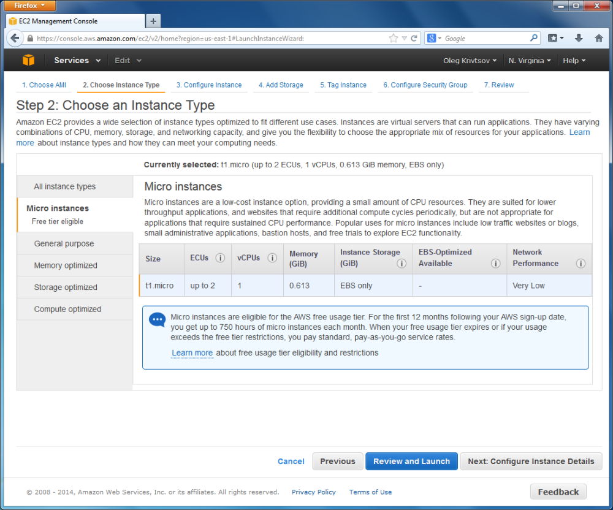

On that page, you can choose the parameters of the virtual machine which affect its performance. In this tutorial,
we will use the *Micro Instance* type, which is available for free usage. Please note that the *Micro Instance* type
is limited in CPU and memory resources, so it is not well suitable for high-load production systems.

Now click the *Next* button to proceed to the next page.

### Step 3 — Configure Instance

The *Configure Instance* page appears (shown in figure below).

On that page, you can edit instance details. It will be enough to set check on the *Enable termination protection*
check box (this will protect the virtual machine from accidental termination).

### Step 4 — Add Storage

Click the *Next* button to go to the *Add Storage* page (see figure below for example).

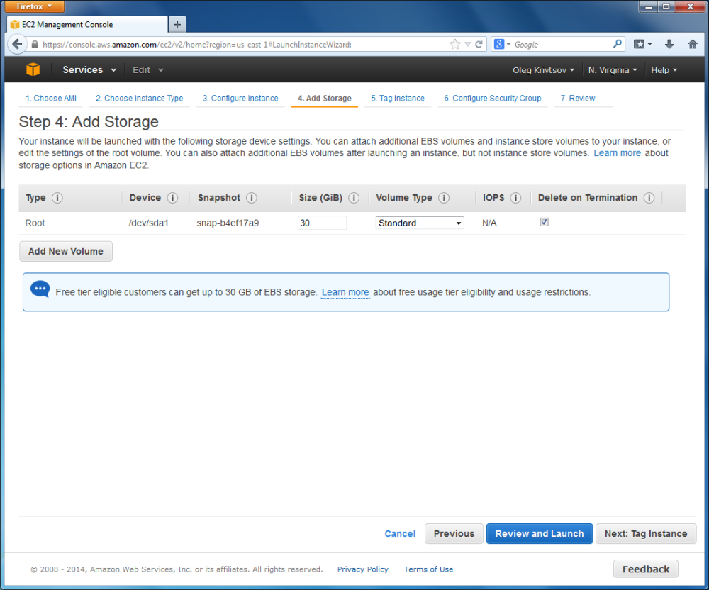

On that page, you can adjust the size of the virtual hard disk drive attached to your virtual machine (for the
free usage, you are able to allocate up to 30 GB of storage space). This disk drive is part of EBS service
(Elastic Block Storage). It is very reliable and automatically backed up to protect your data from accidental loss.

### Step 5 — Tag Instance

Click the *Next* button to go to the next page called *Tag Instance*.

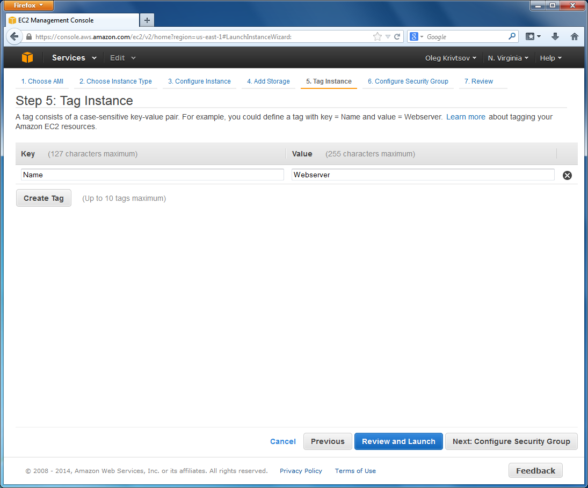

On that page, you will be able to add one or several tags to distinguish this EC2 instance from the others
(in the future, you may launch more instances in your account). For example, add the Name tag and set its
value to "Webserver". This will help you to remember that this instance's purpose is to run the Apache Web Server.

### Step 6 — Security Group

Click the *Next* button to go to the next page called *Security Group* (see below).

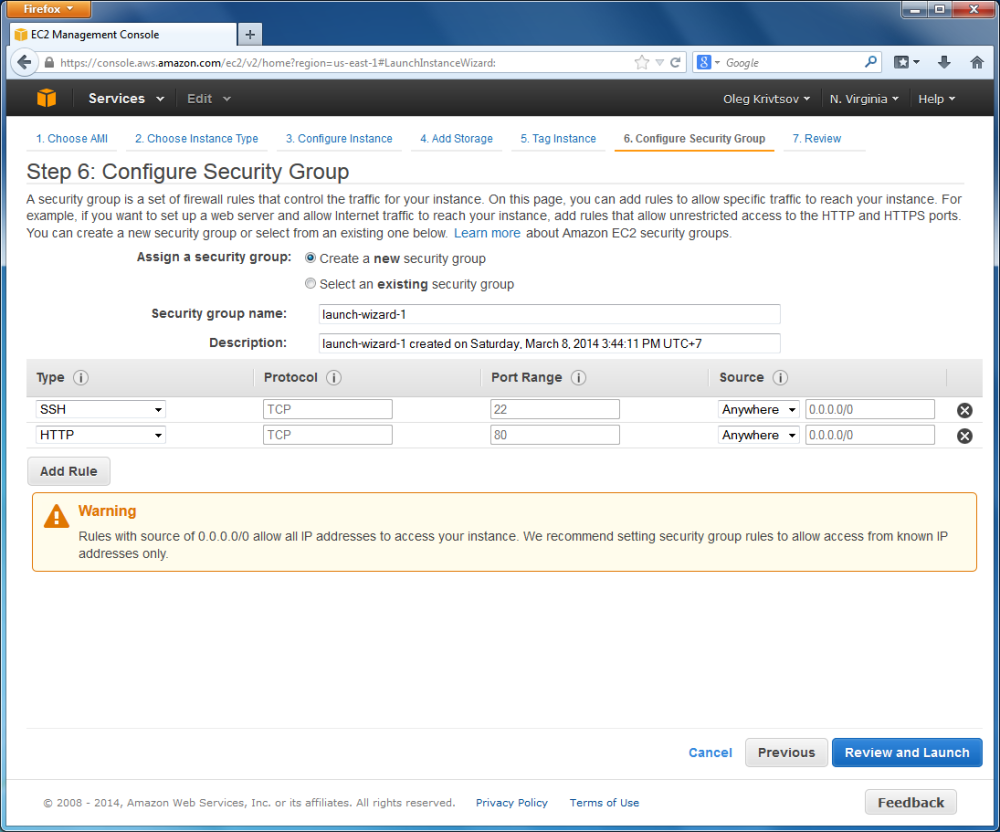

On the *Security Group* page, you need to configure the security group rules (firewall) for the EC2 instance.
The rules define what ports will be open for inbound access. By default, your EC2 instance allows access
through SSH (port 22). You also need to add a rule allowing to access port 80 (HTTP). To do this, click
the *Add Rule* button and enter 80 into the *Port range* field.

### Step 7 — Review Instance Launch

Click the *Next* button to go to the last page named *Review Instance* Launch.

On this page you are able to review the virtual machine settings before you launch it. When you are ready,
click the *Launch* button. The *Select an existing keypair of create a new keypair* pop-up window appears.

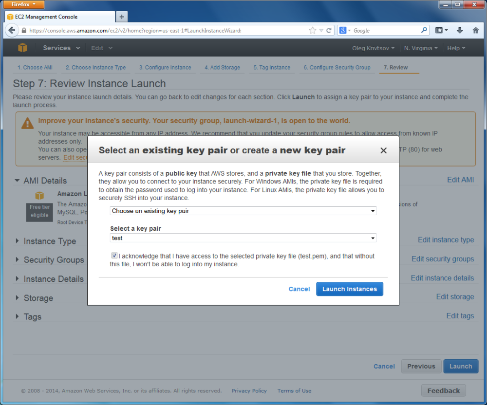

In this window, select the 'test' keypair from the list of existing keypairs (we have created the
'test' keypair earlier) and click the *Launch Instances* button to trigger the instance launch process.

Now you should be able to see your instance on the *Instances* page (see the figure below).

## Assigning an IP Address to the Instance

Every web server on the Internet has a dedicated IP address by which others can refer to it.
Next, you need to assign an IP address to the EC2 instance you have just created. To do this,
click the *Elastic IPs* link in the side bar menu (under *NETWORK & SECURITY* section). On the
page that appears, click *Allocate New Address* button. In the appeared window, click the *Allocate*
button. The new IP address is now displayed in the list of Elastic IPs.

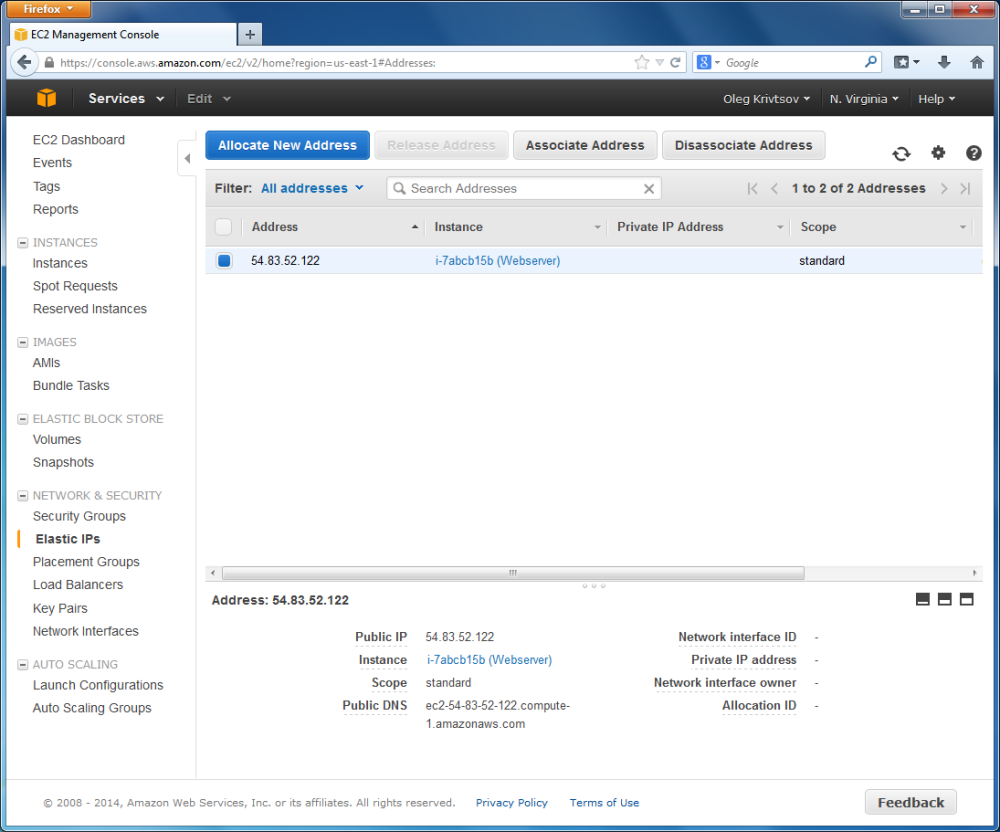

You must immediately assign the created IP address to your instance. To do this, click the
check box to the left of your IP address and click the *Associate Address* button above the
IP address list. In the window that appears, select the instance name and click the
*Yes, Associate* button.

## Connecting to EC2 Instance through SSH

Next we want to connect to the virtual server we’ve just created. In this tutorial, we will use
PuTTY – a free implementation of Telnet and SSH for Windows and Unix platforms.

Download PuTTY archive from [this link](http://the.earth.li/~sgtatham/putty/latest/x86/putty.zip).
Then unzip it to some folder.

You need to import the key pair you have downloaded earlier as a PEM file. To do this, run
*PUTTYGEN.EXE* from PuTTY distribution. *PuTTY Key Generator* window appears. In this window,
click the Load *button* and choose your PEM file to load your existing key pair. Next enter
some password to protect your key (see the image below). Remember the password, because
it will be needed later.

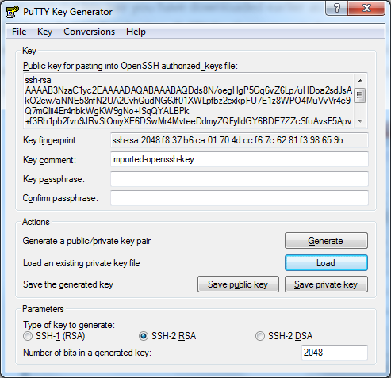

Finally, click the *Save private key* button to save your password-protected key as a PPK file.

Now you are ready to connect to your EC2 instance. Run *PUTTY.EXE* from PuTTY distribution.
The PuTTY Configuration window appears. In that window, select the *Connection->SSH->Auth* category
from the side bar menu and enter the path to your PPK file into the *Private key for connection*
field (see the figure below).

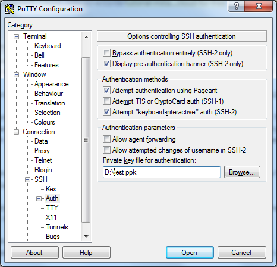

Select *Window->Translation* category from side bar menu and select the UTF-8
encoding from drop-down list (see the figure below for example):

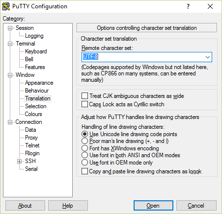

Select *Session* category from side bar menu. Into the *Host name (or IP address)* field, enter the
IP address you assigned to your EC2 instance. In the *Saved sessions* field, enter 'webserver'
and press *Save* button. Now the information you entered is saved, so you don't have to enter it
each time you connect.

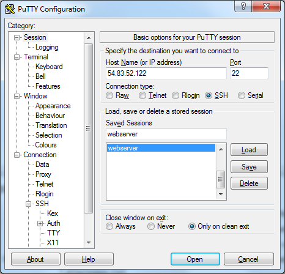

Now double-click the webserver item in the list of saved sessions. Terminal window appears.
You need to enter 'ec2-user' as your login and press Enter. Then enter the password that
you used when creating the PPK file and press Enter again. If everything is OK, you should
be able to see the prompt like in the figure below:

In the shell terminal window, you can type commands and see the results of the command execution.

## Installing Apache HTTP Server and PHP Engine

For Laminas Framework based website to run, you need to have a web server and the PHP engine
installed. The next thing we plan to do is installing Apache Web Server and PHP.

First, it is recommended that you update the system by typing the following shell command:

`sudo yum update`

You do not have to type all commands manually, instead you can copy and paste them.
Select the command in this window and copy it into the clipboard (CTRL+C), then click
your mouse's right button over the PuTTY terminal window to insert the text.

To install Apache HTTP Server, type the following command:

`sudo yum install httpd`

Install the PHP engine:

`sudo yum install php`

And finally, install the PHP engine’s GD extension (this extension is required by the
Hello World web application to run correctly):

`sudo yum install php-gd`

Add Apache HTTP Server to system autorun and start it:

`sudo chkconfig --level 235 httpd on`

`sudo service httpd start`

To check that Apache Web Server works, enter the IP address of your EC2 instance in your
web browser’s navigation bar. If everything is OK, you should see the page like below:

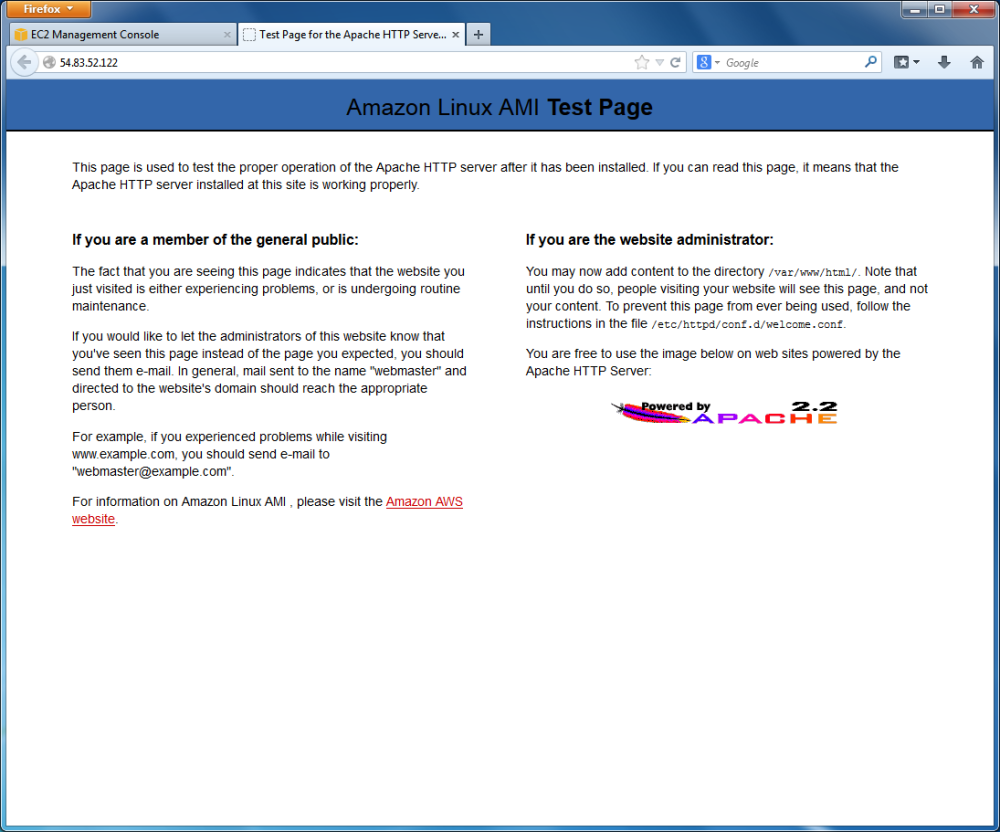

Next, we will edit the PHP config file to set the time zone settings (in this tutorial,
we will use our favorite Midnight Commander editor for this purpose).

Install MC:

`sudo yum install mc`

Open the php.ini file with MC:

`sudo mcedit /etc/php.ini`

Set your time zone settings (replace YOUR_TIMEZONE placeholder with your time zone, for
example, UTC or America/New_York):

`date.timezone = YOUR_TIMEZONE`

When ready, save your changes by pressing the F2 key and then press F10 to exit from
Midnight Commander’s editor.

## Installing the Hello World Web Application

To get the Hello World application code, we will download the code samples archive
bundled with this book from GitHub.

The following shell commands will create directory for downloads and make it current:

`mkdir ~/downloads`

`cd ~/downloads`

Download the code samples archive bundled with the book by typing the following:

`wget https://github.com/olegkrivtsov/using-laminas-book-samples/archive/master.zip`

Unpack the archive with the unzip command and move the files to web server’s document root directory:

`unzip master.zip`

`sudo mv using-laminas-book-samples-master/* /var/www/html`

Next, set file and directory permissions to allow Apache read and write access to the Hello World application files:

`sudo chmod -R 755 /var/www/html/helloworld`

`sudo chown -R apache:apache /var/www/html/helloworld`

### Creating Virtual Host

Now we are almost ready to get our Hello World website live! The last thing we are going to do is
configuring an Apache virtual host. To do that, we will edit the *httpd.conf* file:

`sudo mcedit /etc/httpd/conf/httpd.conf`

If you scroll the file down to its end, you may encounter the commented text block as follows:

~~~
#
# Use name-based virtual hosting.
#
#NameVirtualHost *:80
#
# NOTE: NameVirtualHost cannot be used without a port specifier.
# (e.g. :80) if mod_ssl is being used, due to the nature of the
# SSL protocol.
#

#
# VirtualHost example:
# Almost any Apache directive may go into a VirtualHost container.
# The first VirtualHost section is used for requests without a known
# server name.
#
#<VirtualHost *:80>
#    ServerAdmin webmaster@dummy-host.example.com
#    DocumentRoot /www/docs/dummy-host.example.com
#    ServerName dummy-host.example.com
#    ErrorLog logs/dummy-host.example.com-error_log
#    CustomLog logs/dummy-host.example.com-access_log common
#</VirtualHost>
~~~

To add a virtual host, you’ll have to uncomment this block and add some rules in it.
After your changes, this text block will look like below:

~~~
#
# Use name-based virtual hosting.
#
NameVirtualHost *:80
#
# NOTE: NameVirtualHost cannot be used without a port specifier.
# (e.g. :80) if mod_ssl is being used, due to the nature of the
# SSL protocol.
#

#
# VirtualHost example:
# Almost any Apache directive may go into a VirtualHost container.
# The first VirtualHost section is used for requests without a known
# server name.
#
<VirtualHost *:80>
    ServerAdmin yourname@yourserver.com
    DocumentRoot /var/www/html/helloworld/public
    <Directory /var/www/html/helloworld/public>
        DirectoryIndex index.php
        AllowOverride All
        Require all granted
    </Directory>
</VirtualHost>
~~~

When ready, press F2 to save changes and F10 to exit from Midnight Commander.

Restart Apache to apply your changes:

`sudo service httpd restart`

### Installing Laminas Framework with Composer

Now we will use Composer to install Laminas Framework code and initialize autoloader.
First, go to the directory where you installed the Hello World web application
and type the self-update command to update the Composer:

`cd /var/www/html/helloworld`

`sudo php composer.phar self-update`

The expected output of this command is the following:

~~~
Updating to version 604a65cc31f3e5d8a2b96802135ac24434e87678.
    Downloading: 100%
~~~

Next, type the install command to make Composer to download and install Laminas Framework code:

`sudo php composer.phar install`

The expected output will look like as the following:

~~~
Loading composer repositories with package information
Installing dependencies (including require-dev) from lock file
Warning: The lock file is not up to date with the latest changes in composer.json. You may be getting outdated dependencies. Run update to update them.
  - Installing laminas/laminas (2.2.4)
    Downloading: 100%

    Skipped installation of bin/classmap_generator.php for package laminas/laminas: name conflicts with an existing file
    Skipped installation of bin/pluginmap_generator.php for package laminas/laminas: name conflicts with an existing file
    Skipped installation of bin/templatemap_generator.php for package laminas/laminas: name conflicts with an existing file
laminas/laminas suggests installing doctrine/annotations (Doctrine Annotations >=1.0 for annotation features)
laminas/laminas suggests installing ext-intl (ext/intl for i18n features (included in default builds of PHP))
laminas/laminas suggests installing ircmaxell/random-lib (Fallback random byte generator for Laminas\Math\Rand if OpenSSL/Mcrypt extensions are unavailable)
laminas/laminas suggests installing ocramius/proxy-manager (ProxyManager to handle lazy initialization of services)
laminas/laminas suggests installing laminas/Laminaspdf (LaminasPdf for creating PDF representations of barcodes)
laminas/laminas suggests installing laminas/Laminasservice-recaptcha (LaminasService\ReCaptcha for rendering ReCaptchas in Laminas\Captcha and/or Laminas\Form)
Generating autoload files
~~~

## Results

Once the above steps are done, you will be able to open the Hello World
website in your web browser. If you type the IP address of your EC2
instance in the browser, you should be able to see the following page:

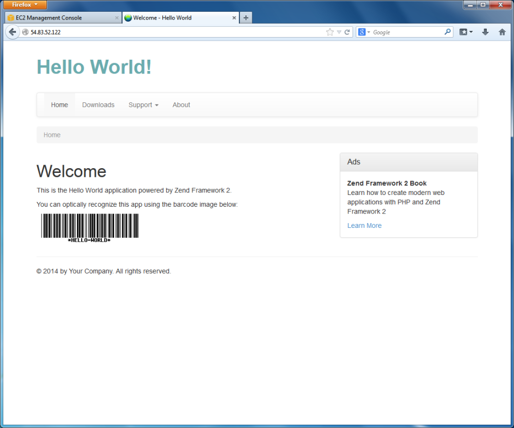

Congratulations! You have completed this tutorial and now you should be able to
install any Laminas Framework based website to an Amazon EC2 instance.

## Summary

When your laminas-based website is ready, you'll need to install it on a publicly acessible web server
to make it visible to other people.

In this tutorial, we have shown how to install a laminas-based website to a Amazon EC2
virtual machine. First, you log in to Amazon Management Console and create a EC2 instanse.
Then you connect to the newly created VM and install Apache HTTP server and PHP engine.
Finally, you copy your website files and install dependencies with Composer. That simple!
