# Role-Based Access Control

If you remember, in the previous chapter we created the User Demo website which allowed us to manage
users and permit access to some web pages to authenticated users only.
In this chapter, we will extend the User Demo and show how to implement the Role-Based Access Control (RBAC).
The RBAC allows to permit or deny access for certain users to certain website
pages based on *roles* and *permissions*.

Since you have already known a lot about Laminas from reading previous chapters, in this chapter we will
omit discussing some obvious things and concentrate on *conceptual* moments only. It is recommended that you refer to
the *Role Demo* sample bundled with this book, which is a complete website that you can run and see everything in action.
All code discussed in this chapter is part of this sample application.

Laminas components covered in this chapter:

| *Component*                    | *Description*                                                 |
|--------------------------------|---------------------------------------------------------------|
| @`Laminas\Permissions\Rbac`        | Provides RBAC container implementation.                       |
| @`Laminas\Cache`                   | Provides functionality for storing data in cache.             |

## Get Role Demo Sample from GitHub

For demonstration, in this chapter, we will create a real-life *Role Demo* website
that shows how to:

 * Implement roles and permissions in your website
 * Organize roles in database into an hierarchy
 * Manage roles and permissions in user interface
 * Use @`Laminas\Permissions\Rbac` component to implement role-based access control
 * Use dynamic assertions to implement complex access control rules

The *Role Demo* sample will be based on the *User Demo* sample that we created in the previous chapter.

To download the *Role Demo* application, visit [this page](https://github.com/olegkrivtsov/using-laminas-book-samples)
and click the *Clone or Download* button to download the code as a ZIP archive.
When download is complete, unpack the archive to some directory.

Then navigate to the `roledemo` directory containing the
source code of the *Role Demo* web application:

~~~text
/using-laminas-book-samples
  /roledemo
  ...
~~~

The *Role Demo* is a website which can be installed on your machine.

!!! note
    Detailed instructions on how to install the *Role Demo* sample can be found in *README.md* file located in the sample directory.

## Introduction to RBAC

Laminas provides a special component named @`Laminas\Permissions\Rbac` which implements a container for roles and permissions.

To install the @`Laminas\Permissions\Rbac` component in your web application, type the following command:

```
php composer.phar require laminas/laminas-permissions-rbac
```

### Roles and Permissions

A *role* is a group of users. For example, in a Blog application, there may be the following roles:
Viewer, Author, Editor, and Administrator.

| *Role Name*                    | *Description*                                                 |
|--------------------------------|---------------------------------------------------------------|
| `Viewer`                       | Can read any post and can do nothing else.                    |
| `Author`                       | Can view posts plus create a post, edit it and finally publish it. |
| `Editor`                       | Can view posts plus edit and publish any post.                |
| `Administrator`                | Can do anything a Viewer and Editor can do plus delete posts. |

Table 17.1. Example roles in a Blog website

A *user* may be assigned a role or several roles at once. For example, user John may be a Viewer
and Editor at the same time.

A role may *inherit* permissions from other roles. In other words, roles may be organized into an hierarchy when
parent roles inherit permissions of child roles. For example, in our Blog application, Administrator role would
inherit permissions from Editor role (see figure 17.1 below). This is because Administrator can do the same things as Editor plus delete posts.
Editor and Author roles would inherit permissions from the Viewer role.

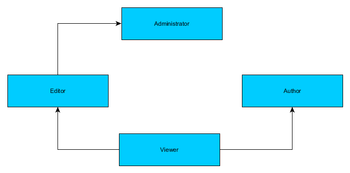

A role may be assigned with several *permissions*. A permission is a single typical action in the system. Here are several examples
of permissions in a Blog website:

| *Permission Name*              | *Description*                                                 |
|--------------------------------|---------------------------------------------------------------|
| `post.view`                    | View any post.                                                |
| `post.edit`                    | Edit any post.                                                |
| `post.own.edit`                | Edit only owned posts.                                        |
| `post.publish`                 | Publish any post.                                             |
| `post.own.publish`             | Publish only owned post.                                      |
| `post.delete`                  | Delete any post.                                              |

Table 17.2. Example permissions in a Blog website

For example, the Viewer role would be assigned the `post.view` permission. The Editor role would be assigned
the `post.edit` and `post.publish` permissions. The Author role would be assigned with
the `post.own.edit` and `post.own.publish` permissions. And the role Administrator would be assigned
with the `post.delete` permission.

### RBAC Container

In Laminas, you can use the @`Rbac` class living in @`Laminas\Permissions\Rbac` namespace as a simple container for your
roles and permissions. With this container, you store your roles in memory organized in an hierarchy and assigned
with permissions.

For example, let's create an @`Rbac` container for the Blog application and fill it with roles and permissions:

~~~php
use Laminas\Permissions\Rbac\Rbac;

// Create Rbac container.
$rbac = new Rbac();

// The following is to tell Rbac to create some parent roles if not exist yet
$rbac->setCreateMissingRoles(true);

// Create role hierarchy
$rbac->addRole('Viewer', ['Editor', 'Author']);
$rbac->addRole('Editor', ['Administrator']);
$rbac->addRole('Author');
$rbac->addRole('Administrator');

// Assign permissions to the Viewer role.
$rbac->getRole('Viewer')->addPermission('post.view');

// Assign permissions to the Author role.
$rbac->getRole('Author')->addPermission('post.own.edit');
$rbac->getRole('Author')->addPermission('post.own.publish');

// Assign permissions to the Editor role.
$rbac->getRole('Editor')->addPermission('post.edit');
$rbac->getRole('Editor')->addPermission('post.publish');

// Assign permissions to the Administrator role.
$rbac->getRole('Administrator')->addPermission('post.delete');
~~~

As you can see, a role is added to the @`Rbac` container with the help of the `addRole()` method.
The `addRole()` method takes two arguments: the name of the role to be created, and the name(s)
of its parent role(s). If the parent roles do not exist yet, they are created automatically
(for that purpose we use the `setCreateMissingRoles()` method).

Permissions are assigned to the created role with the help of role's `addPermission()` method.

### Checking Permissions

When you have an @`Rbac` container set up, you can query if the role has certain permission
with the `isGranted()` method, as follows:

~~~php
// The following will return false, because the Viewer can't delete posts
$rbac->isGranted('Viewer', 'post.delete');

// The following will return true, because admins can delete posts
$rbac->isGranted('Administrator', 'post.delete');
~~~

The `isGranted()` method checks the role and its children and looks for the given permission. If it finds
the permission, it returns `true`; otherwise `false`.

## Default Roles in the Role Demo Sample

Since our Role Demo application is designed to be the base for your own more complex websites,
for our Role Demo sample, we will have only the following simple default roles: Administrator and Guest.

You will be able to add more roles via user interface of the website.

We will have the following default permissions:

| *Permission Name*              | *Description*                                                 |
|--------------------------------|---------------------------------------------------------------|
| `user.manage`                  | Manage users (add/edit/delete).                               |
| `role.manage`                  | Manage roles (add/edit/delete).                               |
| `permission.manage`            | Manage permissions (add/edit/delete).                         |
| `profile.any.view`             | View any user profile in the system.                          |
| `profile.own.view`             | View own profile.                                             |

Table 17.3. Default permissions in the Role Demo website

The first three permissions will allow Administrator to manage users, roles and permissions via user interface.

The last two permissions (`profile.any.view` and `profile.own.view`) are mostly for demonstration of
how Rbac works and can in theory be deleted from your own website if you do not have the user profile page.

The `profile.any.view` allows Administrator to access *http://localhost/application/settings/&lt;user_id&gt;* page,
which is the user profile of a user with the given ID.

The `profile.own.view` allows Guest to access their own profile page *http://localhost/application/settings*.

You will be able to create additional permissions via the user interface of the website.

## Introduction to Dynamic Assertions

You might notice that for the Blog example we had two "special" permissions named `post.own.edit` and `post.own.publish`.
Those permissions are special, because they allow the author to edit *only* the posts he is the creator of.

To "check" such permission against the real user, we need to additionally determine if the post really
belongs to that user. This is called a *dynamic assertion*.

In the Role Demo website, we also will have a special permission called `profile.own.view`. What makes it special
is that it allows the user to view a profile the user is the owner of.

To implement dynamic assertions in the *Role Demo* sample, we will use a special service called the *assertion manager*.
This assertion manager will be implemented as the `RbacAssertionManager` class, which lives in the
`Application\Service` namespace and looks like the following:

~~~php
<?php
namespace Application\Service;

use Laminas\Permissions\Rbac\Rbac;
use User\Entity\User;

/**
 * This service is used for invoking user-defined RBAC dynamic assertions.
 */
class RbacAssertionManager
{
    /**
     * Entity manager.
     * @var Doctrine\ORM\EntityManager
     */
    private $entityManager;

    /**
     * Auth service.
     * @var Laminas\Authentication\AuthenticationService
     */
    private $authService;

    /**
     * Constructs the service.
     */
    public function __construct($entityManager, $authService)
    {
        $this->entityManager = $entityManager;
        $this->authService = $authService;
    }

    /**
     * This method is used for dynamic assertions.
     */
    public function assert(Rbac $rbac, $permission, $params)
    {
        $currentUser = $this->entityManager->getRepository(User::class)
                ->findOneByEmail($this->authService->getIdentity());

        if ($permission=='profile.own.view' && $params['user']->getId()==$currentUser->getId())
            return true;

        return false;
    }
}
~~~

As you can see from the code above, the class has the `assert()` method which accepts three arguments:

  * the `$rbac` is the container of our roles and permissions;
  * the `$permission` is the name of the permission to check;
  * the `$params` is an array of parameters (it can be used for example to pass the user owning the blog post).

Inside the `assert()` method, we can get the currently logged in user and compare it with the user passed, this
way we can return `true` if the user is trying to open its own profile; otherwise `false`.

!!! note
    In theory, you can have many assertion managers in your website (for example, if your Blog module has some
    dynamic assertions, you can create and register an assertion manager for that module).

## Setting Up the Database

In our Role Demo sample, we will store the role hierarchy in the "roledemo" database.
We will create the following tables (see figure 17.2):

  * `role` table will contain data related to a role (its name and description)
  * `role_hierarchy` table will contain parent-child relationships between roles
  * `permission` table will contain permissions
  * `role_permission` table will allow to assign permissions to roles
  * `user_role` table will allow to assign roles to users
  * `user` table will contain data of users (we created this table earlier in *User Demo* sample)

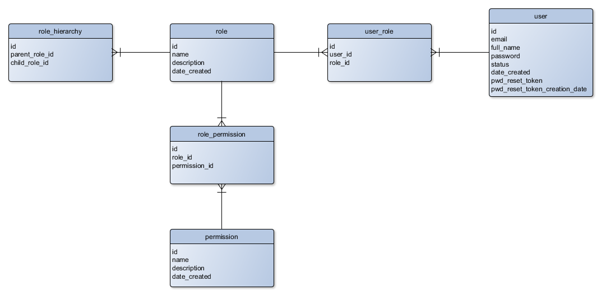

You can find a database migration, which creates these tables, in the *Role Demo* sample application. To run migrations,
type the following command:

~~~bash
./vendor/bin/doctrine-module migrations:migrate
~~~

!!! note
    If you are new to migrations, refer to chapter [Database Migrations](#migrations).

## Implementing Entities

The *Role Demo* sample uses Doctrine ORM for managing database. We have already learned how to use Doctrine in
[Database Management with Doctrine ORM](#doctrine).

For storing information about roles and permissions in database, we will create the `Role` and `Permission`
entities. The `Role` entity is mapped
onto the `role` database table, while the `Permission` entity is mapped onto the `permission` table.
Those are typical Doctrine entity classes.

Create the *Role.php* file inside the *Entity* directory under the *User* module's source directory. Put
the following code into that file:

~~~php
<?php
namespace User\Entity;

use Doctrine\ORM\Mapping as ORM;
use Doctrine\Common\Collections\ArrayCollection;

/**
 * This class represents a role.
 * @ORM\Entity()
 * @ORM\Table(name="role")
 */
class Role
{
    /**
     * @ORM\Id
     * @ORM\Column(name="id")
     * @ORM\GeneratedValue
     */
    protected $id;

    /**
     * @ORM\Column(name="name")
     */
    protected $name;

    /**
     * @ORM\Column(name="description")
     */
    protected $description;

    /**
     * @ORM\Column(name="date_created")
     */
    protected $dateCreated;

    /**
     * @ORM\ManyToMany(targetEntity="User\Entity\Role")
     * @ORM\JoinTable(name="role_hierarchy",
     *      joinColumns={@ORM\JoinColumn(name="child_role_id", referencedColumnName="id")},
     *      inverseJoinColumns={@ORM\JoinColumn(name="parent_role_id", referencedColumnName="id")}
     *      )
     */
    private $parentRoles;

    /**
     * @ORM\ManyToMany(targetEntity="User\Entity\Role")
     * @ORM\JoinTable(name="role_hierarchy",
     *      joinColumns={@ORM\JoinColumn(name="parent_role_id", referencedColumnName="id")},
     *      inverseJoinColumns={@ORM\JoinColumn(name="child_role_id", referencedColumnName="id")}
     *      )
     */
    protected $childRoles;

    /**
     * @ORM\ManyToMany(targetEntity="User\Entity\Permission")
     * @ORM\JoinTable(name="role_permission",
     *      joinColumns={@ORM\JoinColumn(name="role_id", referencedColumnName="id")},
     *      inverseJoinColumns={@ORM\JoinColumn(name="permission_id", referencedColumnName="id")}
     *      )
     */
    private $permissions;

    /**
     * Constructor.
     */
    public function __construct()
    {
        $this->parentRoles = new ArrayCollection();
        $this->childRoles = new ArrayCollection();
        $this->permissions = new ArrayCollection();
    }

    /**
     * Returns role ID.
     * @return integer
     */
    public function getId()
    {
        return $this->id;
    }

    /**
     * Sets role ID.
     * @param int $id
     */
    public function setId($id)
    {
        $this->id = $id;
    }

    public function getName()
    {
        return $this->name;
    }

    public function setName($name)
    {
        $this->name = $name;
    }

    public function getDescription()
    {
        return $this->description;
    }

    public function setDescription($description)
    {
        $this->description = $description;
    }

    public function getDateCreated()
    {
        return $this->dateCreated;
    }

    public function setDateCreated($dateCreated)
    {
        $this->dateCreated = $dateCreated;
    }

    public function getParentRoles()
    {
        return $this->parentRoles;
    }

    public function getChildRoles()
    {
        return $this->childRoles;
    }

    public function getPermissions()
    {
        return $this->permissions;
    }

    public function addParent(Role $role)
    {
        if ($this->getId() == $role->getId()) {
            return false;
        }
        if (!$this->hasParent($role)) {
            $this->parentRoles[] = $role;
            return true;
        }
        return false;
    }

    public function clearParentRoles()
    {
        $this->parentRoles = new ArrayCollection();
    }

    public function hasParent(Role $role)
    {
        if ($this->getParentRoles()->contains($role)) {
            return true;
        }
        return false;
    }
}
~~~

As you could determine from the code above, the *Role* entity is a typical Doctrine entity having
annotated properties and getter and setter methods for retrieving/setting those properties.

Next, create the *Permission.php* file inside the *Entity* directory under the *User* module's source directory. Put
the following code into that file:

~~~php
<?php
namespace User\Entity;

use Doctrine\ORM\Mapping as ORM;
use Doctrine\Common\Collections\ArrayCollection;

/**
 * This class represents a permission.
 * @ORM\Entity()
 * @ORM\Table(name="permission")
 */
class Permission
{
    /**
     * @ORM\Id
     * @ORM\Column(name="id")
     * @ORM\GeneratedValue
     */
    protected $id;

    /**
     * @ORM\Column(name="name")
     */
    protected $name;

    /**
     * @ORM\Column(name="description")
     */
    protected $description;

    /**
     * @ORM\Column(name="date_created")
     */
    protected $dateCreated;

    /**
     * @ORM\ManyToMany(targetEntity="User\Entity\Role")
     * @ORM\JoinTable(name="role_permission",
     *      joinColumns={@ORM\JoinColumn(name="permission_id", referencedColumnName="id")},
     *      inverseJoinColumns={@ORM\JoinColumn(name="role_id", referencedColumnName="id")}
     *      )
     */
    private $roles;

    /**
     * Constructor.
     */
    public function __construct()
    {
        $this->roles = new ArrayCollection();
    }

    public function getId()
    {
        return $this->id;
    }

    public function setId($id)
    {
        $this->id = $id;
    }

    public function getName()
    {
        return $this->name;
    }

    public function setName($name)
    {
        $this->name = $name;
    }

    public function getDescription()
    {
        return $this->description;
    }

    public function setDescription($description)
    {
        $this->description = $description;
    }

    public function getDateCreated()
    {
        return $this->dateCreated;
    }

    public function setDateCreated($dateCreated)
    {
        $this->dateCreated = $dateCreated;
    }

    public function getRoles()
    {
        return $this->roles;
    }
}
~~~

Finally, we will slightly extend the `User` entity that already created in the *User Demo* website and add
the property and methods related to roles:

~~~php
<?php
namespace User\Entity;

use Doctrine\ORM\Mapping as ORM;
use Doctrine\Common\Collections\ArrayCollection;

/**
 * This class represents a registered user.
 * @ORM\Entity()
 * @ORM\Table(name="user")
 */
class User
{
    // User status constants.
    const STATUS_ACTIVE       = 1; // Active user.
    const STATUS_RETIRED      = 2; // Retired user.

    /**
     * @ORM\Id
     * @ORM\Column(name="id")
     * @ORM\GeneratedValue
     */
    protected $id;

    /**
     * @ORM\Column(name="email")
     */
    protected $email;

    /**
     * @ORM\Column(name="full_name")
     */
    protected $fullName;

    /**
     * @ORM\Column(name="password")
     */
    protected $password;

    /**
     * @ORM\Column(name="status")
     */
    protected $status;

    /**
     * @ORM\Column(name="date_created")
     */
    protected $dateCreated;

    /**
     * @ORM\Column(name="pwd_reset_token")
     */
    protected $passwordResetToken;

    /**
     * @ORM\Column(name="pwd_reset_token_creation_date")
     */
    protected $passwordResetTokenCreationDate;

    /**
     * @ORM\ManyToMany(targetEntity="User\Entity\Role")
     * @ORM\JoinTable(name="user_role",
     *      joinColumns={@ORM\JoinColumn(name="user_id", referencedColumnName="id")},
     *      inverseJoinColumns={@ORM\JoinColumn(name="role_id", referencedColumnName="id")}
     *      )
     */
    private $roles;

    /**
     * Constructor.
     */
    public function __construct()
    {
        $this->roles = new ArrayCollection();
    }

    /**
     * Returns user ID.
     * @return integer
     */
    public function getId()
    {
        return $this->id;
    }

    /**
     * Sets user ID.
     * @param int $id
     */
    public function setId($id)
    {
        $this->id = $id;
    }

    /**
     * Returns email.
     * @return string
     */
    public function getEmail()
    {
        return $this->email;
    }

    /**
     * Sets email.
     * @param string $email
     */
    public function setEmail($email)
    {
        $this->email = $email;
    }

    /**
     * Returns full name.
     * @return string
     */
    public function getFullName()
    {
        return $this->fullName;
    }

    /**
     * Sets full name.
     * @param string $fullName
     */
    public function setFullName($fullName)
    {
        $this->fullName = $fullName;
    }

    /**
     * Returns status.
     * @return int
     */
    public function getStatus()
    {
        return $this->status;
    }

    /**
     * Returns possible statuses as array.
     * @return array
     */
    public static function getStatusList()
    {
        return [
            self::STATUS_ACTIVE => 'Active',
            self::STATUS_RETIRED => 'Retired'
        ];
    }

    /**
     * Returns user status as string.
     * @return string
     */
    public function getStatusAsString()
    {
        $list = self::getStatusList();
        if (isset($list[$this->status]))
            return $list[$this->status];

        return 'Unknown';
    }

    /**
     * Sets status.
     * @param int $status
     */
    public function setStatus($status)
    {
        $this->status = $status;
    }

    /**
     * Returns password.
     * @return string
     */
    public function getPassword()
    {
       return $this->password;
    }

    /**
     * Sets password.
     * @param string $password
     */
    public function setPassword($password)
    {
        $this->password = $password;
    }

    /**
     * Returns the date of user creation.
     * @return string
     */
    public function getDateCreated()
    {
        return $this->dateCreated;
    }

    /**
     * Sets the date when this user was created.
     * @param string $dateCreated
     */
    public function setDateCreated($dateCreated)
    {
        $this->dateCreated = $dateCreated;
    }

    /**
     * Returns password reset token.
     * @return string
     */
    public function getResetPasswordToken()
    {
        return $this->passwordResetToken;
    }

    /**
     * Sets password reset token.
     * @param string $token
     */
    public function setPasswordResetToken($token)
    {
        $this->passwordResetToken = $token;
    }

    /**
     * Returns password reset token's creation date.
     * @return string
     */
    public function getPasswordResetTokenCreationDate()
    {
        return $this->passwordResetTokenCreationDate;
    }

    /**
     * Sets password reset token's creation date.
     * @param string $date
     */
    public function setPasswordResetTokenCreationDate($date)
    {
        $this->passwordResetTokenCreationDate = $date;
    }

    /**
     * Returns the array of roles assigned to this user.
     * @return array
     */
    public function getRoles()
    {
        return $this->roles;
    }

    /**
     * Returns the string of assigned role names.
     */
    public function getRolesAsString()
    {
        $roleList = '';

        $count = count($this->roles);
        $i = 0;
        foreach ($this->roles as $role) {
            $roleList .= $role->getName();
            if ($i<$count-1)
                $roleList .= ', ';
            $i++;
        }

        return $roleList;
    }

    /**
     * Assigns a role to user.
     */
    public function addRole($role)
    {
        $this->roles->add($role);
    }
}
~~~

## Implementing Role Management

In the Role Demo sample, we will create a convenient user interface for managing roles.

!!! note
    You can access the role management page by logging in as `admin@example.com` and opening
    menu Admin -> Manage Roles.

The role management will be implemented inside the `RoleController` controller living in the
`User\Controller` namespace. The action methods of the `RoleController` are listed in table 17.4:

| *Action Name*                  | *Description*                                                 |
|--------------------------------|---------------------------------------------------------------|
| `addAction()`                  | Allows to add a new role.                                     |
| `deleteAction()`               | Deletes an existing role.                                     |
| `editAction()`                 | Allows to edit an existing role.                              |
| `editPermissionsAction()`      | Allows to assign permissions to a role.                       |
| `indexAction()`                | Displays the list of existing roles.                          |
| `viewAction()`                 | Displays the details of a role.                               |

Table 17.4. Actions of the RoleController controller

The `RoleController` works in pair with the `RoleManager` service which lives in `User\Service` namespace.

The `RoleController` and `RoleManager` contain nothing new and special, so we will skip their
discussion here and will just provide some screenshots of the resulting user interface below.

!!! note
    You can find the complete code of the `RoleController` and `RoleManager` classes in the Role Demo sample.

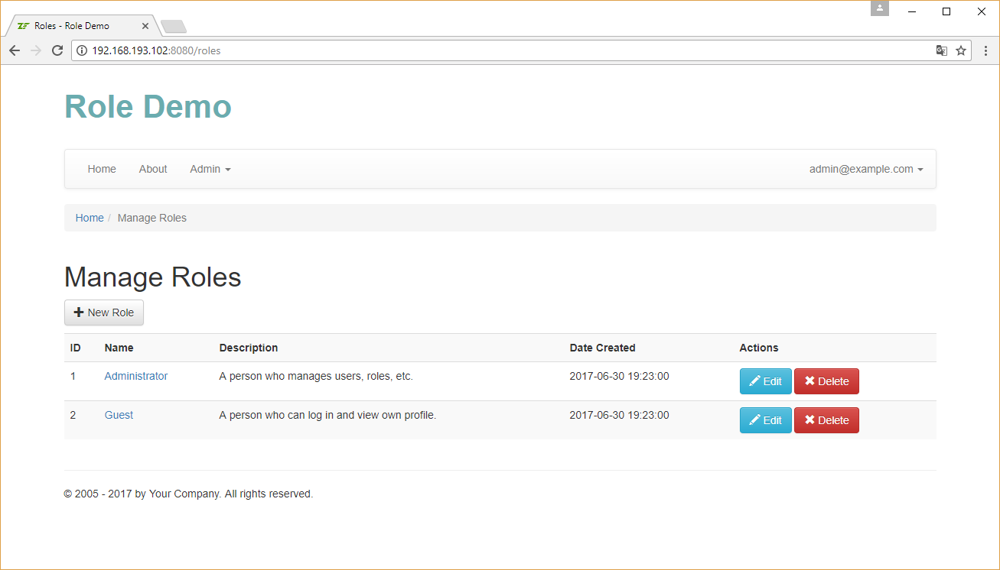

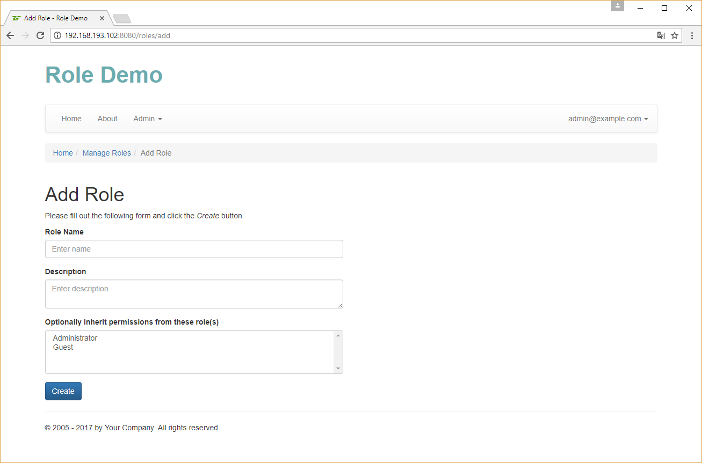

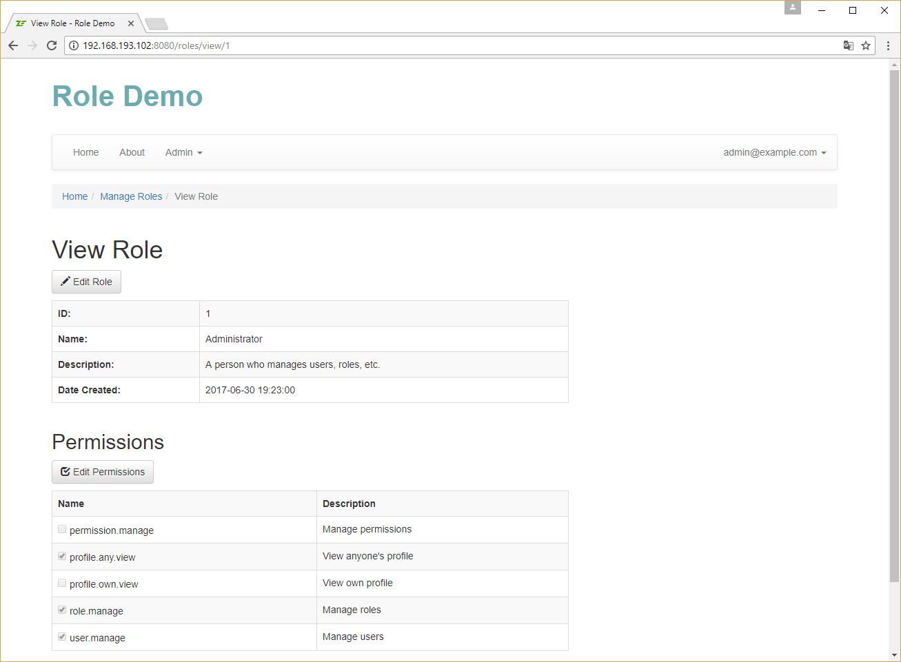

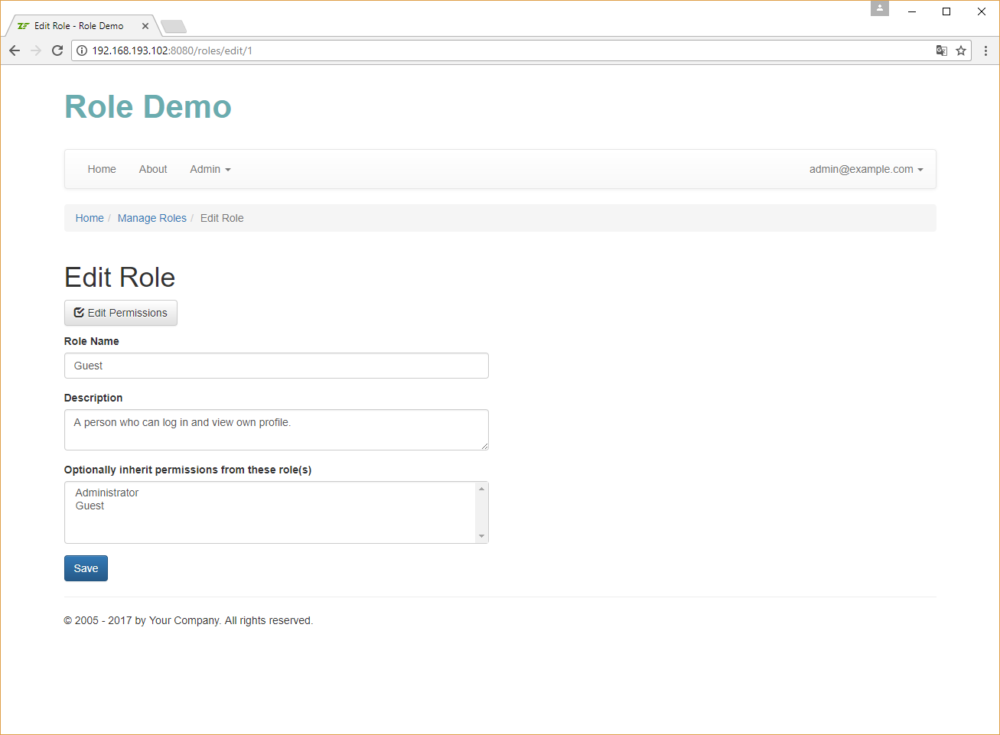

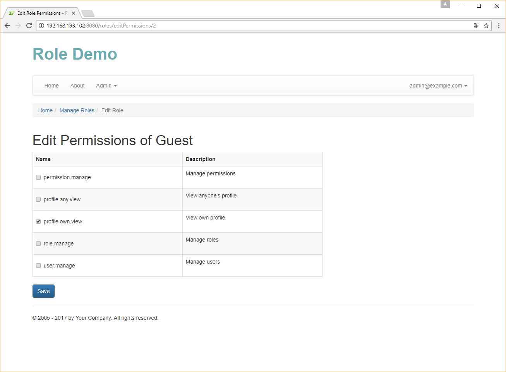

## Implementing Permission Management

In the Role Demo sample, we will create a convenient user interface for managing permissions.
It will be useful if you plan to add new permissions or remove existing ones.

!!! note
    You can access the permission management page by logging in as `admin@example.com` and opening
    menu Admin -> Manage Permissions.

The permission management will be implemented inside the `PermissionController` controller living in the
`User\Controller` namespace. The action methods of the `PermissionController` are listed in table 17.5:

| *Action Name*                  | *Description*                                                 |
|--------------------------------|---------------------------------------------------------------|
| `addAction()`                  | Allows to add a new permission.                               |
| `deleteAction()`               | Deletes an existing permission.                               |
| `editAction()`                 | Allows to edit an existing permission.                        |
| `indexAction()`                | Displays the list of existing permissions.                    |
| `viewAction()`                 | Displays the details of a permission.                         |

Table 17.5. Actions of the PermissionController controller

The `PermissionController` works in pair with the `PermissionManager` service which
lives in `User\Service` namespace.

The `PermissionController` and `PermissionManager` contain nothing new and special, so we will skip their
discussion here and will just provide some screenshots of the resulting user interface below.

!!! note
    You can find the complete code of the `PermissionController` and `PermissionManager` classes in the Role Demo sample.

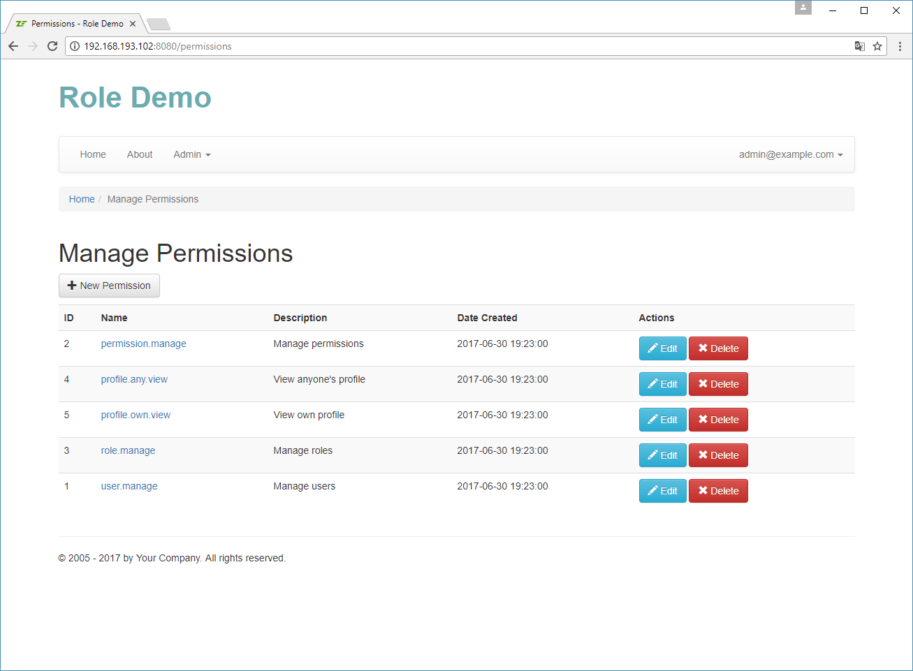

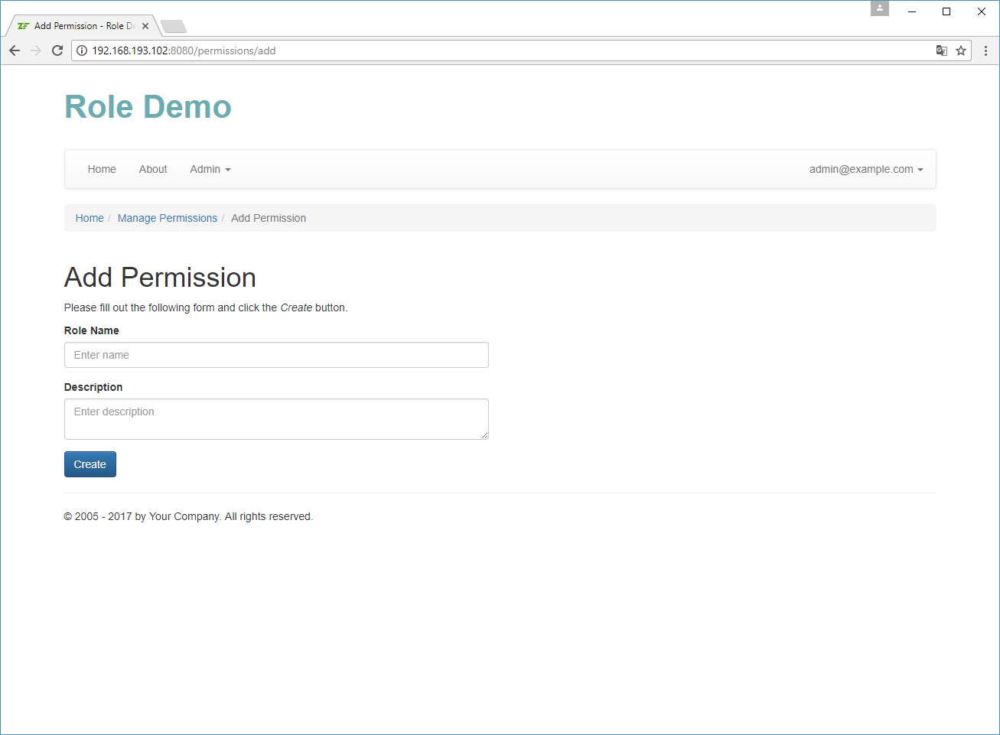

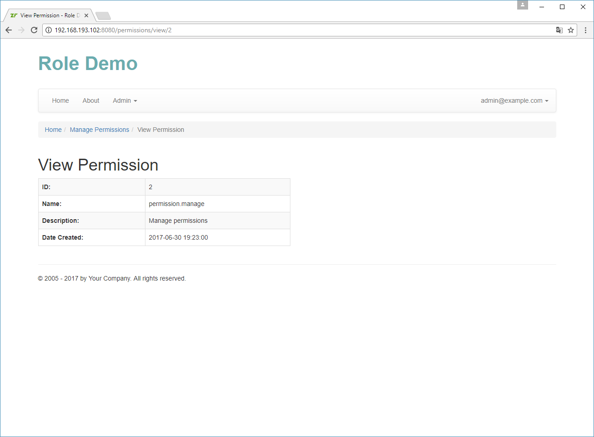

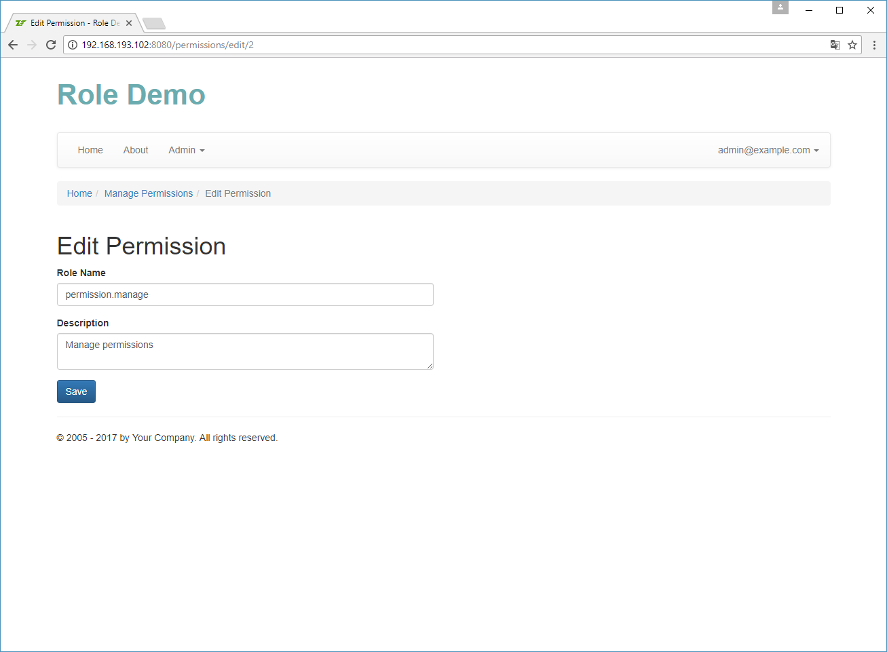

## Assigning Roles to a User

In the Role Demo website, you can assign roles to a user via the convenient user interface.
Open the *Admin -> Manage Users* menu and click *Edit* on the user of your choice. On the
page that appears, select the roles you'd like to assign to the user and click the *Save* button.

This functionality contain nothing new and special, so we will skip its detailed
discussion here and will just provide a screenshot of the user interface below.

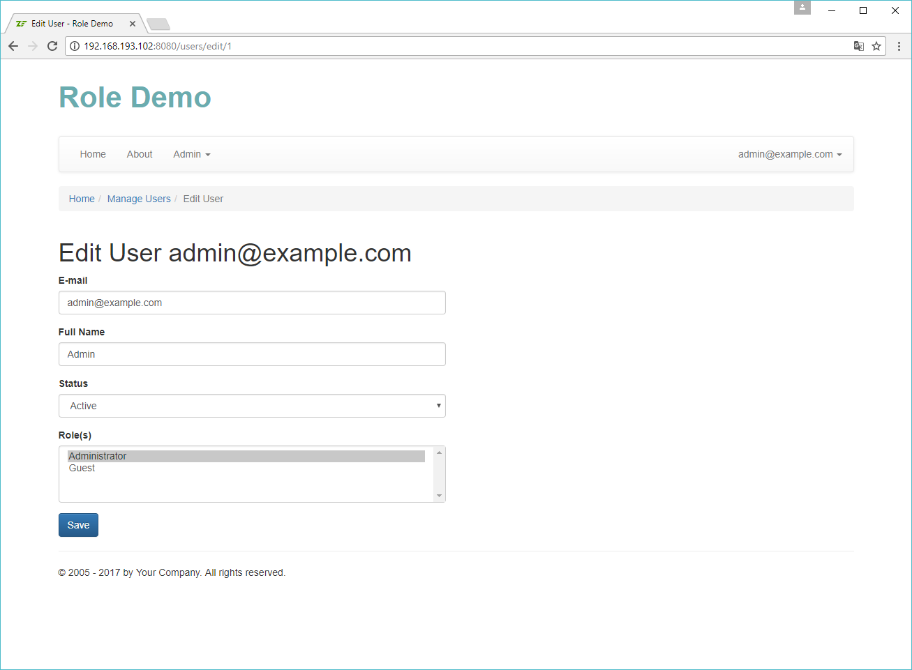

## Implementing RbacManager

The next thing we will discuss will be the functionality for creating the `Rbac` container,
whose purpose is loading the role hierarchy from the database,
and caching the data in the filesystem cache.

!!! note
    The *cache* allows to store frequently used data in fast storage. For example, retrieving roles
    and permissions from database on each page load may be rather slow, while storing the precomputed
    role hierarchy in a file may be faster.

### Setting Up Caching

First, let's set up caching. To do that, you need to install the `Laminas\Cache` and `Laminas\Serializer` components with
the following commands:

~~~bash
php composer.phar require laminas/laminas-cache
php composer.phar require laminas/laminas-serializer
~~~

Finally, edit the *config/autoload/global.php* and add the following lines:

~~~php
use Laminas\Cache\Storage\Adapter\Filesystem;

return [
    //...
    // Cache configuration.
    'caches' => [
        'FilesystemCache' => [
            'adapter' => [
                'name'    => Filesystem::class,
                'options' => [
                    // Store cached data in this directory.
                    'cache_dir' => './data/cache',
                    // Store cached data for 1 hour.
                    'ttl' => 60*60*1
                ],
            ],
            'plugins' => [
                [
                    'name' => 'serializer',
                    'options' => [
                    ],
                ],
            ],
        ],
    ],
    //...
];
~~~

This will allow you to use the `Filesystem` cache and store cached data
in *APP_DIR/data/cache* directory.

!!! note
    If you want to learn more about caching, please refer to the `Laminas\Cache` Laminas component
    documentation.

### Writing the RbacManager Service

The purpose of the `RbacManager` service will be to construct the `Rbac` container and load
the roles and permissions from database. If the needed information is already saved to cache,
it will load it from cache instead of loading from database.

Another goal of the `RbacManager` service will be to use the assertion manager we wrote earlier
and check for dynamic assertions.

The `RbacManager` class will have two methods:

  * the `init()` method will be used to load role hierarchy from database and save it in cache;
  * the `isGranted()` method will be used to query the `Rbac` container if the given *user* has the given permission
    (and checking the assertion manager(s) for the dynamic assertions).

The `RbacManager` class will read the configuration and look for the `rbac_manager` key.
The key should contain the `assertions` subkey, in which you can register all assertion managers that you have.

~~~php
return [
    //...

    // This key stores configuration for RBAC manager.
    'rbac_manager' => [
        'assertions' => [Service\RbacAssertionManager::class],
    ],
];
~~~

The code of the `RbacManager` class living in `User\Service` namespace is presented below.

~~~php
<?php
namespace User\Service;

use Laminas\Permissions\Rbac\Rbac;
use Laminas\Permissions\Rbac\Role as RbacRole;
use User\Entity\User;
use User\Entity\Role;
use User\Entity\Permission;

/**
 * This service is responsible for initialzing RBAC (Role-Based Access Control).
 */
class RbacManager
{
    /**
     * Doctrine entity manager.
     * @var Doctrine\ORM\EntityManager
     */
    private $entityManager;

    /**
     * RBAC service.
     * @var Laminas\Permissions\Rbac\Rbac
     */
    private $rbac;

    /**
     * Auth service.
     * @var Laminas\Authentication\AuthenticationService
     */
    private $authService;

    /**
     * Filesystem cache.
     * @var Laminas\Cache\Storage\StorageInterface
     */
    private $cache;

    /**
     * Assertion managers.
     * @var array
     */
    private $assertionManagers = [];

    /**
     * Constructs the service.
     */
    public function __construct($entityManager, $authService, $cache, $assertionManagers)
    {
        $this->entityManager = $entityManager;
        $this->authService = $authService;
        $this->cache = $cache;
        $this->assertionManagers = $assertionManagers;
    }

    /**
     * Initializes the RBAC container.
     */
    public function init($forceCreate = false)
    {
        if ($this->rbac!=null && !$forceCreate) {
            // Already initialized; do nothing.
            return;
        }

        // If user wants us to reinit RBAC container, clear cache now.
        if ($forceCreate) {
            $this->cache->removeItem('rbac_container');
        }

        // Try to load Rbac container from cache.
        $this->rbac = $this->cache->getItem('rbac_container', $result);
        if (!$result)
        {
            // Create Rbac container.
            $rbac = new Rbac();
            $this->rbac = $rbac;

            // Construct role hierarchy by loading roles and permissions from database.

            $rbac->setCreateMissingRoles(true);

            $roles = $this->entityManager->getRepository(Role::class)
                    ->findBy([], ['id'=>'ASC']);
            foreach ($roles as $role) {

                $roleName = $role->getName();

                $parentRoleNames = [];
                foreach ($role->getParentRoles() as $parentRole) {
                    $parentRoleNames[] = $parentRole->getName();
                }

                $rbac->addRole($roleName, $parentRoleNames);

                foreach ($role->getPermissions() as $permission) {
                    $rbac->getRole($roleName)->addPermission($permission->getName());
                }
            }

            // Save Rbac container to cache.
            $this->cache->setItem('rbac_container', $rbac);
        }
    }

    /**
     * Checks whether the given user has permission.
     * @param User|null $user
     * @param string $permission
     * @param array|null $params
     */
    public function isGranted($user, $permission, $params = null)
    {
        if ($this->rbac==null) {
            $this->init();
        }

        if ($user==null) {

            $identity = $this->authService->getIdentity();
            if ($identity==null) {
                return false;
            }

            $user = $this->entityManager->getRepository(User::class)
                    ->findOneByEmail($identity);
            if ($user==null) {
                // Oops.. the identity presents in session, but there is no such user in database.
                // We throw an exception, because this is a possible security problem.
                throw new \Exception('There is no user with such identity');
            }
        }

        $roles = $user->getRoles();

        foreach ($roles as $role) {
            if ($this->rbac->isGranted($role->getName(), $permission)) {

                if ($params==null)
                    return true;

                foreach ($this->assertionManagers as $assertionManager) {
                    if ($assertionManager->assert($this->rbac, $permission, $params))
                        return true;
                }
            }

            $parentRoles = $role->getParentRoles();
            foreach ($parentRoles as $parentRole) {
                if ($this->rbac->isGranted($parentRole->getName(), $permission)) {
                    return true;
                }
            }
        }

        return false;
    }
}
~~~

The factory for the `RbacManager` class looks like the following:

~~~php
<?php
namespace User\Service\Factory;

use Interop\Container\ContainerInterface;
use User\Service\RbacManager;
use Laminas\Authentication\AuthenticationService;

/**
 * This is the factory class for RbacManager service. The purpose of the factory
 * is to instantiate the service and pass it dependencies (inject dependencies).
 */
class RbacManagerFactory
{
    /**
     * This method creates the RbacManager service and returns its instance.
     */
    public function __invoke(ContainerInterface $container, $requestedName, array $options = null)
    {
        $entityManager = $container->get('doctrine.entitymanager.orm_default');
        $authService = $container->get(\Laminas\Authentication\AuthenticationService::class);
        $cache = $container->get('FilesystemCache');

        $assertionManagers = [];
        $config = $container->get('Config');
        if (isset($config['rbac_manager']['assertions'])) {
            foreach ($config['rbac_manager']['assertions'] as $serviceName) {
                $assertionManagers[$serviceName] = $container->get($serviceName);
            }
        }

        return new RbacManager($entityManager, $authService, $cache, $assertionManagers);
    }
}
~~~

## Adding the Not Authorized Page

Next we will create the *Not Authorized* page (see figure 17.13) on which we will redirect the user when they are not
allowed to access some web page.

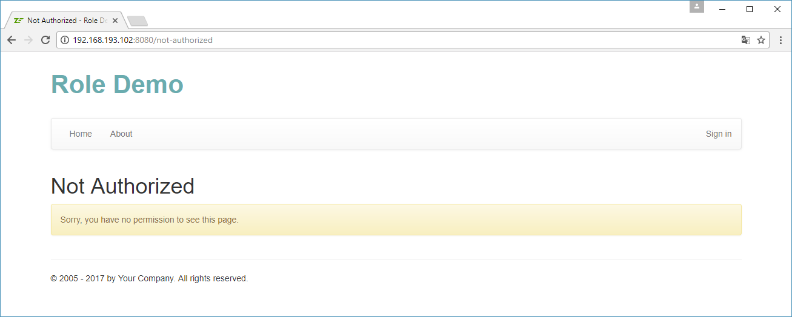

Add the following route to the *module.config.php* file of the *User* module:

~~~php
return [
    'router' => [
        'routes' => [
            'not-authorized' => [
                'type' => Literal::class,
                'options' => [
                    'route'    => '/not-authorized',
                    'defaults' => [
                        'controller' => Controller\AuthController::class,
                        'action'     => 'notAuthorized',
                    ],
                ],
            ],
        ],
    ],
];
~~~

Then add the `notAuthorizedAction()` method to the `AuthController` in the `User` module:

~~~php
/**
 * Displays the "Not Authorized" page.
 */
public function notAuthorizedAction()
{
    $this->getResponse()->setStatusCode(403);

    return new ViewModel();
}
~~~

Finally, add the *not-authorized.phtml* view template file under the *user/auth* directory under the *User* module's
*view* directory:

~~~php
<?php
$this->headTitle("Not Authorized");
?>

<h1>Not Authorized</h1>

<div class="alert alert-warning">Sorry, you have no permission to see this page.</div>
~~~

Now you can see the *Not Authorized* page if you type the following URL into the address bar of the browser:
"http://localhost/not-authorized".

## Modifying the AuthManager Service

The next thing we will do is modifying the access filter inside the `AuthManager` service
we wrote for the *User Demo* sample. Particularly, we want to modify the `filterAccess()`
method. We want the `filterAccess()` method to use our `RbacManager` class.

But first we will modify the format of the `access_filter` key in the configuration. We want the key to allow
to permit access to:

 * anyone if we specify the asterisk (`*`);
 * any authenticated user if we specify the "commercial at" (`@`);
 * a concrete authenticated user with the given `identity` email address if we specify (`@identity`)
 * any authenticated user with the given `permission` if we specify the plus sign followed by the
   permission name (`+permission`).

For example, here how the `access_filter` key would look like for the *User* module:

~~~php
<?php
return [
    //...

    // The 'access_filter' key is used by the User module to restrict or permit
    // access to certain controller actions for unauthorized visitors.
    'access_filter' => [
        'controllers' => [
            Controller\UserController::class => [
                // Give access to "resetPassword", "message" and "setPassword" actions
                // to anyone.
                ['actions' => ['resetPassword', 'message', 'setPassword'], 'allow' => '*'],
                // Give access to "index", "add", "edit", "view", "changePassword" actions
                // to users having the "user.manage" permission.
                ['actions' => ['index', 'add', 'edit', 'view', 'changePassword'],
                 'allow' => '+user.manage']
            ],
            Controller\RoleController::class => [
                // Allow access to authenticated users having the "role.manage" permission.
                ['actions' => '*', 'allow' => '+role.manage']
            ],
            Controller\PermissionController::class => [
                // Allow access to authenticated users having "permission.manage" permission.
                ['actions' => '*', 'allow' => '+permission.manage']
            ],
        ]
    ],

    //...
];
~~~

Below you can find the source code of the `filterAccess()` method of the `AuthManager` service:

~~~php
/**
 * This is a simple access control filter. It is able to restrict unauthorized
 * users to visit certain pages.
 *
 * This method uses the 'access_filter' key in the config file and determines
 * whenther the current visitor is allowed to access the given controller action
 * or not. It returns true if allowed; otherwise false.
 */
public function filterAccess($controllerName, $actionName)
{
    // Determine mode - 'restrictive' (default) or 'permissive'. In restrictive
    // mode all controller actions must be explicitly listed under the 'access_filter'
    // config key, and access is denied to any not listed action for unauthorized users.
    // In permissive mode, if an action is not listed under the 'access_filter' key,
    // access to it is permitted to anyone (even for not logged in users.
    // Restrictive mode is more secure and recommended to use.
    $mode = isset($this->config['options']['mode'])?$this->config['options']['mode']:'restrictive';
    if ($mode!='restrictive' && $mode!='permissive')
        throw new \Exception('Invalid access filter mode (expected either restrictive or permissive mode');

    if (isset($this->config['controllers'][$controllerName])) {
        $items = $this->config['controllers'][$controllerName];
        foreach ($items as $item) {
            $actionList = $item['actions'];
            $allow = $item['allow'];
            if (is_array($actionList) && in_array($actionName, $actionList) ||
                $actionList=='*') {
                if ($allow=='*')
                    // Anyone is allowed to see the page.
                    return self::ACCESS_GRANTED;
                else if (!$this->authService->hasIdentity()) {
                    // Only authenticated user is allowed to see the page.
                    return self::AUTH_REQUIRED;
                }

                if ($allow=='@') {
                    // Any authenticated user is allowed to see the page.
                    return self::ACCESS_GRANTED;
                } else if (substr($allow, 0, 1)=='@') {
                    // Only the user with specific identity is allowed to see the page.
                    $identity = substr($allow, 1);
                    if ($this->authService->getIdentity()==$identity)
                        return self::ACCESS_GRANTED;
                    else
                        return self::ACCESS_DENIED;
                } else if (substr($allow, 0, 1)=='+') {
                    // Only the user with this permission is allowed to see the page.
                    $permission = substr($allow, 1);
                    if ($this->rbacManager->isGranted(null, $permission))
                        return self::ACCESS_GRANTED;
                    else
                        return self::ACCESS_DENIED;
                } else {
                    throw new \Exception('Unexpected value for "allow" - expected ' .
                            'either "?", "@", "@identity" or "+permission"');
                }
            }
        }
    }

    // In restrictive mode, we require authentication for any action not
    // listed under 'access_filter' key and deny access to authorized users
    // (for security reasons).
    if ($mode=='restrictive') {
        if(!$this->authService->hasIdentity())
            return self::AUTH_REQUIRED;
        else
            return self::ACCESS_DENIED;
    }

    // Permit access to this page.
    return self::ACCESS_GRANTED;
}
~~~

As you could see from the code, the method returns one of three constants:

  * `ACCESS_GRANTED` if user is allowed to see the given page;
  * `AUTH_REQUIRED` if user needs to authenticate first;
  * `ACCESS_DENIED` if user is denied to see the page.

## Modifying the Dispatch Event Listener

Next, we will modify the `Module` class living in `User` namespace and
particularly its `onDispatch()` method. The main goal of this is that if the access filter
returns `ACCESS_DENIED`, we redirect the user to the *Not Authorized* page.

~~~php
<?php
namespace User;

use Laminas\Mvc\MvcEvent;
use Laminas\Mvc\Controller\AbstractActionController;
use User\Controller\AuthController;
use User\Service\AuthManager;

class Module
{
    //...

    /**
     * Event listener method for the 'Dispatch' event. We listen to the Dispatch
     * event to call the access filter. The access filter allows to determine if
     * the current visitor is allowed to see the page or not. If he/she
     * is not authorized and is not allowed to see the page, we redirect the user
     * to the login page.
     */
    public function onDispatch(MvcEvent $event)
    {
        // Get controller and action to which the HTTP request was dispatched.
        $controller = $event->getTarget();
        $controllerName = $event->getRouteMatch()->getParam('controller', null);
        $actionName = $event->getRouteMatch()->getParam('action', null);

        // Convert dash-style action name to camel-case.
        $actionName = str_replace('-', '', lcfirst(ucwords($actionName, '-')));

        // Get the instance of AuthManager service.
        $authManager = $event->getApplication()->getServiceManager()->get(AuthManager::class);

        // Execute the access filter on every controller except AuthController
        // (to avoid infinite redirect).
        if ($controllerName!=AuthController::class)
        {
            $result = $authManager->filterAccess($controllerName, $actionName);

            if ($result==AuthManager::AUTH_REQUIRED) {
                // Remember the URL of the page the user tried to access. We will
                // redirect the user to that URL after successful login.
                $uri = $event->getApplication()->getRequest()->getUri();
                // Make the URL relative (remove scheme, user info, host name and port)
                // to avoid redirecting to other domain by a malicious user.
                $uri->setScheme(null)
                    ->setHost(null)
                    ->setPort(null)
                    ->setUserInfo(null);
                $redirectUrl = $uri->toString();

                // Redirect the user to the "Login" page.
                return $controller->redirect()->toRoute('login', [],
                        ['query'=>['redirectUrl'=>$redirectUrl]]);
            }
            else if ($result==AuthManager::ACCESS_DENIED) {
                // Redirect the user to the "Not Authorized" page.
                return $controller->redirect()->toRoute('not-authorized');
            }
        }
    }
}
~~~

## Adding Access Controller Plugin and View Helper

To query `RbacManager` inside of controllers and view templates, we need to create a
special controller plugin (which we will name `Access`) and a special view helper (which we will name
`Access` too).

### Access Controller Plugin

Sometimes it is required to check some permission inside the controller. For example, this is needed
for the `profile.own.view` permission, which uses the dynamic assertion. For this purpose, we will
create the `Access` controller plugin.

The plugin code will be located inside the `AccessPlugin.php` file inside the *Controller/Plugin* directory
of the *User* module's source directory:

~~~php
<?php
namespace User\Controller\Plugin;

use Laminas\Mvc\Controller\Plugin\AbstractPlugin;

/**
 * This controller plugin is used for role-based access control (RBAC).
 */
class AccessPlugin extends AbstractPlugin
{
    private $rbacManager;

    public function __construct($rbacManager)
    {
        $this->rbacManager = $rbacManager;
    }

    /**
     * Checks whether the currently logged in user has the given permission.
     * @param string $permission Permission name.
     * @param array $params Optional params (used only if an assertion is associated with permission).
     */
    public function __invoke($permission, $params = [])
    {
        return $this->rbacManager->isGranted(null, $permission, $params);
    }
}
~~~

The `Access` plugin's factory looks like the following:

~~~php
<?php
namespace User\Controller\Plugin\Factory;

use Interop\Container\ContainerInterface;
use Laminas\ServiceManager\Factory\FactoryInterface;
use User\Service\RbacManager;
use User\Controller\Plugin\AccessPlugin;

/**
 * This is the factory for AccessPlugin. Its purpose is to instantiate the plugin
 * and inject dependencies into its constructor.
 */
class AccessPluginFactory implements FactoryInterface
{
    public function __invoke(ContainerInterface $container, $requestedName, array $options = null)
    {
        $rbacManager = $container->get(RbacManager::class);

        return new AccessPlugin($rbacManager);
    }
}
~~~

The plugin is registered inside the *module.config.php* file as follows:

~~~php
// We register module-provided controller plugins under this key.
'controller_plugins' => [
    'factories' => [
        Controller\Plugin\AccessPlugin::class => Controller\Plugin\Factory\AccessPluginFactory::class,
    ],
    'aliases' => [
        'access' => Controller\Plugin\AccessPlugin::class,
    ],
],
~~~

So, in your controller's action, you can easily call this plugin like the following:

~~~php
if (!$this->access('profile.own.view', ['user'=>$user])) {
    return $this->redirect()->toRoute('not-authorized');
}
~~~

### Access View Helper

Sometimes, it may be required to query the `RbacManager` inside a view template. For example,
you may need to hide or show some HTML block based on current user's permissions. To do that,
we will implement the `Access` view helper.

The view helper's code will be located inside the `Access.php` file inside the *View/Helper* directory
of the *User* module's source directory:

~~~php
<?php
namespace User\View\Helper;

use Laminas\View\Helper\AbstractHelper;

/**
 * This view helper is used to check user permissions.
 */
class Access extends AbstractHelper
{
    private $rbacManager = null;

    public function __construct($rbacManager)
    {
        $this->rbacManager = $rbacManager;
    }

    public function __invoke($permission, $params = [])
    {
        return $this->rbacManager->isGranted(null, $permission, $params);
    }
}
~~~

The `Access` view helper's factory looks like the following:

~~~php
<?php
namespace User\View\Helper\Factory;

use Interop\Container\ContainerInterface;
use Laminas\ServiceManager\Factory\FactoryInterface;
use User\Service\RbacManager;
use User\View\Helper\Access;

/**
 * This is the factory for Access view helper. Its purpose is to instantiate the helper
 * and inject dependencies into its constructor.
 */
class AccessFactory implements FactoryInterface
{
    public function __invoke(ContainerInterface $container, $requestedName, array $options = null)
    {
        $rbacManager = $container->get(RbacManager::class);

        return new Access($rbacManager);
    }
}
~~~

The view helper is registered inside the *module.config.php* config file as follows:

~~~php
// We register module-provided view helpers under this key.
'view_helpers' => [
    'factories' => [
        View\Helper\Access::class => View\Helper\Factory\AccessFactory::class,
    ],
    'aliases' => [
        'access' => View\Helper\Access::class,
    ],
],
~~~

So, you can easily call the view helper from any of your view templates as follows:

~~~php
if ($this->access('profile.own.view, ['user'=>$user]))) {
   // do something...
}
~~~

## Using the User Module

Congratulations, now our *Role Demo* is ready, so we make some resume of how you typically use it
if you plan to base your own website on it.

First of all, you need to create all needed roles and permissions through the convenient user interface
that we created. Assign a role (or several roles) to each website user.

Then edit the *module.config.php* configuration configuration file in your module and add two keys:

  * the `rbac_manager` key will contain settings for the `RbacManager` (particularly the
    configuration of assertion manager(s));

  An example of that key is presented below:

~~~php
// This key stores configuration for RBAC manager.
'rbac_manager' => [
    'assertions' => [Service\RbacAssertionManager::class],
],
~~~

  * the `access_filter` key stores the access rules for the pages of your website. It typically looks like below:

~~~php
'access_filter' => [
    'options' => [
        'mode' => 'restrictive'
    ],
    'controllers' => [
        Controller\IndexController::class => [
            // Allow anyone to visit "index" and "about" actions
            ['actions' => ['index', 'about'], 'allow' => '*'],
            // Allow authorized users to visit "settings" action
            ['actions' => ['settings'], 'allow' => '@']
        ],
    ]
],
~~~

The `*` and `@` in the `allow` subkeys are not the only options. You can make the `allow`
subkeys to look as follows. We allow access to the page to:

 * anyone if we specify the asterisk (`*`);
 * any authenticated user if we specify the "commercial at" (`@`);
 * a concrete authenticated user with the given `identity` email address if we specify (`@identity`)
 * any authenticated user with the given `permission` if we specify the plus sign followed by the
   permission name (`+permission`).

If your website has some dynamic assertions, extend the `assert()` method of the
existing `RbacAssertionManager` class (or write and register your own assertion manager):

~~~php
public function assert(Rbac $rbac, $permission, $params)
{
    $currentUser = $this->entityManager->getRepository(User::class)
            ->findOneByEmail($this->authService->getIdentity());

    if ($permission=='post.own.edit' && $params['post']->getUser()->getId()==$currentUser->getId())
        return true;

    if ($permission=='post.own.publish' && $params['post']->getUser()->getId()==$currentUser->getId())
        return true;

    return false;
}
~~~

If you want to check permissions in a controller action, you can use the `Access` controller plugin as follows:

~~~php
if (!$this->access('profile.own.view', ['user'=>$user])) {
    return $this->redirect()->toRoute('not-authorized');
}
~~~

If you want to check permissions in a view template, you can use the `Access` view helper:

~~~php
if ($this->access('profile.own.view', ['user'=>$user))) {
   // do something...
}
~~~

That's all! That simple! Enjoy!

## Summary

In this chapter we have implemented the *Role Demo* website which demonstrates how to use roles
and permissions in Laminas.

A role is basically a group of users. A user may be assigned with one or several roles at once.

A role may be assigned one or more permissions. A permission is a single action in the system.

A dynamic assertion is an additional rule associated with the permission.

Roles may be organised into an hierarchy, when parent roles
inherit permissions from their child roles.
