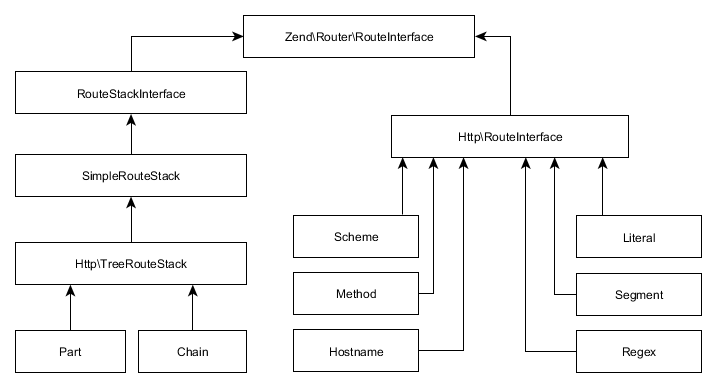
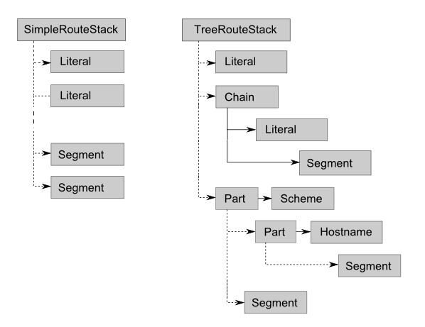
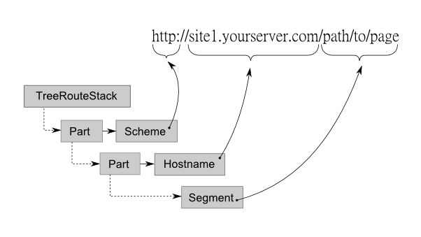
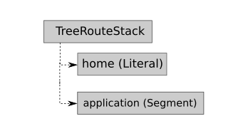
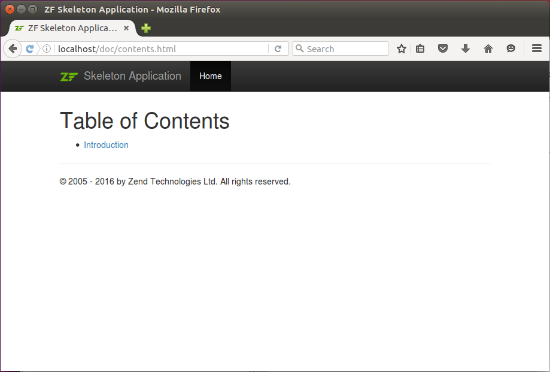
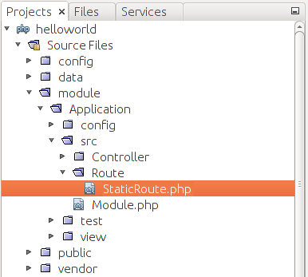
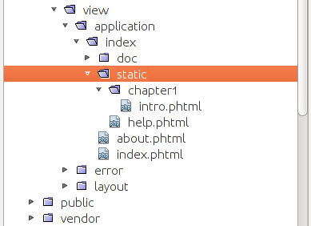
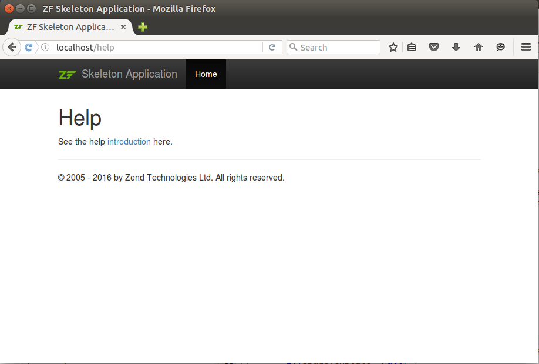
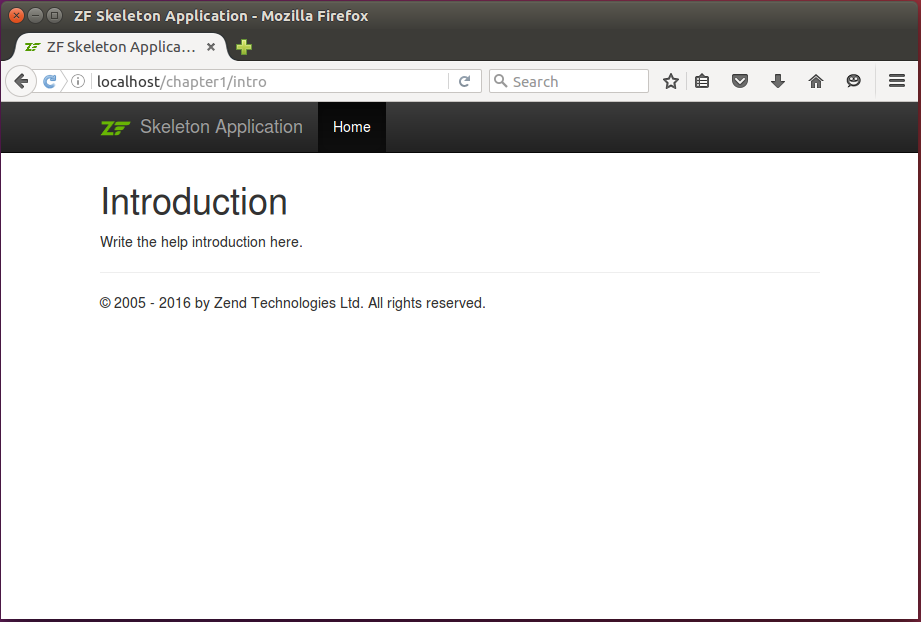

# Routing

When a site user enters a URL in a web browser, the HTTP request is finally dispatched to
controller's action in your laminas-based website. In this chapter, we will learn about how laminas-based application maps page URLs to
controllers and their actions. This mapping is accomplished with the help of routing.
Routing is implemented as a part of @`Laminas\Router` component.

Laminas components covered in this chapter:

| *Component*                    | *Description*                                                 |
|--------------------------------|---------------------------------------------------------------|
| @`Laminas\Router`                  | Implements support of routing.                                |
| @`Laminas\Barcode`                 | Auxiliary component implementing barcodes.                    |

## URL Structure

To better understand routing, we first need to look at the URL structure.
A typical URL from an HTTP request consists of several parts. There are scheme, host name, path, fragment and query
parts.

For example, let's look at the URL "http://site1.yourserver.com/path/to/page?a=1&b=2#section" (figure 5.1).

This URL begins with the scheme (the scheme typically looks like *http* or *https*).
Then, the host name follows which is the domain name of your web server (like *site1.yourserver.com*).
Optional path segments (separated by '/' character) follow the host name. So if you have the path part "/path/to/page" then
"path", "to", and "page" would each be a path segment. Next, after the question mark,
the optional query part follows. It consists of one or several "name=value" parameters separated
from each other by an ampersand character ('&'). Finally, after the hash ('#'), we have the fragment name.

Each part in a URL uses special character encoding, which is named the *URL encoding*.
This encoding ensures that the URL contains only "safe" characters from the ASCII [^ascii] table. If a URL contains
unsafe characters, they are replaced with a percentage character ('%') followed by two
hexadecimal digits (for example, the space character will be replaced by '%20').

[^ascii]: ASCII (American Standard Code for Information Interchange) is a character set which
          can be used to encode characters from the English alphabet. It encodes 128 characters: digits, letters,
          punctuation marks and several control codes inherited from Teletype machines.

## Route Types

*Routing* is a mechanism which allows to map HTTP request to a controller's action.
With routing, Laminas knows which of the controller's action method to execute
as the result of the request. For example, you can map "http://localhost/" URL to `IndexController::indexAction()` method,
and "http://localhost/about" URL to `IndexController::aboutAction()` method.
You define the mapping between URLs and controllers with the help of *routes*.

There are several standard route types provided by Laminas Framework (shown in table 5.1).
These route types are implemented as classes living in the @`Laminas\Router\Http`[Laminas\Router] namespace.

| *Route Type*                   | *Description*                                                 |
|--------------------------------|---------------------------------------------------------------|
| *Literal*                      | Exact matching against the path part of a URL.                |
| *Segment*                      | Matching against a path segment (or several segments) of a URL. |
| *Regex*                        | Matching the path part of a URL against a regular expression template.|
| *Hostname*                     | Matching the host name against some criteria.                 |
| *Scheme*                       | Matching URL scheme against some criteria.                    |
| *Method*                       | Matching an HTTP method (e.g. GET, POST, etc.) against some criteria. |

Table 5.1. Route Types

Each route type in the table above (except the *Method* type) may be matched against a specific part
(or several parts) of a URL. The *Method* route type is matched against the HTTP method (either GET
or POST) retrieved from HTTP request.

## Combining Route Types

Routes may be combined with the help of "aggregate" route types (shown in table 5.2).
The compound route types allow to define arbitrarily complex URL mapping rules.

| *Route Type*                   | *Description*                                                 |
|--------------------------------|---------------------------------------------------------------|
| *SimpleRouteStack*             | Aggregates different route types in a list with priorities.   |
| *TreeRouteStack*               | Aggregates different route types in a tree-like structure.    |
| *Part*                         | Aggregates different route types in a subtree.                |
| *Chain*                        | Aggregates different route types in a chain (degenerated subtree). |

Table 5.2. Aggregate Route Types

The @`TreeRouteStack`[Laminas\Router\Http\TreeRouteStack] and @`SimpleRouteStack`[Laminas\Router\SimpleRouteStack] are used as the "top-level" route types.
The *SimpleRouteStack* allows to organize different routes in a priority list.
The *TreeRouteStack* allows to *nest* different routes, forming a "tree".

Figure 5.2 shows the route class inheritance diagram.

As you can see from the image, all route classes are inherited from @`RouteInterface`[Laminas\Router\RouteInterface] interface (we
will learn this interface in details in the *Writing Own Route Type* section later in this
chapter). The @`SimpleRouteStack`[Laminas\Router\SimpleRouteStack] is a parent class for @`TreeRouteStack`[Laminas\Router\Http\TreeRouteStack] class, which
inherits the behavior of the simple route stack (allows to organize routes in priority list) and
extends it (allows to organize routes in subtrees). The @`Part`[Laminas\Router\Http\Part] and @`Chain`[Laminas\Router\Http\Chain] classes are
derived from @`TreeRouteStack`[Laminas\Router\Http\TreeRouteStack] class and are used internally by the @`TreeRouteStack`[Laminas\Router\Http\TreeRouteStack] for building
subtrees and chains of child routes.

### Simple Route Stack

The @`SimpleRouteStack`[Laminas\Router\SimpleRouteStack] allows to combine different routes in a priority list.
For an example of such a list, look at the route stack in the left part of figure 5.3.
The example list contains several *Literal* routes and several *Segment* routes.

When matching against the HTTP request, the @`SimpleRouteStack`[Laminas\Router\SimpleRouteStack] walks through the list
of routes and tries to match each route in turn. Each route in the list has a priority;
the routes with the higher priority are visited first. The lookup is finished once some route matches
the HTTP request. If none of the routes match, the "not found" error is raised.

### Tree Route Stack

The @`TreeRouteStack`[Laminas\Router\Http\TreeRouteStack] class extends the @`SimpleRouteStack`[Laminas\Router\SimpleRouteStack] class, which means it can
organize routes in a priority list, plus it provides an ability to nest routes in subtrees
and chains. An example tree route stack is presented in the right part of figure 5.3.
The list contains of one @`Literal`[Laminas\Router\Http\Literal] route, a chain of @`Literal`[Laminas\Router\Http\Literal] and @`Segment` routes,
and a subtree consisting of two branches: a branch containing a single @`Segment` route,
and a branch consisting of @`Scheme`, @`Hostname`[Laminas\Router\Http\Hostname] and @`Segment` routes.

The tree route stack performs request matching in the following way. It walks through
its priority list items (denoted by dashed lines in figure 5.3), starting from high-priority routes. If a certain item is
a @`Chain`[Laminas\Router\Http\Chain] route or a @`Part`[Laminas\Router\Http\Part] route, it processes such a nested route from its parent route to children.
If the parent route matches, the children (denoted with solid lines) are analyzed then. The nested route is considered matching
if at least one route matches in each tree (or chain) level.

Each route in a tree (or chain) consumes a part of the URL (figure 5.4). The parent route is matched against the
first part of the URL, its child is matched again
the next part, and so on, until the end of the URL string
is reached.

## Routing Configuration

You typically do not create the route stack (or tree) yourself, instead you provide the
instructions for Laminas on how to do that.

The routing configuration for a module is stored in *module.config.php* configuration file:

~~~php
<?php
use Laminas\Router\Http\TreeRouteStack;

return [
    //...
    'router' => [
        'router_class' => TreeRouteStack::class,
        'routes' => [
            // Register your routing rules here...
        ],
        'default_params' => [
            // Specify default parameters here for all routes here ...
        ]
    ],
];
~~~

Above, in line 6 we have the *router* key, under which there is the *routes* subkey (line 8),
containing the routing rules.

You can specify which top-level route class to use (either @`TreeRouteStack`[Laminas\Router\Http\TreeRouteStack] or @`SimpleRouteStack`[Laminas\Router\SimpleRouteStack])
with the `router_class` parameter (line 7). If this parameter is not present,
the @`TreeRouteStack`[Laminas\Router\Http\TreeRouteStack] is used by default.

You can use the optional `default_params` key (line 11) to define the *default values* for parameters
for all routes at once. However, you typically do not use this key and define
the defaults on a per-route basis.

!!! note
    We will show how you extract parameters from route later in this chapter.

### Configuration for Simple Routes

A typical route has the *name*, *type* and *options*:

  * The *name* is used to uniquely identify the route.
  * The *type* defines the fully qualified name of the route type (PHP class which implements
    the matching algorithm).
  * The *options* is an array that includes the *route*
    string which should be compared against the URL part, and several parameters called the *defaults*.

Configuration for each route under the `routes` subkey may have the following format:

~~~php
'<route_name>' => [
    'type' => '<route_type_class>',
    'priority' => <priority>,
    'options' => [
        'route' => '<route>',
        'defaults' => [
            //...
        ],
    ],
]
~~~

Above, the `<route_name>` placeholder should be the name of the route. A route name must be in lower case,
like "home" or "about". The `type` key specifies the fully qualified route class name.

The optional `priority` key allows to define the priority (which should be an integer number)
of the route in the priority list (routes with higher priority will be visited first). If you
omit the `priority` key, the routes will be visited in the LIFO [^lifo] order.

!!! note
    Routes having equal priority will be visited in the LIFO order. Thus, for the best performance, you should
    register routes that will match most often in the last turn, and least common routes should be registered first.

[^lifo]: LIFO (stands for Last In, First Out) is used to organize items in a stack, where
         the topmost item, which is added last, is taken out first.

The `options` key defines the array of route's options. We will discuss the options
in the following sections of this chapter.

### Configuration for Nested Routes

To organize routes in a subtree, you add the `child_routes` key to the route definition,
and add your child routes under that key, like below:

~~~php
'<route_name>' => [
    'type' => '<route_type_class>',
    'priority' => <priority>,
    'options' => [
        //...
    ],
    'child_routes' => [
        // Add child routes here.
        // ...
    ]
],
~~~

If you need to organize the routes in a chain (degenerated subtree), you add the
`chain_routes` key to your route configuration:

~~~php
'<route_name>' => [
    'type' => '<route_type_class>',
    'priority' => <priority>,
    'options' => [
        //...
    ],
    'chain_routes' => [
        // Add chained routes here.
        // ...
    ]
],
~~~

!!! note
    Looking at the two examples above, you won't see the explicit usage of @`Part`[Laminas\Router\Http\Part] and
    @`Chain`[Laminas\Router\Http\Chain] route types, because (for your convenience) they are used by the Laminas automatically when
    it encounters the `child_routes` and `chain_routes` keys in your routing configuration.

### Default Routing Configuration in Laminas Skeleton Application

Now that you know how to configure routes and organize them in compound structures,
let's look at the real life example. In a fresh Laminas Skeleton Application, the routing
configuration looks like below:

~~~php
<?php
use Laminas\Router\Http\Literal;
use Laminas\Router\Http\Segment;

return [
    'router' => [
        'routes' => [
            'home' => [
                'type' => Literal::class,
                'options' => [
                    'route'    => '/',
                    'defaults' => [
                        'controller' => Controller\IndexController::class,
                        'action'     => 'index',
                    ],
                ],
            ],
            'application' => [
                'type'    => Segment::class,
                'options' => [
                    'route'    => '/application[/:action]',
                    'defaults' => [
                        'controller'    => Controller\IndexController::class,
                        'action'        => 'index',
                    ],
                ],
            ],
        ],
    ],

  //...
];
~~~

In the configuration presented above, we have two routing rules listed in turn:
first we have the "home" route (line 8) and then we have the "application" route (line 18).

The "home" route maps the empty URL path to the "index" action of the `IndexController` controller. For example,
enter "http://localhost/" in your browser to see the Home page of your website. This route
is of type "Literal".

The "application" route (of type "Segment") maps URLs looking like "http://localhost/application",
"http://localhost/application/about", "http://localhost/application/news", etc onto the corresponding
action of the `IndexController` controller. The actual action name is determined by the "action" parameter.
The default value for this parameter is "index". That means that if you do not specify any action, the request
will be dispatched to "index" action.

This configuration corresponds to the tree route stack shown in figure 5.5:

In the next sections, we will provide some examples on how to use the route types
in your website.

## Literal Route Type

With *Literal* route type, the route match is achieved only when you have the
exact match of the route string against the URL path part. You typically use the *Literal* type
for URLs which should be short and memorable, like '/about' or '/news'.

Below, the definition of the route named "home" is presented. The "home" route is
usually mapped to the "index" action of the `IndexController` and points to the *Home* page of
your site:

~~~php
'home' => [
    'type' => Literal::class,
    'options' => [
        'route'    => '/',
        'defaults' => [
            'controller' => Controller\IndexController::class,
            'action'     => 'index',
        ],
    ],
],
~~~

Line 2 of this example says that the route's type is *Literal*. The actual
route matching algorithm is implemented in the @`Laminas\Router\Http\Literal`
class.

Line 4 defines the route string to match against the URL path (the forward slash '/' means the empty URL part).
Because we have the literal route type, the route match is achieved only when you have the
exact literal path match. For example, if you have the URL "http://localhost/" or "http://localhost",
it will match the '/' route string.

Lines 5-8 define the `defaults`, which are the parameters returned by the router
if the route matches. The `controller` and `action` parameters define the controller
and controller's action method which should be executed. You can also define other
parameters here, if needed.

As another example of the *Literal* route type, let's add the '/about' route for the *About* page we've
created earlier in the *Views* section of the chapter [Model-View-Controller](mvc.md). To create the route, add
the following lines right after the "home" route definition inside of your
*module.config.php* file:

~~~php
'about' => [
    'type' => Literal::class,
    'options' => [
        'route' => '/about',
        'defaults' => [
            'controller' => Controller\IndexController::class,
            'action'     => 'about',
        ],
    ],
],
~~~

If you now open the "http://localhost/about" URL in your web browser, you should
see the *About* page.

## Segment Route Type

The *Segment* route type allows for matching the route string against one
or several URL path segments.

!!! note
    If you look at the *module.config.php* file, you can see the *Segment* route type is
    used inside of the "application" route to make actions of your `IndexController`
    automatically mapped to site URLs. You just add an action method to your `IndexController` class,
    and it becomes available by a URL like "http://localhost/application/&lt;action&gt;".
    For example, you can see the *About* page of your site with the following URL:
    "http://localhost/application/about".

To demonstrate the creation of the *Segment* route type, let's implement
a controller action which will generate a simple barcode image. The barcodes may be of different types and have different
labels. We will use the *Segment* route type to map the action to a URL like
"http://localhost/barcode/&lt;type&gt;/&lt;label&gt;".

!!! note
    Barcodes are widely used in supermarkets for optically recognizing goods in your
    shopping cart.

To be able to use barcodes, you need to install the @`Laminas\Barcode` component with Composer, by
typing the following command:

~~~bash
php composer.phar require laminas/laminas-barcode
~~~

!!! note
    Please note that for barcode images to work, you need to have the GD[^gd] extension
    of the PHP engine installed and enabled. In Linux Ubuntu, you can install this extension with the
    following command:

    `sudo apt-get install php-gd`

    After installing the extension, restart Apache to apply your changes.

[^gd]: PHP GD extension allows to create image files in different formats (like JPEG, PNG, GIF, etc.)

First, we define the "barcode" route in the *module.config.php* file:

~~~php
'barcode' => [
    'type' => Segment::class,
    'options' => [
        'route' => '/barcode[/:type/:label]',
        'constraints' => [
            'type' => '[a-zA-Z][a-zA-Z0-9_-]*',
            'label' => '[a-zA-Z0-9_-]*'
        ],
        'defaults' => [
            'controller' => Controller\IndexController::class,
            'action' => 'barcode',
        ],
    ],
],
~~~

Segments of the route string (line 4) may be constant or variable. You can define the variable
segments by using "wildcards". We have three segments: `barcode`, `:type` and `:label`.
The `barcode` segment is constant, while the latter two are wildcards (wildcard's name
should start with a colon).

You specify how a wildcard should look like inside of the `constraints` subkey (lines 5-8).
We define the regular expression `[a-zA-Z][a-zA-Z0-9_-]*` which constraints our `:type`
wildcard to begin with a letter and (optionally) contain several letters, digits,
underscores or minus characters. The constraint for the `:label` wildcard is almost the same,
but this segment can start with any allowed character (either letter, digit, underscore or minus sign character).

Optional segments can be enclosed in square brackets. In our example, we
have both the `:type` and `:label` segments as optional.

In lines 9-12, we define the `defaults`, the parameters that will be returned by the router.
The `controller` and `action` defaults specify which controller and action method to
execute on route match.

Next, we add the `barcodeAction()` method into the `IndexController` class:

~~~php
// Add name alias in the beginning of the file
use Laminas\Barcode\Barcode;

// ...

// The "barcode" action
public function barcodeAction()
{
  // Get parameters from route.
    $type = $this->params()->fromRoute('type', 'code39');
    $label = $this->params()->fromRoute('label', 'HELLO-WORLD');

    // Set barcode options.
    $barcodeOptions = ['text' => $label];
    $rendererOptions = [];

    // Create barcode object
    $barcode = Barcode::factory($type, 'image',
                 $barcodeOptions, $rendererOptions);

    // The line below will output barcode image to standard
    // output stream.
    $barcode->render();

    // Return Response object to disable default view rendering.
    return $this->getResponse();
}
~~~

In lines 10-11 we get the values of the `type` and `label` wildcards
from route. We do that with the help of @`Params` controller plugin's
`fromRoute()` method. Analogous to `fromQuery()` method, it takes
two arguments: the variable name and its default value.

For generating the barcode image, we use the @`Laminas\Barcode` component.
In line 14 we define the label text for the barcode. In lines 18-19 we
create the @`Barcode`[Laminas\Barcode\Barcode] object with the factory method. Finally, in line 23 we
render the image file by dumping it to PHP output stream.

!!! note
    @`Laminas\Barcode` is an auxiliary component used for generation of various
    barcode images. For additional information about this component, please
    refer to the corresponding section of Laminas Framework reference manual.

In line 26 we return the @`Response`[Laminas\Http\PhpEnvironment\Response] object to suppress the default view rendering.

Now, enter the "http://localhost/barcode" URL into your browser to see
the barcode image (shown in figure 5.6):

Because we have the wildcards in the route, you can pass the type and label
parameters of the barcode image in the URL. Below, several
URL examples are provided (corresponding barcodes are presented in figure
5.7):

~~~
a. http://localhost/barcode/code39/HELLO-WORLD
b. http://localhost/barcode/leitcode/12345
c. http://localhost/barcode/identcode/98765453212
d. http://localhost/barcode/postnet/123456
e. http://localhost/barcode/planet/1234567890123
f. http://localhost/barcode/upca/12345678901
g. http://localhost/barcode/code128/ABCDEF
h. http://localhost/barcode/ean2/12
~~~

## Regex Route Type

The regular expression route type (*Regex*) is useful if you have URLs which can be
matched against a regular expression.

For example, assume you want to create a simple documentation system for your website.
The documentation would consist of "static" pages mapped to URLs like */doc/&lt;page_name&gt;.html*.

!!! note
    By the term "static page" we refer to a page which mostly contains static HTML code
    plus several PHP inline fragments. For such simple pages you do not need to create
    separate controller actions. All "static" pages can be served by the single controller action.

Let's implement the route which will serve the "static" pages of the site. Because "static"
pages are simple, you typically won't need to add per-page action methods
to the controller. All pages will be handled by the single action `IndexController::docAction()`.

First, we add the *Regex* route named "doc" to the *module.config.php* file:

~~~php
'doc' => [
    'type' => Regex::class,
    'options' => [
        'regex'    => '/doc(?<page>\/[a-zA-Z0-9_\-]+)\.html',
        'defaults' => [
            'controller' => Controller\IndexController::class,
            'action'     => 'doc',
        ],
        'spec'=>'/doc/%page%.html'
    ],
],
~~~

Line 2 defines the *Regex* type for the route. In line 4, we
have the regular expression `/doc(?<page>\/[a-zA-Z0-9_\-]+)\.html`.
It will match to URLs like "/doc/contents.html", "/docs/introduction.html" and so on.
The expression contains the named capture [^capture] "page", which will be returned by
the router on match together with the default parameters.

Line 9 contains `spec` option, which is used for generating URLs by route (we will discuss generating URLs
by route later in this chapter).

[^capture]: In PHP PCRE regular expressions, it is possible to name a sub-pattern
            using the syntax `(?P<name>pattern)`. This sub-pattern will then be indexed
            in the *matches* array by its name.

Do not forget to add the following line to the beginning of `module.config.php` file:

`use Laminas\Router\Http\Regex;`

Next, add the following action to `IndexController` class:

~~~php
public function docAction()
{
    $pageTemplate = 'application/index/doc'.
        $this->params()->fromRoute('page', 'documentation.phtml');

    $filePath = __DIR__.'/../../view/'.$pageTemplate.'.phtml';
    if(!file_exists($filePath) || !is_readable($filePath)) {
        $this->getResponse()->setStatusCode(404);
        return;
    }

    $viewModel = new ViewModel([
            'page'=>$pageTemplate
        ]);
    $viewModel->setTemplate($pageTemplate);

    return $viewModel;
}
~~~

In lines 3-4 above, we retrieve the `page` parameter from route (remember the "page"
named capture from our regular expression?) and save it as the
`$pageTemplate` variable. We will use the `$pageTemplate` variable for determining the view template name
to pass to the view resolver. Then, in lines 6-10, we check if such a file is present,
and if not, return the 404 "Not Found" status code, which will force Laminas to display
the error page. In line 12, we create the @`ViewModel`[Laminas\View\Model\ViewModel] variable container, and in line
15 we explicitly set the view template name for rendering.

To see the documentation system in action, create a couple of "static" view template files:
the Table of Contents page (`contents.phtml`) and the Introduction page (`introduction.phtml`).
Create the *doc* subdirectory under the *view/application/index* directory of the `Application` module and
put the *contents.phtml* view template there:

~~~php
<h1>Table of Contents</h1>

<ul>
    <li>
        <a href="<?= $this->url('doc', ['page'=>'introduction']); ?>">
            Introduction
        </a>
    </li>
</ul>
~~~

In the lines above, we provide the HTML code for the "Table of Contents" page header,
and the list which contains the single item named "Introduction" pointing to the Introduction "static" page.
The link URL is generated with the @`Url`[Laminas\View\Helper\Url] view helper (for more details on the `Url`[Laminas\View\Helper\Url] helper, see further sections
in this chapter).

Then add the *introduction.phtml* page into the same *doc* directory:

~~~php
<h1>Introduction</h1>

Some introductory materials.

~~~

In the lines above, we define the HTML markup for the simple Introduction page.

Now, if you open the "http://localhost/doc/contents.html" URL in your
browser, you should see a nice simple documentation system which you can extend and
use in your site (figure 5.8):

Clicking the *Introduction* link will direct you to the "Introduction" static page.
You can also add other pages to the *doc* directory to make them automatically
available for site users through our *Regex* route.

!!! note
    One disadvantage of such a documentation system is that it does not work well if you place nested
    pages in subdirectories under the *doc* directory. The reason of this limitation lies in the way the
    *Regex* route assembles URLs. You can't generate URLs containing slash characters, as these "unsafe"
    characters will be automatically URL-encoded. We will work-around this problem with our custom route
    type that we will create at the end of this chapter.

## Other Route Types

The *Hostname*, *Scheme*, and *Method* route types are used less commonly
compared to the route types mentioned previously.

### Hostname

The *Hostname* route type can be used, for example, if you develop a content
management system (CMS) [^cms] engine, which should serve several websites at once,
each site using a different sub-domain. In that case you will define the *Hostname*
route as the parent, and nest child routes of other types inside of it:

[^cms]: A Content Management System (CMS) is a website allowing for collaborative creating, editing and
        publishing content (blogs, pages, documents, videos etc.) using a centralized web interface.
        CMS systems make it possible for non-programmers to perform the website's daily tasks, like
        content publishing.

~~~php
'routename' => [
    'type' => Hostname::class,
    'options' => [
        'route' => ':subdomain.yourserver.com',
        'constraints' => [
            'subdomain' => '[a-zA-Z][a-zA-Z0-9_-]*'
        ],
        'defaults' => [
        ],
    ],
    'child_routes'=>[
        //...
    ],
],
~~~

In the example above, in line 1 we define the route which
has the *Hostname* type. The `route` option (line 4) defines
the domain name to match against. The `:subdomain` is a wildcard,
which can take different sub-domain values. The `constraints` key defines the regular expression
this sub-domain parameter must match. The *Hostname* route will differentiate your
domains, so each site will behave differently, depending on the value of the
`subdomain` parameter returned:

~~~php
// An example of an action that uses parameters returned by
// Hostname route.
public function someAction()
{
    // Get the 'subdomain' parameter from the route.
    $subdomain = $this->params()->fromRoute('subdomain', null);

    // Use different logic based on sub-domain.
    //...

    // Render the view template.
    return new ViewModel();
}
~~~

### Scheme

The *Scheme* route type is useful if you need to handle HTTP and HTTPS [^https] protocols
in different ways.

[^https]: The HTTPS protocol is typically used for secure connections, like account page
          or shopping cart page. When you use HTTPS, the request data is tunnelled through Secure Socket Layer (SSL) channel
          and not available to third parties.

The typical *Scheme* route configuration is presented below:

~~~php
'routename' => [
    'type' => Scheme::class,
    'options' => [
        'scheme' => 'https',
        'defaults' => [
            'https' => true,
        ],
    ],
    'child_routes'=>[
        //...
    ],
],
~~~

Above, we define the route of type *Scheme*. It takes the `scheme` option,
which should be the scheme to match against (like `http` or `https`).
If the scheme in HTTP request's URL is exactly the same as the `scheme` option,
the route is considered matching. You can use the `defaults` key to return some
parameters on route match. In the example above, the `https` boolean parameter
will be returned.

### Method

The *Method* route type can be used if you need to direct *GET* and *POST* requests
into different controller's actions. Its typical configuration is presented below:

~~~php
'routename' => [
    'type' => Method::class,
    'options' => [
        'verb' => 'post',
        'defaults' => [
        ],
    ],
    'child_routes'=>[
        //...
    ],
],
~~~

Above, we define the route which has the *Method* type. It takes the `verb` option,
which may be the comma-separated list of acceptable HTTP verbs (like *get*, *post*, *put*, etc.)

## Extracting Parameters from Route

On route match, the router (top-level route class) returns
some parameters: the "defaults" (parameters listed in the `defaults` section of
routing configuration) plus any wildcard parameters extracted from URL string.

In your controller, you will often need to retrieve these parameters.
We already did this in the examples above. In this section, we will give some summary.

To retrieve a parameter from the route in your controller's action method,
you typically use the @`Params` controller plugin and its `fromRoute()` method,
which takes two arguments: the name of the parameter to retrieve and the value to
return if the parameter is not present.

The `fromRoute()` method can also be used to retrieve all parameters at once as an array.
To do that, call the `fromRoute()` without arguments, as shown in the example below:

~~~php
// An example action.
public function someAction()
{
    // Get the single 'id' parameter from route.
    $id = $this->params()->fromRoute('id', -1);

    // Get all route parameters at once as an array.
    $params = $this->params()->fromRoute();

    //...
}
~~~

### Retrieving the RouteMatch and the Router Object

On route match, the router class internally creates an instance of @`Laminas\Router\RouteMatch` class,
providing the methods for extracting the matched route name and parameters extracted from route.
The useful methods of the @`RouteMatch`[Laminas\Router\RouteMatch] class are listed in table 5.3:

| *Method Name*                  | *Description*                                                 |
|--------------------------------|---------------------------------------------------------------|
| `getMatchedRouteName()`        | Gets the name of matched route.                               |
| `getParams()`                  | Get all parameters.                                           |
| `getParam($name, $default)`    | Get a specific parameter.                                     |

Table 5.3. Laminas\Router\RouteMatch class methods

!!! note
    In most cases, it will be sufficient to use the @`Params` controller plugin, but alternatively
    you can use the @`RouteMatch`[Laminas\Router\RouteMatch] object for accomplishing the same task.

To get the @`RouteMatch`[Laminas\Router\RouteMatch] object from your controller's action method, you can use the following
code:

~~~php
// An example action.
public function someAction()
{
    // Get the RouteMatch object.
    $routeMatch = $this->getEvent()->getRouteMatch();

    // Get matched route's name.
    $routeName = $routeMatch->getMatchedRouteName();

    // Get all route parameters at once as an array.
    $params = $routeMatch->getParams();

    //...
}
~~~

In line 5 of the code above, we use the `getEvent()` method of the `AbstractActionController` base class
to retrieve the @`MvcEvent` object, which represents the event (in Laminas, the application life cycle consists
of events). We then use the `getRouteMatch()` method of the @`MvcEvent` class to retrieve the `RouteMatch` object.

In line 8, we use the `getMatchedRouteName()` method to retrieve the name of the route that matched
the HTTP request, and in line 11 we retrieve all the parameters from the route.

The @`MvcEvent` class can also be used for retrieving the router (the top-level route class). You can
do this with the `getRouter()` method of the @`MvcEvent` class, as below:

~~~php
    // Call this inside of your action method
    // to retrieve the RouteStackInterface for the router class.
    $router = $this->getEvent()->getRouter();
~~~

In the code above, we use the `getRouter()` method, which returns the @`RouteStackInterface` interface.
This interface is the base interface for both @`SimpleRouteStack`[Laminas\Router\SimpleRouteStack] and @`TreeRouteStack`[Laminas\Router\Http\TreeRouteStack], and it provides
the methods for working with the routes contained inside the route stack.

## Generating URLs from Route

The main task of any route class is to determine whether this given route matches the HTTP request, and on match
return the set of parameters by which a controller and action can be determined. An opposite
task a route class allows to generate a URL by parameters. This feature can be used
in your controller action methods for generating URLs, for example, for redirecting a user to another page.
It can also be used inside view templates for generating hyperlinks.

### Generating URLs in View Templates

Your web pages usually contain hyperlinks to other pages. These links may point either
to a page internal to your site or to a page on another site. A hyperlink is represented by `<a>` HTML tag
having `href` attribute specifying the URL of the destination page. Below, an example of a hyperlink
pointing to an external page is presented:

`<a href="http://example.com/path/to/page">A link to another site page</a>`

When you generate a hyperlink to a resource internal to your site, you typically
use relative URL (without host name):

`<a href="/path/to/internal/page">A link to internal page</a>`

To generate URLs in your view templates (*.phtml* files), you can use the @`Url`[Laminas\View\Helper\Url] view helper class,
which takes the route name as an input argument:

~~~php
<!-- A hyperlink to Home page -->
<a href="<?= $this->url('home'); ?>">Home page</a>

<!-- A hyperlink to About page -->
<a href="<?= $this->url('about'); ?>">About page</a>
~~~

In the lines above, we generate two relative URLs. In line 2, we call the @`Url`[Laminas\View\Helper\Url] view helper
and pass the "home" route name as its parameter. In line 5, we pass the "about" route name as
an argument for the @`Url`[Laminas\View\Helper\Url] view helper.

!!! note
    In the example above, the @`Url`[Laminas\View\Helper\Url] view helper internally uses the @`RouteMatch`[Laminas\Router\RouteMatch] object and calls
    the @`Literal`[Laminas\Router\Http\Literal] route to assemble the URL string by route name.

After the @`PhpRenderer` class executes the view template's
code, the output HTML markup will be the following:

~~~html
<!-- A hyperlink to Home page -->
<a href="/">Home page</a>

<!-- A hyperlink to About page -->
<a href="/about">About page</a>
~~~

#### Passing Parameters

If a route uses some variable parameters, you should pass them to the @`Url`[Laminas\View\Helper\Url] view helper
as the second argument:

~~~php
<!-- A hyperlink to About page -->
<a href="<?= $this->url('application', ['action' => 'about']); ?>" >
  About page
</a>

<!-- A hyperlink to Barcode image -->
<a href="<?= $this->url('application', ['action' => 'barcode',
  'type' => 'code39', 'text' => 'HELLO-WORLD']); ?>" >
  Barcode image </a>
~~~

In the example above, we use @`Url`[Laminas\View\Helper\Url] view helper to generate the two
URLs by route name and parameters. We pass the "application"
route name as the first argument, and an array of parameters
as the second argument.

In line 2, we pass the "action" parameter to tell the
*Segment* route class that it should substitute the corresponding wildcard
in the route string with the "about" string.

After the @`PhpRenderer` class executes the view template's
code, the output HTML markup will be the following:

~~~php
<!-- A hyperlink to About page -->
<a href="/application/about" > About page </a>

<!-- A hyperlink to Barcode image -->
<a href="/application/barcode/code39/HELLO-WORLD" > Barcode image </a>
~~~

As another example, let's try to generate a URL for our *Regex* route
(the one which serves our "static" pages):

~~~php
<!-- A hyperlink to Introduction page -->
<a href="<?= $this->url('doc', ['page'=>'introduction']); ?>">
 Introduction </a>
~~~

This will generate the following HTML markup:

~~~html
<!-- A hyperlink to Introduction page -->
<a href="/doc/introduction.html"> Introduction </a>
~~~

#### Generating Absolute URLs

If you need to generate an absolute URL (having the scheme and host name),
you can specify the third parameter for the @`Url`[Laminas\View\Helper\Url] view helper. The third parameter
should be an array containing one or several options. For assembling the absolute
URL, pass the `force_canonical` option, as in the example below:

~~~php
<!-- A hyperlink to Home page -->
<a href="<?= $this->url('home', [], ['force_canonical' => true]); ?>" >
  Home page </a>

<!-- A hyperlink to About page -->
<a href="<?php echo $this->url('application', ['action' => 'about'],
  ['force_canonical' => true]); ?>" > About page </a>
~~~

In line 2 of the example above, we pass the "home" route name as the first
argument, empty array as the second argument, and an array containing `force_canonical`
option as the third argument. In lines 6-7, we also pass the `force_canonical` option
as the third argument for generating the URL of the About page.

The resulting HTML markup of the code above will be as follows:

~~~html
<!-- A hyperlink to Home page -->
<a href="http://localhost/" > Home page </a>

<!-- A hyperlink to About page -->
<a href="http://localhost/application/index/about" > About page </a>
~~~

#### Specifying Query Part

If you want your URL to have a query part, you can specify the `query` option in
the third argument of the `Url` view helper. For example, assume you have the "search"
action in some controller (and a route mapped to this action), and you want to pass it search query string and count of output results
per page. The URL for this action would be like this: "http://localhost/search?q=topic&count=10".
To generate such a URL, you can use the following code:

~~~php
<a href="<?= $this->url('search', [], ['force_canonical' => true,
         'query'=>['q'=>'topic', 'count'=>10]]); ?>" >
  Search </a>
~~~

In the code above, we specified the `query` option, which is the array containing *name=>value*
pairs of the query parameters.

### Generating URLs in Controllers

You can generate URLs inside your controller's action methods using the `Url` controller
plugin. To generate a URL, you call the @`Url`[Laminas\Mvc\Controller\Plugin\Url] controller plugin's `fromRoute()` method, as in the example
below:

~~~php
// An example action method
public function someAction()
{
    // Generate a URL pointing to the Home page ('/')
    $url1 = $this->url()->fromRoute('home');

    // Generate an absolute URL pointing to the About page
    // ('http://localhost/application/about')
    $url2 = $this->url()->fromRoute('application',
              ['action'=>'about'], ['force_canonical'=>true]);
}
~~~

!!! note
    The arguments the `Url` plugin takes and their meaning are identical to the @`Url`[Laminas\View\Helper\Url] view helper's
    ones. So, you can generate absolute or relative URLs the same way you did in your view templates.

### URL Encoding

When generating URLs either with the @`Url`[Laminas\View\Helper\Url] view helper or with the @`Url`[Laminas\Mvc\Controller\Plugin\Url] controller plugin,
you should remember that URLs may only contain "safe" characters from ASCII character set. Thus,
if you pass the parameter containing unsafe characters, these characters will be replaced with
the sequence of the percentage character and two digits.

For example, let's try to generate a URL for our *Regex* route and pass it the "page" parameter
with the value "/chapter1/introduction".

~~~php
<!-- A hyperlink to Introduction page -->
<a href="<?= $this->url('doc', ['page'=>'chapter1/introduction']); ?>">
  Introduction </a>
~~~

We could assume it generates the URL like "/doc/chapter1/introduction.html". But
because the slash ('/') character is unsafe, it will be replaced with the "%2F" characters
for security reasons, and we will have the following HTML code:

~~~html
<!-- A hyperlink to Introduction page -->
<a href="/doc/chapter1%2Fintroduction.html"> Introduction </a>
~~~

Unfortunately, this hyperlink is unusable, because it won't match our
*Regex* route.

## Writing Own Route Type

Although Laminas provides you with many route types, in some situations, you will need
to write your own route type.

One example of the need for such a custom route type is when you have to define the URL mapping rules
dynamically. Usually, you store the routing configuration in module's config file,
but in some CMS systems you will have documents stored in the database. For such a system, you would need to develop a custom route type which
would connect to the database and perform route matching against the data stored in the database.
You cannot store this information in config file, because new documents are created by system
administrators, not programmers.

### RouteInterface

We know that every route class must implement the @`Laminas\Router\Http\RouteInterface` interface.
The methods of this interface are presented in table 5.4:

| *Method Name*                  | *Description*                                                 |
|--------------------------------|---------------------------------------------------------------|
| `factory($options)`            | Static method for creation of the route class.                |
| `match($request)`              | Method which performs match against the HTTP request data.    |
| `assemble($params, $options)`  | Method for generating URL by route parameters.                |
| `getAssembledParams()`         | Method for retrieving parameters that were utilized for URL generation. |

Table 5.4. RouteInterface methods

The static `factory()` method is used by the Laminas router (@`TreeRouteStack`[Laminas\Router\Http\TreeRouteStack] or @`SimpleRouteStack`[Laminas\Router\SimpleRouteStack])
for instantiating the route class. The router passes the `options` array an argument for the
`factory()` method.

The `match()` method is used to perform the matching of the HTTP request (or, particularly its URL)
against the options data passed to the route class through the `factory()`. The `match()` method should
return either an instance of the `RouteMatch` class on successful match, or `null` on failure.

The `assemble()` method is used for generating URL string by
route parameters and options. The `getAssembledParams()` helper method's purpose is
to return the array of parameters which were used on URL generation.

### Custom Route Class

To demonstrate the creation of a custom route type, let's improve our previous
approach to building the simple documentation system with *Regex* route type.
The disadvantage of the *Regex* route type is that you cannot organize the
static pages in a hierarchy by creating subdirectories under the *doc* directory
(when generating an URL for such a page, the slash directory separator will be
URL-encoded making the hyperlink unusable). We will create our
custom `StaticRoute` class that allows to fix this issue.

Moreover, the class we will create is more powerful, because it will
not only recognize URLs starting with "/doc" and ending with ".html". Instead,
it will recognize generic URLs, like "/help" or "/support/chapter1/introduction".

What we want to achieve:

* The `StaticRoute` class should be insertable to the route stack (to `SimpleRouteStack`
  or to `TreeRouteStack`) and usable together with other route types.

* The route class should recognize generic URLs, like "/help" or "/introduction".

* The route class should match the URL against the directory structure. For example,
  if the URL is "/chapter1/introduction", then the route should check if the corresponding view
  template file *&lt;base_dir&gt;/chapter1/introduction.phtml* exists and is readable, and if so,
  report match. If the file does not exist (or not readable), return the failure status.

* The route class should check the URL for acceptable file names using a regular expression.
  For example, the file name "introduction" is acceptable, but the name "*int$roduction" is not.
  If the file name is not acceptable, the failure status should be returned.

* The route should be able to assemble the URL string by route name and parameters.

To start, create the *Route* subdirectory under the module's source directory
and put the *StaticRoute.php* file inside of it (figure 5.9).

Inside that file, paste the stub code presented below:

~~~php
<?php
namespace Application\Route;

use Traversable;
use \Laminas\Router\Exception;
use \Laminas\Stdlib\ArrayUtils;
use \Laminas\Stdlib\RequestInterface as Request;
use \Laminas\Router\Http\RouteInterface;
use \Laminas\Router\Http\RouteMatch;

// Custom route that serves "static" web pages.
class StaticRoute implements RouteInterface
{
    // Create a new route with given options.
    public static function factory($options = [])
    {
    }

    // Match a given request.
    public function match(Request $request, $pathOffset = null)
    {
    }

    // Assembles a URL by route params.
    public function assemble(array $params = [], array $options = [])
    {
    }

    // Get a list of parameters used while assembling.
    public function getAssembledParams()
    {
    }
}
~~~

From the code above, you can see that we placed the `StaticRoute` class
inside the `Application\Route` namespace (line 2).

In lines 4-9, we define some class name aliases for making
the class names shorter.

In lines 12-33, we define the stub for the `StaticRoute` class. The `StaticRoute`
class implements the @`RouteInterface`[Laminas\Router\RouteInterface] interface and defines all the methods specified
by the interface: `factory()`, `match()`, `assemble()` and `getAssembledParams()`.

Next, let's add several protected properties and the constructor method to the `StaticRoute`
class, as shown below:

~~~php
<?php
//...

class StaticRoute implements RouteInterface
{
    // Base view directory.
    protected $dirName;

    // Path prefix for the view templates.
    protected $templatePrefix;

    // File name pattern.
    protected $fileNamePattern = '/[a-zA-Z0-9_\-]+/';

    // Defaults.
    protected $defaults;

    // List of assembled parameters.
    protected $assembledParams = [];

    // Constructor.
    public function __construct($dirName, $templatePrefix,
            $fileNamePattern, array $defaults = [])
    {
        $this->dirName = $dirName;
        $this->templatePrefix = $templatePrefix;
        $this->fileNamePattern = $fileNamePattern;
        $this->defaults = $defaults;
    }

    // ...
}
~~~

Above, in line 7, we define the `$dirName` property that is intended for storing
the name of the base directory where the "static" view templates will be located.
In line 10, we define the `$templatePrefix` class variable for storing the prefix
for prepending to all view template names. Line 13 contains the `$fileNamePattern`
variable that will be used for checking the file name.

In lines 22-29, we define the constructor method that is called on instance
creation for initializing the protected properties.

Next, let's implement the `factory()` method for our `StaticRoute` custom route class.
The `factory()` method will be called by the router for instantiating the route class:

~~~php
<?php
//...

class StaticRoute implements RouteInterface
{
    //...

    // Create a new route with given options.
    public static function factory($options = [])
    {
        if ($options instanceof Traversable) {
            $options = ArrayUtils::iteratorToArray($options);
        } elseif (!is_array($options)) {
            throw new Exception\InvalidArgumentException(__METHOD__ .
                ' expects an array or Traversable set of options');
        }

        if (!isset($options['dir_name'])) {
            throw new Exception\InvalidArgumentException(
                'Missing "dir_name" in options array');
        }

        if (!isset($options['template_prefix'])) {
            throw new Exception\InvalidArgumentException(
                'Missing "template_prefix" in options array');
        }

        if (!isset($options['filename_pattern'])) {
            throw new Exception\InvalidArgumentException(
                'Missing "filename_pattern" in options array');
        }

        if (!isset($options['defaults'])) {
            $options['defaults'] = [];
        }

        return new static(
            $options['dir_name'],
            $options['template_prefix'],
            $options['filename_pattern'],
            $options['defaults']);
    }
}
~~~

In the code above, we see that the `factory()` method takes the `options`
array as the argument (line 9). The `options` array may contain the options
for configuring the route class. The `StaticRoute` class will accept the following
options:

* `dir_name` - the base directory where to store all "static" view templates.
* `template_prefix` - the prefix to prepend to all template names.
* `filename_pattern` - the regular expression for checking the file names.
* `defaults` - parameters returned by router by default.

Once we parsed the options, in lines 37-41 we call the class' constructor
method to instantiate and return the `StaticRoute` object.

The next method we add to the `StaticRoute` route class is the `match()` method:

~~~php
<?php
//...

class StaticRoute implements RouteInterface
{
    //...

    // Match a given request.
    public function match(Request $request, $pathOffset=null)
    {
        // Ensure this route type is used in an HTTP request
        if (!method_exists($request, 'getUri')) {
            return null;
        }

        // Get the URL and its path part.
        $uri  = $request->getUri();
        $path = $uri->getPath();

        if($pathOffset!=null)
            $path = substr($path, $pathOffset);

        // Get the array of path segments.
        $segments = explode('/', $path);

        // Check each segment against allowed file name template.
        foreach ($segments as $segment) {
            if(strlen($segment)==0)
                continue;
            if(!preg_match($this->fileNamePattern, $segment))
            return null;
        }

        // Check if such a .phtml file exists on disk
        $fileName = $this->dirName . '/'.
                $this->templatePrefix.$path.'.phtml';
        if(!is_file($fileName) || !is_readable($fileName)) {
            return null;
        }

        $matchedLength = strlen($path);

        // Prepare the RouteMatch object.
        return new RouteMatch(array_merge(
              $this->defaults,
              ['page'=>$this->templatePrefix.$path]
             ),
             $matchedLength);
    }
}
~~~

In the code above, we see that the `match()` method takes
two arguments: the HTTP request object (an instance of @`Laminas\Stdlib\Request`
class) and the URL path offset. The request object is used for
accessing the request URL (line 17). The path offset parameter is a non-negative integer,
which points to the portion of the URL the route is matched against (line 21).

In line 24, we extract the segments from URL. Then we check if every segment is
an acceptable file (directory) name (lines 27-32). If the segment is not a valid file name,
we return `null` as a failure status.

In line 35, we calculate the path to the view template, and in lines 37-39 we check if such
a file really exists and accessible for reading. This way we match the URL against the
directory structure.

In lines 44-48, we prepare and return the @`RouteMatch`[Laminas\Router\RouteMatch] object with the default
parameters plus the "page" parameter containing the view template name for rendering.

To complete the implementation of our `StaticRoute` class, we add the `assemble()` and
`getAssembledParams()` methods, that will be used for generation of URLs by route parameters.
The code for these methods is presented below:

~~~php
<?php
//...

class StaticRoute implements RouteInterface
{
    //...

    // Assembles a URL by route params
    public function assemble(array $params = [],
                           array $options = [])
    {
        $mergedParams = array_merge($this->defaults, $params);
        $this->assembledParams = [];

        if(!isset($params['page'])) {
            throw new Exception\InvalidArgumentException(__METHOD__ .
               ' expects the "page" parameter');
        }

        $segments = explode('/', $params['page']);
        $url = '';
        foreach($segments as $segment) {
            if(strlen($segment)==0)
                continue;
            $url .= '/' . rawurlencode($segment);
        }

        $this->assembledParams[] = 'page';

        return $url;
    }

    // Get a list of parameters used while assembling.
    public function getAssembledParams()
    {
        return $this->assembledParams;
    }
}
~~~

In the code above, we define the `assemble()` method, which takes
the two arguments: the `parameters` array and the `options` array (line 9).
The method constructs the URL by encoding the segments with URL encoding
and concatenating them (line 20-26).

The method `getAssembledParams()` just returns the names of the parameters
we used for URL generation (line 36).

Now we've finished the `StaticRoute` route class. To use our custom route type,
we add the following configuration to the *module.config.php* configuration file:

~~~php
'static' => [
    'type' => StaticRoute::class,
    'options' => [
        'dir_name'         => __DIR__ . '/../view',
        'template_prefix'  => 'application/index/static',
        'filename_pattern' => '/[a-z0-9_\-]+/',
        'defaults' => [
            'controller' => Controller\IndexController::class,
            'action'     => 'static',
        ],
    ],
],
~~~

In line 1 of the configuration above, we define the routing rule named "static".
The `type` parameter defines the fully qualified `StaticRoute` class name (line 2).
In the `options` array, we define the base directory where the "static" pages will be
placed (line 4), the template prefix (line 5), the filename pattern (line 6),
and the `defaults` array, containing the name of the controller and the action that
will serve all the static pages.

Do not forget to insert the following line to the beginning of the `module.config.php` class:

`use Application\Route\StaticRoute;`

The final step is creating the action method in the `IndexController` class:

~~~php
public function staticAction()
{
    // Get path to view template from route params
    $pageTemplate = $this->params()->fromRoute('page', null);
    if($pageTemplate==null) {
        $this->getResponse()->setStatusCode(404);
        return;
    }

    // Render the page
    $viewModel = new ViewModel([
            'page'=>$pageTemplate
        ]);
    $viewModel->setTemplate($pageTemplate);
    return $viewModel;
}
~~~

The action above is almost identical to the action we used for the *Regex* route.
In line 4, we retrieve the `page` parameter from route and save it as the
`$pageTemplate` variable. In line 11, we create the `ViewModel` variable container, and in line
14 we explicitly set the view template name for rendering.

To see the system in action, let's add a couple of "static" view pages:
the Help page (`help.phtml`) and the introduction page (`intro.phtml`).
Create the *static* subdirectory under the *view/application/index* directory
of the `Application` module and put the *help.phtml* view template there:

~~~php
<h1>Help</h1>

    See the help <a href="<?= $this->url('static',
	   ['page'=>'/chapter1/intro']); ?>">introduction</a> here.

~~~

Then create the *chapter1* subdirectory in the *static* directory and
put the following *chapter1/intro.phtml* file in there:

~~~html
<h1>Introduction</h1>

    Write the help introduction here.

~~~

Finally, you should receive the following directory structure (see figure 5.10):

Eventually, open the following URL in your browser: *http://localhost/help*. The
Help page should appear (see figure 5.11 for example). If you type the *http://localhost/chapter1/intro*
URL in your browser, you should see the Introduction page (figure 5.12).

You can create static pages just by adding the phtml files under the
*static* directory, and they will automatically become available to site users.

!!! note
    If you are stuck, you can find this complete working example inside the *Hello World*
    application.

## Summary

In this chapter, we've learned about routing. Routing is used for mapping HTTP
request to controller's action method. There are several route types (*Literal*,
*Segment*, *Regex*, *Hostname*, *Scheme*, *Method* etc.).
Each route type uses different URL parts (and, possibly, other data from HTTP request)
to compare the URL with the specified route template. We also learned how to write custom
route class if the capabilities of standard route types are not sufficient.

The main task of a route class is to return a route match containing the set of parameters,
by which a controller and action can be determined. An opposite task a route class allows to
generate a URL by parameters. This feature is widely used in view layer of the application
for generating hyperlinks.

Route types can be combined in a nested tree with the help of `TreeRouteStack` router,
or organized in a chain with `SimpleRouteStack` router. These two routers allow to define
arbitrarily complex rules.

Routing configuration is stored in module's configuration file under the `router` key.
Each module exposes its own routing rules, which are merged with other modules' configuration
upon application start up.
