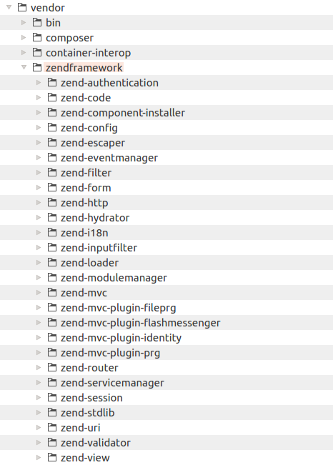
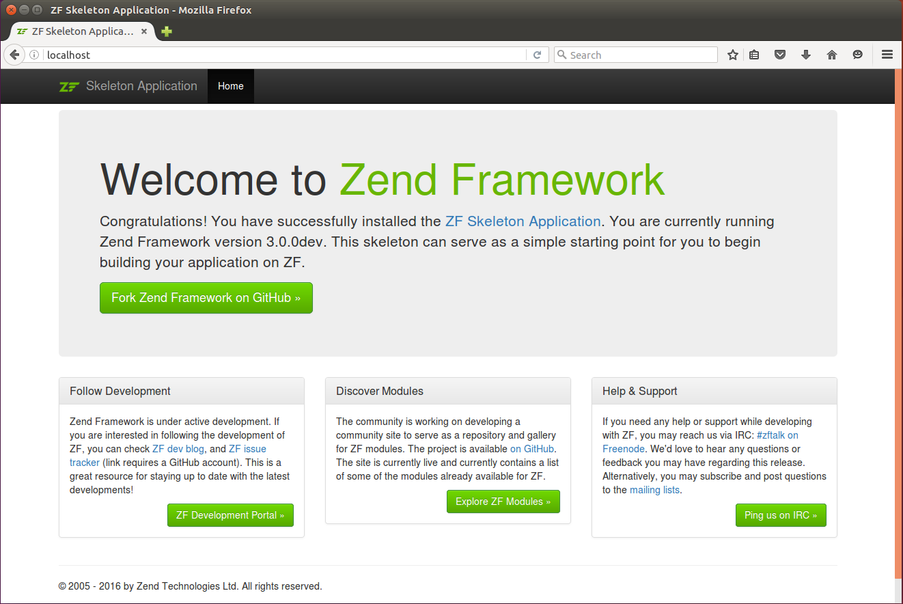
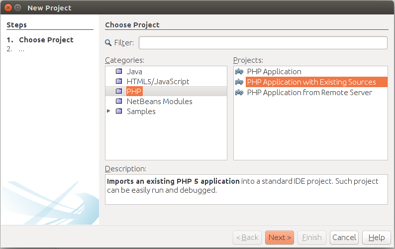
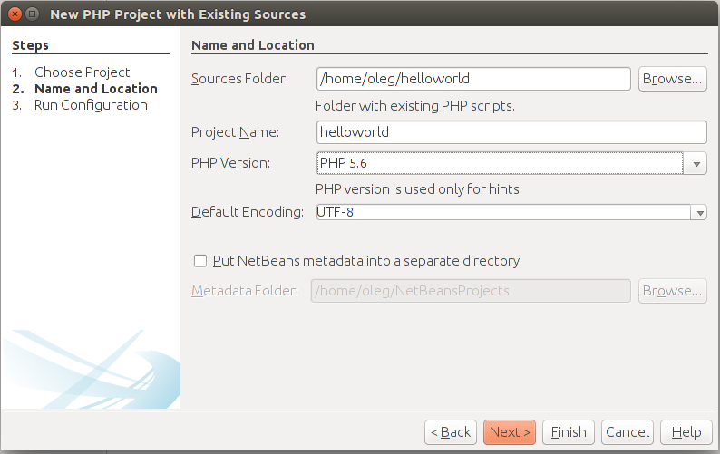
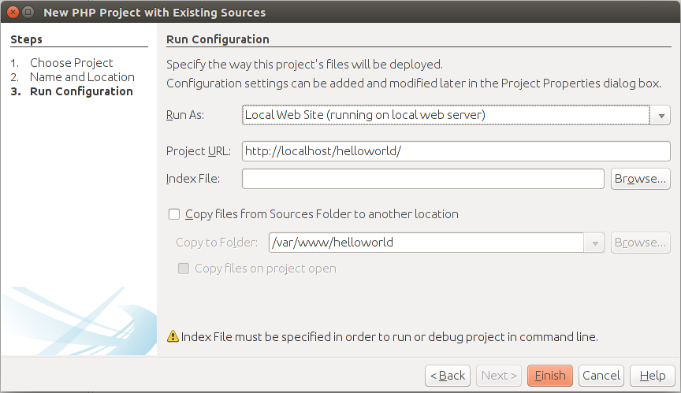
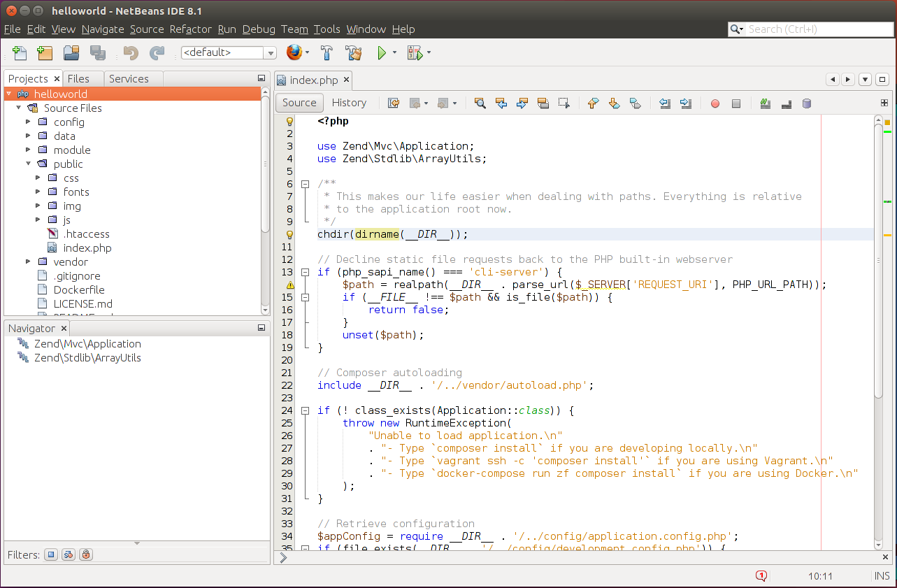

# Laminas Skeleton Application

Laminas Framework provides you with the so called "skeleton application" to make it easier to create
your new websites from scratch. In this chapter, we will show how to install the skeleton
application and how to create an Apache virtual host. It is recommended that you refer to
[Appendix A. Configuring Web Development Environment](devenv.md) before reading this chapter to get your development
environment configured.

## Getting Laminas Skeleton Application

The Skeleton Application is a simple laminas-based application that contains
most necessary things for creating your own website.

The skeleton application's code is stored on GitHub code hosting and can be publicly
accessed by [this link](https://github.com/laminas/LaminasSkeletonApplication).
However, you typically do not download the source code of the skeleton application directly,
instead you use [Composer](http://getcomposer.org/) dependency manager, as shown below.

First, you need to get the latest version of Composer. You do this with the following commands:

```bash
cd ~

php -r "copy('https://getcomposer.org/installer', 'composer-setup.php');"

php composer-setup.php

php -r "unlink('composer-setup.php');"
```

The commands above change your working directory to be your home directory, download the `composer-setup.php` installer script
to your working directory, run it, and, finally, remove the installer.

Once you run the commands above, you should have the `composer.phar` file in your working directory.

Now, type the following command from your command prompt:

```bash
php composer.phar create-project -sdev laminas/skeleton-application helloworld
```

The command above downloads the Laminas Skeleton Application to `helloworld` directory and runs its
interactive installer. You now should answer several yes/no questions by typing `y` or `n` and pressing Enter.
Your answers will help the installer to determine which dependencies to install.
If you don't know what to answer, answer 'n' (no); you will be able to install additional dependencies
later at any time.

For the beginning, you can answer the questions the following way:

```bash
    Do you want a minimal install (no optional packages)? Y/n
n

    Would you like to install the developer toolbar? y/N
n

    Would you like to install caching support? y/N
n

    Would you like to install database support (installs laminas-db)? y/N
n

    Would you like to install forms support? y/N
y
    Will install laminas/laminas-mvc-form (^1.0)
    When prompted to install as a module, select application.config.php or modules.config.php

    Would you like to install JSON de/serialization support? y/N
n

    Would you like to install logging support? y/N
n

    Would you like to install MVC-based console support? (We recommend migrating to zf-console, symfony/console, or Aura.CLI) y/N
n

    Would you like to install i18n support? y/N
n

    Would you like to install the official MVC plugins, including PRG support, identity, and flash messages? y/N
n

    Would you like to use the PSR-7 middleware dispatcher? y/N
n

    Would you like to install sessions support? y/N
n

    Would you like to install MVC testing support? y/N
n

    Would you like to install the laminas-di integration for laminas-servicemanager? y/N
n
```

Once you answer the questions, the installer will download and install all necessary packages and asks
you to which config file you would like to inject information about installed modules. When prompted,
type '1' and press Enter:

```bash
 Please select which config file you wish to inject 'Laminas\Form' into:
  [0] Do not inject
  [1] config/modules.config.php
  [2] config/development.config.php.dist
  Make your selection (default is 0):1

  Remember this option for other packages of the same type? (y/N) y
```

Next, the installer will ask you if you would like to remove existing version control files from the project.
Since you will probably store your web application in your own version control system (like Git) and do not need
existing VCS files, type 'y' and press Enter:

```bash
Do you want to remove the existing VCS (.git, .svn..) history? [Y,n]? y
```

Now copy `composer.phar` file to your new `helloworld` directory:

```bash
cp composer.phar helloworld
```

And final and very important step is enabling the *development mode* by typing the following command:

~~~bash
cd helloworld
php composer.phar development-enable
~~~

!!! note
    The development mode is typically used when you *develop* your application. When you enable the development
    mode additional "development" configuration files are created in your web application's `config` directory. In this
    mode your application may optionally load additional "development" modules. Configuration caching
    is also disabled in this mode allowing you to change your website's configuration files and see the changes immediately.

    Once you have finished the development, you can enable the *production* mode by typing the following:

    `php composer.phar development-disable`

Congratulations! The hard work is done. Now let's look inside the `helloworld` directory.

## Typical Directory Structure

Every laminas-based website (including the skeleton application) is organized in the same recommended way.
Of course, you can configure your application to use a different directory layout, but this may
make it difficult to support your website by other people who are not familiar
with such a directory structure.

Let's have a brief look at the typical directory structure (see figure 2.1):


As you can see, in the top-level directory (we will denote it `APP_DIR` from now on),
there are several files:

* `composer.json` is a JSON configuration file for Composer.

* `composer.lock` file contains information about packages installed with Composer.

* `composer.phar` is an executable PHP archive containing the code
  of Composer dependency management tool.

* `docker-compose.yml` and `Dockerfile` files are auxiliary files used only if you use [Docker](https://www.docker.com) container manager tool.
  In this book, we do not cover usage of Docker.

* `LICENSE.md` is a text file containing Laminas license (you had a chance to read it in
 [Introduction to Laminas Framework](intro.md)).
  Do not remove or modify this file, because Laminas license doesn't allow to do so.

* `phpunit.xml.dist` file is a configuration for [PHPUnit](https://phpunit.de/) (unit testing framework). You use this file
  when you want to create unit tests for your website.

* `README.md` is a text file containing a brief description of the skeleton application. You typically
  will replace this file contents with the information about your website: its name, what it does,
  and how to install it.

* `TODO.md` is an auxiliary file that can be safely removed.

* `Vagrantfile` is an auxiliary file that contains configuration for [Vagrant](https://www.vagrantup.com/), which is a virtual development
  environment manager. You can ignore this file if you don't know what is Vagrant. In this book, we do not use Vagrant.

And we also have several subdirectories:

The `config` directory contains application-level configuration files.

The `data` directory contains the data your application might create; it may also contain cache used to speed-up Laminas Framework.

The `module` directory contains all application modules. Currently there is a
single module called `Application`. The `Application` is the main module of your
website. You can also put other modules here, if you wish. We will talk about
the modules a little bit later.

The `vendor` directory's purpose is to contain third-party library files, including
Laminas Framework library files. This directory is typically populated by Composer.

The `public` directory contains data publicly accessible by the web-user. As you can see, web-users
will mainly communicate with the `index.php`, which is also called the *entry point* of your website.

!!! note
    Your website will have a single entry point, *index.php*, because this is more secure than allowing
    anyone to access all your PHP files.

Inside of the `public` directory, you can also find hidden `.htaccess` file. Its main purpose is to define
URL rewriting rules.

The `public` directory contains several subdirectories also publicly accessible by web-users:

* `css` subdirectory contains all publicly accessible CSS files;
* `fonts` subdirectory contains application-specific web-fonts;
* `img` subdirectory contains publicly accessible images (*.JPG, *.PNG, *.GIF, *.ICO, etc.);
* and `js` subdirectory stores publicly accessible JavaScript files used by your web-pages.
  Typically, files of [jQuery](http://jquery.com/) library are placed here, but you can put your own JavaScript files here, too.

!!! note "What is jQuery library?"
    jQuery is a JavaScript library which was created to simplify the client-side scripting of HTML
    pages. jQuery's selector mechanism allows to easily attach event handlers to certain HTML elements, making
    it really simple to make your HTML pages interactive.

Because the Laminas Skeleton Application is stored on GitHub, inside of the directory structure,
you can find hidden `.gitignore` file. This is a [GIT](http://git-scm.com/) version control
system's files. You can ignore it (or even remove them if you do not plan to store your code in a GIT repository).

## Application Dependencies

A dependence is some third-party code your app uses. For example Laminas Framework is the dependence for your website.

In Composer, any library is called *a package*. All packages installable by Composer
are registered on [Packagist.org](https://packagist.org/) site.
With Composer, you can identify the packages that your app requires and have Composer to download and install them automatically.

The dependencies of the skeleton application are declared in `APP_DIR/composer.json` file (see below):

~~~json
{
    "name": "laminas/skeleton-application",
    "description": "Skeleton Application for Laminas Framework laminas-mvc applications",
    "type": "project",
    "license": "BSD-3-Clause",
    "keywords": [
        "framework",
        "mvc",
        "zf2"
    ],
    "homepage": "http://framework.Laminas.com/",
    "minimum-stability": "dev",
    "prefer-stable": true,
    "require": {
        "php": "^5.6 || ^7.0",
        "laminas/laminas-component-installer": "^1.0 || ^0.3 || ^1.0.0-dev@dev",
        "laminas/laminas-mvc": "^3.0.1",
        "zfcampus/zf-development-mode": "^3.0",
        "laminas/laminas-mvc-form": "^1.0",
        "laminas/laminas-mvc-plugins": "^1.0.1",
        "laminas/laminas-session": "^2.7.1"
    },
    "autoload": {
        "psr-4": {
            "Application\\": "module/Application/src/"
        }
    },
    "autoload-dev": {
        "psr-4": {
            "ApplicationTest\\": "module/Application/test/"
        }
    },
    "extra": [],
    "scripts": {
        "development-disable": "zf-development-mode disable",
        "development-enable": "zf-development-mode enable",
        "development-status": "zf-development-mode status",
        "serve": "php -S 0.0.0.0:8080 -t public/ public/index.php"
    }
}
~~~

!!! note "What is JSON?"
    JSON (JavaScript Object Notation), is a text-based file format used for human-readable
    representation of simple structures and nested associative arrays. Although JSON
    originates from JavaScript, it is used in PHP and in other languages, because
    it is convenient for storing configuration data.

In that file, we see some basic info on the skeleton application (its name,
description, license, keywords and home page). You will typically change this info for your future
websites. This information is optional, so you can even safely remove it,
if you do not plan to publish your web application on `Packagist` catalog.

What is interesting for us now is the `require` key. The `require`
key contains the dependencies declarations for our application. We see that we
require PHP engine version 5.6 or later and several Laminas Framework components, like `laminas-mvc`, `laminas-mvc-form`, etc.

The information contained in `composer.json` file is enough to locate the
dependencies, download and install them into the `vendor` subdirectory. If at any time you determine
that you need to install another dependency, you can do that by editing `composer.json` and adding your dependency in it,
and then typing the following commands from your command shell:

~~~bash
php composer.phar self-update
php composer.phar install
~~~

The commands above will self-update the Composer to the latest available version, and then
install your dependencies. By the way, Composer does not install PHP for you,
it just ensures PHP has an appropriate version, and if not, it will warn you.

If you look inside the `vendor` subdirectory, you can see that it contains a lot of files.
Laminas Framework files can be found inside the `APP_DIR/vendor/laminas/`
directory (figure 2.2).



!!! note
    In some other frameworks, another (conventional) way of dependency installation is used.
    You just download the dependency library as an archive, unpack it and put it somewhere inside of your
    directory structure (typically, to `vendor` directory). This approach was used in Zend Framework 1.
    But, in Laminas Framework, you are recommended to install dependencies with Composer.

## Apache Virtual Host

Now we are almost ready to get our skeleton website live! The last thing we
are going to do is configure an Apache virtual host. A virtual host term means
that you can run several websites on the same machine. The virtual sites are
differentiated by domain name (like `site.mydomain.com` and `site2.mydomain.com`) or
by port number (like `localhost` and `localhost:8080`). Virtual hosts work
transparently for site users, that means users have no idea whether the sites are
working on the same machine or on different ones.

Currently, we have the skeleton application inside of your home directory. To let Apache know
about it, we need to edit the virtual host file.

!!! note
    Virtual host file may be located at a different path, depending on your operating system type.
    For example, in Linux Ubuntu it is located in `/etc/apache2/sites-available/000-default.conf` file.
    For OS- and server-specific information about virtual hosts, please refer to [Appendix A. Configuring Web Development Environment](devenv.md).

Let's now edit the default virtual host file to make it look like below (we assume you use Apache v2.4):

~~~text
<VirtualHost *:80>
    ServerAdmin webmaster@localhost

    DocumentRoot /home/username/helloworld/public

	<Directory /home/username/helloworld/public/>
        DirectoryIndex index.php
        AllowOverride All
        Require all granted
    </Directory>

</VirtualHost>
~~~

Line 1 of the file makes Apache to listen to all (*) IP addresses on port 80.

Line 2 defines the web master's E-mail address. If something bad happens to the
site, Apache sends an alert E-mail to this address. You can enter your E-mail
here.

Line 4 defines the document root directory (`APP_DIR/public`). All files and directories
under the document root will be accessible by web-users. You should set
this to be the absolute path to skeleton application's `public` directory.
So, the directories and files inside `public` (like `index.php`, `css`, `js`, etc.)
will be accessible, while directories and files above `public` directory (like
`config`, `module`, etc.) wont' be accessible by web users, which enhances the
security of the website.

Lines 6-10 define rules for the document root directory (`APP_DIR/public`). For example, the `DirectoryIndex`
directive tells Apache that *index.php* should be used as the default index file. The `AllowOverride All` directive
allows to define any rules in `.htaccess` files. The `Require all granted` directive allows
everyone to visit the website.

!!! note
    Laminas Framework utilizes Apache's URL rewriting module for redirecting
    web-users to entry script of your website. Please ensure that your web server
    has `mod_rewrite` module enabled. For instructions on how to enable the module, please
    refer to [Appendix A. Configuring Web Development Environment](devenv.md).

!!! note
    After editing the config file, do not forget to restart Apache to apply your changes.

## Opening the Website in Your Browser

To open the website, type "http://localhost" in your browser's navigation bar and press Enter.
Figure 2.3 shows the site in action.

On the page that appears, you can see the navigation menu at the top. The navigation bar currently
contains the single link named *Home*.
Under the navigation bar, you can see the "Welcome to Laminas Framework" caption. Below
the caption, you can find some advices for beginners on how to develop new laminas-based
applications.



## Creating NetBeans Project

Now that we have the skeleton application set up and working, we will want to change something
with it in the future. To easily navigate the directory structure, edit files and debug the
website, the common practice is to use an IDE (Integrated Development Environment). In this book, we
use NetBeans IDE (see [Appendix A. Configuring Web Development Environment](devenv.md) for more information on how to install NetBeans).

To create NetBeans project for our skeleton application, run NetBeans and open menu
*File->New Project...*. The *New Project* dialog appears (see figure 2.4).



In the *Choose Project* page that appears, you should choose PHP project type
and in the right list select *Application with Existing Sources*
(because we already have the skeleton application's code). Then click the *Next* button to go to the next page
(shown in figure 2.5).



In the *Name and Location* dialog page, you should enter the path to the code (like */home/username/helloworld*),
the name for the project (for example, `helloworld`) and specify the version of PHP your code uses (PHP 5.6 or later).
The PHP version is needed for the NetBeans PHP syntax checker which will scan your PHP code for errors and
highlight them. Press the *Next* button to go to the next dialog page (shown in figure 2.6).



In the *Run Configuration* page, it is recommended that you specify the way you run the website (Local Web
Site) and website URL (`http://localhost`). Keep the *Index File* field empty (because we are using `mod_rewrite`,
the actual path to your `index.php` file is hidden by Apache). If you are seeing the warning message like
"Index File must be specified in order to run or debug project in command line", just ignore it.

Click the *Finish* button to create the project. When the *helloworld* project
has been successfully created, you should see the project window (see the figure 2.7).



In the project window, you can see the menu bar, the tool bar,
the *Projects* pane where your project files are listed, and, in the right
part of the window, you can see the code of the `index.php` entry file.

Please refer to [Appendix B. Introduction to PHP Development in NetBeans IDE](netbeans.md)
for more NetBeans usage tips, including launching and interactively debugging
laminas-based websites.

**It's time for some advanced stuff...**

Congratulations! We've done the hard work of installing and running
the Laminas Skeleton Application, and now it's time to have a rest
and read about some advanced things in the last part of this chapter.

## Hypertext Access File (.htaccess)

We've mentioned the `APP_DIR/public/.htaccess` file when talking about typical
directory structure. Now let's try to understand the role of this file.

The `.htaccess` (hypertext access) file is actually an Apache web server's
configuration file allowing to override some web server's global configuration.
The `.htaccess` file is a directory-level configuration, which means it
affects only its owning directory and all sub-directories.

The content of `.htaccess` file is presented below:

~~~text
RewriteEngine On
# The following rule tells Apache that if the requested filename
# exists, simply serve it.
RewriteCond %{REQUEST_FILENAME} -s [OR]
RewriteCond %{REQUEST_FILENAME} -l [OR]
RewriteCond %{REQUEST_FILENAME} -d
RewriteRule ^.*$ - [L]
# The following rewrites all other queries to index.php. The
# condition ensures that if you are using Apache aliases to do
# mass virtual hosting or installed the project in a subdirectory,
# the base path will be prepended to allow proper resolution of
# the index.php file; it will work in non-aliased environments
# as well, providing a safe, one-size fits all solution.
RewriteCond %{REQUEST_URI}::$1 ^(/.+)/(.*)::\2$
RewriteRule ^(.*) - [E=BASE:%1]
RewriteRule ^(.*)$ %{ENV:BASE}/index.php [L]
~~~

Line 1 tells Apache web server to enable URL rewrite engine (`mod_rewrite`).  The rewrite engine modifies
the incoming URL requests, based on regular expression rules.
This allows you to map arbitrary URLs onto your internal URL structure in any way you like.

Lines 4 - 7 define rewrite rules that tell the web server that if the client (web browser)
requests a file that exists in the document root directory, than to return the contents of that
file as HTTP response. Because we have our `public` directory inside of the virtual host's document root,
we allow site users to see all files inside of the `public` directory, including `index.php`,
CSS files, JavaScript files and image files.

Lines 14 - 16 define rewrite rules that tell Apache what to do if the site user requests a file
which does not exist in document root. In such a case, the user should be redirected to `index.php`.

Table 2.1 contains several URL rewrite examples. The first and second URLs point to existing
files, so `mod_rewrite` returns the requested file paths. The URL in the third example
points to a non-existent file `htpasswd` (which may be a symptom of a hacker attack),
and based on our rewrite rules, the engine returns `index.php` file.

| **Requested URL**                   | **Rewritten URL**                       |
|-------------------------------------|-----------------------------------------|
| `http://localhost/index.php`        | File exists; return the local file `APP_DIR/public/index.php`              |
| `http://localhost/css/bootstrap.css`| File exists; return the local file `APP_DIR/public/css/bootstrap.css`      |
| `http://localhost/htpasswd`         | File does not exist; return `APP_DIR/public/index.php` instead.     |

Table 2.1. URL rewrite examples

## Blocking Access to the Website by IP Address

Sometimes it may be required to block access to your website from all other IP addresses except yours.
For example, when you develop a website, you don't want someone to see your incomplete work. Also,
you may not want to let Google or other search engines to index your website.

To forbid access to your site, you can modify the virtual host and add the following line to it:

~~~text
Require ip <your_ip_address>
~~~

!!! note "How do I determine my IP address?"
    You can use the [http://www.whatismyip.com](http://www.whatismyip.com/) website to determine
    your external IP address. The external IP address is the address by which other
    computers on the Internet may access your site.

## HTTP Authentication

You may want to allow access to your site to certain users. For example, when you are
demonstrating your website to your boss, you will give her username and password for
logging into your site.

To allow access to your website by username and password, you can modify the virtual host
file as follows:

~~~text
...
<Directory /home/username/helloworld/public/>
    DirectoryIndex index.php
    AllowOverride All
    AuthType Basic
    AuthName "Authentication Required"
    AuthUserFile /usr/local/apache/passwd/passwords
    Require valid-user
</Directory>
...
~~~

Line 5 defines Basic authentication method. The most common method is
Basic. It is important to
be aware, however, that Basic authentication sends the password from the client
to the server unencrypted. This method should therefore not be used for highly
sensitive data. Apache supports one other authentication
method: `AuthType Digest`. This method is much more
secure. Most recent browsers support Digest authentication.

Line 6 defines the text that will be displayed to user when he tries to log in.

Line 7 defines the file where passwords will be stored. This file should be created
with the `htpasswd` utility.

Line 8  will allow anyone to log in that is listed in the password file,
and who correctly enters their password.

To create `passwords` file, type the following command:

~~~bash
htpasswd -c /usr/local/apache/passwd/passwords <username>
~~~

In the command above, you should replace the `<username>` placeholder
with the name of the user. You can choose an arbitrary name, for example "admin".
The command will request the user's password and write the password to the file:

~~~bash
# htpasswd -c /usr/local/apache/passwd/passwords <username>
New password:
Re-type new password:
Adding password for user <username>
~~~

When the user tries to visit the site, he/she sees the HTTP authentication dialog.
To log into your site, the visitor should enter the correct username and password.

!!! note
    For additional information on HTTP authentication, you can refer to
    [Authentication and Authorization](http://httpd.apache.org/docs/current/howto/auth.html)
    topic of Apache documentation.

## Having Multiple Virtual Hosts

When developing several websites on the same machine, you will want to create
several virtual hosts. For each virtual host you need to specify a domain name (like `site1.mydomain.com`).
But if you currently don't have a domain name, you can specify a different port instead
(see the example below).

~~~text
# Listen directive tells Apache to listen requests on port 8080
Listen 8080

<VirtualHost *:8080>
    ...
</VirtualHost>
~~~

To access the website, in your browser's navigation bar, enter "http://localhost:8080".

!!! note
    After editing the virtual host config file, you should restart Apache to apply changes.

## Hosts File

When you have multiple local websites mapped to different ports, it becomes difficult
to remember on which port each site presents. To simplify this, you can use name-based
virtual host and define an alias for your website in your system `hosts` file.

First, modify your Apache virtual host file to be *name-based* virtual host:

~~~text
<VirtualHost *:80>
    # Add the ServerName directive
	ServerName site1.localhost
	...
</VirtualHost>
~~~

Next, you should edit the `hosts` file. The `hosts` file is a system file
which contains mappings between IP addresses and host names. The hosts file contains
lines of text consisting of an IP address in the first text field followed by one or
more host names.

To add an alias for your local websites, add lines for each of your website as
shown in the example below.

~~~text
127.0.0.1            site1.localhost
~~~

So now you'll be able to simply enter "site1.localhost" in your browser's address bar
instead of remembering the port number.

!!! note
    In Linux, the hosts file is located in `/etc/hosts`.
    In Windows, the file is typically located in `C:\Windows\System32\drivers\etc\hosts`.
    To edit the file, you need to be an administrator. Please also note that some
    anti-virus software may block changes to hosts file, so you'll have to temporarily disable
    your anti-virus to edit the file, and enable it after.

!!! note
    If you have purchased a real domain name for your website (like `example.com`), you do not
    need to modify your `hosts` file, because Apache will be able to resolve the IP address of
    your website using the DNS system. You modify your `hosts` file only when DNS system knows nothing
    about the domain name and can't resolve the IP address of your website.

## Advanced Composer Usage

Earlier in this chapter, we have used Composer to install Laminas Framework library code.
Now let's briefly describe some advanced Composer usage examples.

As we already know, the only required key in the `composer.json` file is `require`. This key
tells what packages are required by your application:

~~~json
{
    "require": {
        "php": "^5.6 || ^7.0",
        "laminas/laminas-component-installer": "^1.0 || ^0.3 || ^1.0.0-dev@dev",
        "laminas/laminas-mvc": "^3.0.1",
        "zfcampus/zf-development-mode": "^3.0",
        "laminas/laminas-mvc-form": "^1.0",
        "laminas/laminas-mvc-plugins": "^1.0.1",
        "laminas/laminas-session": "^2.7.1"
    }
}
~~~

### Package Names and Versions

A package name consists of two parts: vendor name and project name. For example
"laminas/laminas-mvc" package name consists of "laminas" vendor name
and "laminas-mvc" project name. You can search for other packages from "laminas"
vendor through [Packagist.org](https://packagist.org/search/?q=laminas) website (see
the figure 2.8 for an example).


A package also has an associated version number. A version number consists of major number, minor number,
optional build number, and optional stability suffix (e.g. b1, rc1). Within the `require` key we specify which
versions of the package are acceptable. For example, "^5.6" means that we can install
versions greater than "5.6", but lower than "6.0" (that we can install only those packages that do not break
backward compatibility). In table 2.2, possible ways of specifying acceptable versions are presented:

| *Definition Example*    | *Description*                                                              |
|-------------------------|----------------------------------------------------------------------------|
| 3.0.1                   | Exact version. In this example, only the version 3.0.1 can be installed.   |
| >=3.0.1                 | Greater or equal version can be installed (3.0.1, 3.2.1, etc.)             |
| >3.0.1                  | Greater version can be installed (3.0.2 etc.)                              |
| <=3.0.1                 | Lower or equal version can be installed (1.0, 1.5, 2.0.0 etc.)             |
| <3.0.1                  | Lower version can be installed (1.0, 1.1, 1.9, etc.)                       |
| !=3.0.1                 | All versions except this version can be installed.                         |
| >=3.0,<3.1.0            | Any version belonging to this range of versions can be installed.          |
| 3.*                     | Any version having major number equal to 3 can be installed (minor number can be any).          |
| ~3.0                    | Any version starting from 3.0, but lower than the next major version (equivalent to >=3.0,<4.0).         |
| ^3.0                    | Any version starting from 3.0, but lower than the next major version (equivalent to >=3.0,<4.0). Similar to `~3.0`, but it sticks closer to semantic versioning, and will always allow non-breaking updates.           |

Table 2.2. Package Version Definitions

### Installing and Updating Packages

We've seen how to use the `php composer.phar install` command to install our dependencies. As soon as you call this
command, Composer will find, download and install the dependencies to your `vendor` subdirectory.

!!! note "Is it safe to install dependencies with Composer?"
    Well, some people may be afraid of Composer-style dependency management,
    because they think someone can update the dependencies system-wide by mistake or intentionally,
    causing the web application to break. Note, that Composer *never* installs these
    system-wide, instead it installs them into your `APP_DIR/vendor/` directory.

After installation, Composer also creates the `APP_DIR/composer.lock` file. This file now contains
actual versions of the packages that were installed. If you run the `install` command again,
Composer will encounter the `composer.lock` file, check which dependencies already installed and
as all packages already installed, it just exits without doing anything.

Now assume that in some period of time new security updates for your dependency packages are released.
You will want to update your packages to keep your website secure. You can do that by typing the following:

~~~bash
php composer.phar update
~~~

If you want to update only a single dependency, type its name as the following:

~~~bash
php composer.phar update laminas/laminas-mvc
~~~

After the `update` command, your `composer.lock` file will be updated, too.

!!! note "What do I do if I want to roll back to a previous version of the package?"
    If the update procedure resulted in unwanted problems with your system, you can roll back
    by reverting the changes to your `composer.lock` file and issuing the `install` command again.
    Reverting changes to `composer.lock` is easy if you use a version control system, like GIT or SVN.
    If you don't use a version control system, make a backup copy of `composer.lock` before updating.

### Adding a New Dependency

If you want to add new dependency to the application, you can either edit `composer.json`
manually, or issue `require` command. For example, to install Doctrine ORM module to your web
site (to add the "doctrine/doctrine-module" package to the
application dependencies), type the following:

~~~bash
php composer.phar require doctrine/doctrine-module 2.*
~~~

The command above edits `composer.json` file, and downloads and installs the package. We will use this command
later in chapter [Managing Database with Doctrine](doctrine.md), when becoming familiar with database management.

### Virtual Packages

Composer can be used to require some functionality to present on your system. You've already seen
how we require "php:^5.6". PHP package is a virtual package representing PHP itself. You can also
require other stuff, like PHP extensions (see table 2.3 below).

| *Definition Example*    | *Description*                                                              |
|-------------------------|----------------------------------------------------------------------------|
| "php":"^5.6"            | Require PHP version greater or equal than 5.6, but lower than 6.0.         |
| ext-dom, ext-pdo-mysql  | Require PHP DOM and PDO MySQL extensions                                   |
| lib-openssl             | Require OpenSSL library                                                    |

Table 2.3. Virtual Composer Packages

You can use `php composer.phar show --platform` command to display a list of available virtual packages
for your machine.

### Composer and Version Control Systems

If you are using a version control system (like Git), you will be curious
about what should be stored in Git: your application code only, or your application code
plus all the Composer-installed dependencies in `APP_DIR/vendor` directory?

In general, it is not recommended to store your Composer-dependencies
under version control, because this can make your repository really big and slow to check out and branch. Instead,
you should store your `composer.lock` file under version control. The `composer.lock`
file guarantees that everyone will install the same versions of dependencies as you have.
This is useful in development teams having more than one developer, because all
developers should have the same code to avoid unwanted issues with environment
misconfiguration.

!!! note "What if some dependence will be declared obsolete and removed from Packagist.org?"
    Well, the possibility of package removal is minimum. All packages are free and open-source,
    and the community of users can always restore the dependency even if it is removed from packagist.
    By the way, the same concept of dependency installation is used in Linux (remember APT or RPM manager?),
    so did anyone see any Linux package lost?

But there may be situations when you *should* store some dependent libraries under
version control:

* If you have to make custom changes to third-party code. For example, assume
  you have to fix a bug in a library, and you cannot wait for the library's vendor
  to fix it for you (or if the library vendor cannot fix the bug). In this case,
  you should place the library code under version control to ensure your custom
  changes won't be lost.

* If you have written a reusable module or library and want to store it in the `vendor`
  directory without publishing it on *Packagist.org*. Because you don't have an ability
  to install this code from the Packagist, you should store it under version control.

* If you want a 100% guarantee that a third-party package won't be lost. Although
  the risk is minimum, for some applications it is critical to be autonomous and
  not depend on package availability on *Packagist.org*.

## Summary

In this chapter, we have downloaded the Laminas Skeleton Application project
code from GitHub and installed it via Composer dependency manager.
We've configured the Apache Virtual Host to tell the web server about location
of the website's document root directory.

The skeleton application demonstrates the recommended directory structure of a typical website.
We have the `public` directory containing files publicly accessible by site users, including the `index.php`
entry point file, CSS files, JavaScript files and images. All other directories of the
application are inaccessible by site users and contain application configuration, data and
modules.

In the second part of the chapter we discussed some advanced Apache configuration. For example, you
can protect your website with password and
allow accessing it from certain IP addresses only.

The Composer dependency manager is a powerful tool for installing the dependencies of
your website. For example, Laminas Framework itself can be considered as a dependency.
All packages installable by Composer are registered in a centralized catalog on the
Packagist.org site.
